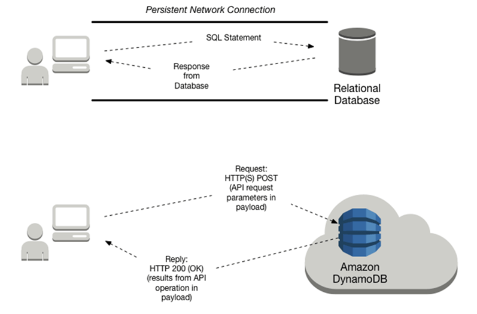
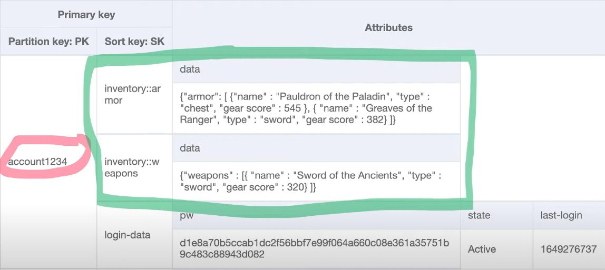
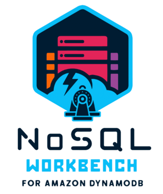

# Get started with DynamoDB

Application logic is important, but an essential component is **your data**.

You are likely familiar with storing data in SQL and NoSQL databases in traditional solutions. Due to its rapid response and low latency, Amazon DynamoDB, a NoSQL data store released in 2012 is a frequently used data storage service for serverless solutions.

## What is DynamoDB?

Amazon DynamoDB is a fully managed serverless NoSQL database service. DynamoDB stores data in
_tables._ Tables hold _items._ Items are composed
of _attributes_. Although these components sound similar to a traditional
SQL table with rows and fields, there are also differences which will be explained in the
fundamentals section.

Data access is generally predictable and fast, in the millisecond (ms) range. If you need even faster response time, the DynamoDB Accelerator (DAX) provides in-memory acceleration for microsecond level access to data.

Traditional web frameworks maintain persistent network connections to SQL databases with _connection pools_ to
avoid latency accessing data. With serverless architecture and DynamoDB, connection pools are **not**
necessary to rapidly connect and scale the database. Instead, you can adjust your tables' throughput capacity, as needed.

For rapid local development, modeling, and testing, AWS provides a downloadable version of DynamoDB that you can run on your computer.
The local database instance provides the same API as the cloud-based service.

## Fundamentals

In DynamoDB, _tables_, _items_, and _attributes_ are the core components.
Data items stored in tables are identified with a _primary key_, which can be a simple _partition hash key_ or a composite of a partition key and a sort key. Although these terms may sound familiar, we will define all of them to clarify how similar and different they are from traditional SQL database terms.

### Core Components

A _table_ is a collection of _items_, and each _item_ is a collection of
_attributes_.

- **Table** – a collection of data. For example, a table called
  _People_ could store personal contact information about friends, family, or anyone else of interest. You could also have a _Cars_ table to store information about vehicles that people drive.

Data in a DynamoDB is uniquely identified with a _primary key,_ and optional secondary indexes for query flexibility.
DynamoDB tables are schemaless. Other than the _primary key_, you do not need to define additional attributes when you create a table.

Each table contains zero or more _items._

- **Item** – An _item_ is a group of attributes that is uniquely identifiable
  among all of the other items. In a _People_ table, each item represents a person. For a _Cars_ table, each item represents one vehicle.

Items in DynamoDB are similar to rows, records, or tuples in other database systems. In
DynamoDB, there is no limit to the number of items you can store in a table. DynamoDB items have a
size limit of 400KB. An _item collection_, a group of related items that
share the same partition key value, are used to model one-to-many relationships. (1)

Each item is composed of one or more attributes:

- **Attribute** –An _attribute_ is a fundamental data element, something
  that does not need to be broken down any further. For example, an item in a _People_ table contains attributes called _PersonID_, _LastName_, _FirstName_, and so on. In a Cars table, attributes could include _Make, Model, BuildYear, and RetailPrice._ For a _Department_ table, an item might have attributes such as _DepartmentID_, _Name_, _Manager_, and so on. Attributes in DynamoDB are similar in many ways to fields or columns in other database systems.

Most of attributes are _scalar_, which means that they can have only one value. Strings and numbers are common examples of scalars. Attributes may be nested, up to 32 levels deep. An example could be an Address which contains Street, City, and PostalCode.

Watch an AWS Developer Advocate explain these core concepts in this video: [Tables, items, and attributes (6 min)](https://www.youtube.com/embed/Mw8wCj0gkRc "https://www.youtube.com/embed/Mw8wCj0gkRc").

As mentioned in the video, the primary key for the following table consists of both a partition key and sort key. The sort keys “inventory::armor” and “inventory::weapons” contain double colons to add query flexibility to get all inventory. This is not a DynamoDB requirements, just a convention by the developer to make retrieval more flexible.

All of the data for account1234 will be stored in the same database partition to ensure retrieval of related data is quick.

Related resources:

- [Item collections - how to model one-to-many relationships in DynamoDB](../../../amazondynamodb/latest/developerguide/WorkingWithItemCollections.md "../../../amazondynamodb/latest/developerguide/WorkingWithItemCollections.md") - example
  of using an item collection, a group of related items that share the same partition key
  value, as a way to model one-to-many relationships

- [Characteristics of databases](../../../amazondynamodb/latest/developerguide/SQLtoNoSQL.md "../../../amazondynamodb/latest/developerguide/SQLtoNoSQL.md") - comparison of SQL and NoSQL qualities of DynamoDB

### Reading data

DynamoDB is a non-relational NoSQL database that does not support table joins. Instead, applications read data from one table at a time. There are four ways to read data:

- `GetItem` – Retrieves a single item from a table. This is the most efficient way to read a single item because it provides direct access to the physical location of the item. (DynamoDB also provides the `BatchGetItem` operation, allowing you to perform up to 100 `GetItem` calls in a single operation.)
- `Query` – Retrieves all of the items that have a specific partition key. Within those items, you can apply a condition to the sort key and retrieve only a subset of the data. `Query` provides quick, efficient access to the partitions where the data is stored.
- `Scan` – Retrieves all of the items in the specified table. This operation should not be used with large tables because it can consume large amounts of system resources. Think of it like a “SELECT \* FROM BIG_TABLE” in SQL. You should generally prefer Query over Scan.
- `ExecuteStatement` retrieves a single or multiple items from a table. `BatchExecuteStatement` retrieves multiple items from different tables in a single operation. Both of these operations use [PartiQL](../../../amazondynamodb/latest/developerguide/ql-reference.md "../../../amazondynamodb/latest/developerguide/ql-reference.md"), a SQL-compatible query language.

### Primary keys and indexes

- **Partition key** - also called a hash key, identifies the partition where the data is stored in the database.
- **Sort key** - also called a range key, represents 1:many relationships

The primary key can be a partition key, nothing more. Or, it can be a composite key which is a combination of a partition key and sort key. When querying, you must give the partition key, and optionally provide the sort key.

Amazon DynamoDB provides fast access to items in a table by specifying primary key values. However, many applications might benefit from having one or more secondary (or alternate) keys available, to allow efficient access to data with attributes other than the primary key. To address this, you can create one or more secondary indexes on a table and issue `Query` or `Scan` requests against these indexes.

A _secondary index_ is a data structure that contains a subset of attributes from a table, along with an alternate key to support `Query` operations. You can retrieve data from the index using a `Query`, in much the same way as you use `Query` with a table. A table can have multiple secondary indexes, which give your applications access to many different query patterns.

DynamoDB supports two types of secondary indexes:

- [**Global secondary index**](../../../amazondynamodb/latest/developerguide/GSI.md "../../../amazondynamodb/latest/developerguide/GSI.md") **—** An index with a partition key and a sort key that can be different from those on the base table. A global secondary index is considered "global" because queries on the index can span all of the data in the base table, across all partitions. A global secondary index is stored in its own partition space away from the base table and scales separately from the base table.
- [**Local secondary index**](../../../amazondynamodb/latest/developerguide/LSI.md "../../../amazondynamodb/latest/developerguide/LSI.md") **—** An index that has the same partition key as the base table, but a different sort key. A local secondary index is "local" in the sense that every partition of a local secondary index is scoped to a base table partition that has the same partition key value.

In DynamoDB, you perform `Query` and `Scan` operations directly on the index, in the same way that you would on a table.

### Data types

DynamoDB supports many different data types for attributes within a table. They can be categorized as follows:

- **Scalar Types** – A scalar type can represent exactly one value. The scalar types are number, string, binary, Boolean, and null.
- **Document Types** – A document type can represent a complex structure with nested attributes, such as you would find in a JSON document. The document types are list and map.
- **Set Types** – A set type can represent multiple scalar values. The set types are string set, number set, and binary set.

Related resource:

- [Supported data types and naming rules in Amazon DynamoDB](../../../amazondynamodb/latest/developerguide/HowItWorks.md "../../../amazondynamodb/latest/developerguide/HowItWorks.md")

### Operations on tables

Operations are divided into Control plane, Data plane, Streams, and Transactions:

- _Control plane_ operations let you create and manage DynamoDB tables. They also let you work with indexes, streams, and other objects that are dependent on tables. Operations include CreateTable, DescribeTable, ListTables, UpdateTable, DeleteTable.
- _Data plane_ operations let you perform create, read, update, and delete (also called _CRUD_) actions on data in a table. Some of the data plane operations also let you read data from a secondary index. Operations include: ExecuteStatement, BatchExecuteStatement, PutItem, BatchWriteItem (to create or delete data), Get Item, BatchGetItem, Query, Scan, UpdateItem, DeleteItem
- _DynamoDB Streams_ operations let you enable or disable a stream on a table, and allow access to the data modification records contained in a stream. Operations include: ListStreams, DescribeStreams, GetSharedIterator, GetRecords
- _Transactions_ provide atomicity, consistency, isolation, and durability (ACID) enabling you to maintain data correctness in your applications more easily. Operations include: ExecuteTransaction, TransactWriteItems, TransactGetItems

Note: you can also use [PartiQL - a SQL-compatible query language for Amazon DynamoDB](../../../amazondynamodb/latest/developerguide/ql-reference.md "../../../amazondynamodb/latest/developerguide/ql-reference.md"), to perform data plane and transactional operations.

## Advanced Topics

You can do a lot just creating a DynamoDB table with a primary key. As you progress on your journey, you should explore the following more advanced topics.

- Create more complex data models in NoSQL WorkBench.
- Use DynamoDB Streams to trigger functions when data is created, updated, or deleted.
- Coordinate all-or-nothing changes with transactions.
- Query and control the database using SQL-compatible PartiQL query language.
- Reduce millisecond access times to microseconds with the in-memory DynamoDB Accelerator (DAX).

### NoSQL Workbench & Local DynamoDB

NoSQL Workbench is a cross-platform visual application that provides data modeling, data visualization, and query development features to help you design, create, query, and manage DynamoDB tables.

- **Data modeling** - build new data models, or design models based on existing data models.
- **Data visualization** - map queries and visualize the access patterns (facets) of the application without writing code. Every facet corresponds to a different access pattern in DynamoDB. You can manually add data to your data model.
- **Operation builder** - use the _operation builder_ to develop and test queries, and query live datasets. You can also build and perform data plane operations, including creating projection and condition expressions, and generating sample code in multiple languages.

You can also run a local instance of DynamoDB on your workstation. Combined with NoSQL workbench, this can provide a fast local setup for experimentation and learning.

Related resources:

- [NoSQL Workbench](../../../amazondynamodb/latest/developerguide/workbench.md "../../../amazondynamodb/latest/developerguide/workbench.md") & [Building data models with NoSQL Workbench](../../../amazondynamodb/latest/developerguide/workbench.md "../../../amazondynamodb/latest/developerguide/workbench.md") - model and query data with a desktop tool
- [Setting up DynamodDB local (downloadable version)](../../../amazondynamodb/latest/developerguide/DynamoDBLocal.md "../../../amazondynamodb/latest/developerguide/DynamoDBLocal.md")

### DynamoDB Streams

DynamoDB Streams is an optional feature that captures data modification events. The data about these events appear in the stream in near-real time, and in the order that the events occurred, as a _stream record_.

If you enable a stream on a table, DynamoDB Streams writes a stream record whenever one of the following events occurs:

- A new item is added to the table: the stream captures an image of the entire item, including all of its attributes.
- An item is updated: the stream captures the "before" and "after" image of any attributes that were modified in the item.
- An item is deleted from the table: the stream captures an image of the entire item before it was deleted.

Each stream record also contains the name of the table, the event timestamp, and other metadata. Stream records have a lifetime of 24 hours; after that, they are automatically removed from the stream.

You can use DynamoDB Streams together with AWS Lambda to create an event source mapping—a resource
that invokes your Lambda function automatically whenever an event of interest appears in a
stream

For example, consider a _Customers_ table that contains customer information for a company. Suppose that you want to send a "welcome" email to each new customer. You could enable a stream on that table, and then associate the stream with a Lambda function. The Lambda function would run whenever a new stream record appears, but only process new items added to the _Customers_ table. For any item that has an `EmailAddress` attribute, the Lambda function would invoke Amazon Simple Email Service (Amazon SES) to send an email to that address.

Related resources:

- [Change data capture with Amazon DynamoDB](../../../amazondynamodb/latest/developerguide/streamsmain.md "../../../amazondynamodb/latest/developerguide/streamsmain.md") -- stream item-level change data in near-real time
- [Change data capture for DynamoDB Streams](../../../amazondynamodb/latest/developerguide/Streams.md "../../../amazondynamodb/latest/developerguide/Streams.md") - DynamoDB Streams captures a time-ordered sequence of item-level modifications in any DynamoDB table and stores this information in a log for up to 24 hours.

### Transactions

Amazon DynamoDB transactions simplify the developer experience of making coordinated, all-or-nothing changes to multiple items both within and across tables. _Transactions_ provide atomicity, consistency, isolation, and durability (ACID) enabling you to maintain data correctness in your applications more easily.

You can use the DynamoDB transactional read and write APIs to manage complex business workflows that require adding, updating, or deleting multiple items as a single, all-or-nothing operation. With the transaction write API, you can group multiple `Put`, `Update`, `Delete`, and `ConditionCheck` actions. You can then submit the actions as a single `TransactWriteItems` operation that either succeeds or fails as a unit.

Related resource:

- [DynamoDB Transactions: How it works](../../../amazondynamodb/latest/developerguide/transaction-apis.md "../../../amazondynamodb/latest/developerguide/transaction-apis.md") - Explains how to group actions together and submit as all-or-nothing TransactWriteItems or TransactGetItems operations

### PartiQL Query Access

Amazon DynamoDB supports [PartiQL](https://partiql.org/ "https://partiql.org/"), a SQL-compatible query language, to select, insert, update, and delete data in Amazon DynamoDB. PartiQL can also be used to perform transactional operations.

You can run ad hoc PartiQL queries against tables. PartiQL operations provide the same availability, latency, and performance as the other DynamoDB data plane operations.

Related resources:

- [PartiQL - a SQL-compatible query language for Amazon DynamoDB](../../../amazondynamodb/latest/developerguide/ql-reference.md "../../../amazondynamodb/latest/developerguide/ql-reference.md")
- [PartiQL Tutorial](https://partiql.org/ "https://partiql.org/") - learn how to write queries using the interactive shell, or REPL.

### DynamoDB Accelerator (DAX) In-memory acceleration

In most cases, the DynamoDB response times can be measured in single-digit milliseconds. If your use case requires a response in microseconds, is read-heavy, or has bursty workloads, DAX provides fast response times for accessing eventually consistent data, increased throughput, and potential operational cost savings.

Related resource:

- [In-memory acceleration with DynamoDB Accelerator (DAX)](../../../amazondynamodb/latest/developerguide/DAX.md "../../../amazondynamodb/latest/developerguide/DAX.md") - for response times in microseconds, increased throughput, and potential operational cost savings for large read-heavy or bursty workloads.

## Additional resources

Official AWS documentation:

- [Amazon DynamoDB Developer Guide](../../../amazondynamodb/latest/developerguide/Introduction.md "../../../amazondynamodb/latest/developerguide/Introduction.md") - extensive and complete documentation for Amazon DynamoDB
- [Getting started with DynamoDB](../../../amazondynamodb/latest/developerguide/GettingStartedDynamoDB.md "../../../amazondynamodb/latest/developerguide/GettingStartedDynamoDB.md") - tutorial to create a table, write/read/update and query data. You will use the AWS CLI, with the option to run PartiQL DB queries.
- [Getting Started Resource Center - Choosing an AWS database service](https://aws.amazon.com/getting-started/decision-guides/databases-on-aws-how-to-choose/ "https://aws.amazon.com/getting-started/decision-guides/databases-on-aws-how-to-choose/") - Choosing the right database requires you to make a series of decisions based on your organizational needs. This decision guide will help you ask the right questions, provide a clear path for implementation, and help you migrate from your existing database.

Resources from the serverless community:

- [Creating a single-table design with Amazon DynamoDB](https://aws.amazon.com/blogs/compute/creating-a-single-table-design-with-amazon-dynamodb/ "https://aws.amazon.com/blogs/compute/creating-a-single-table-design-with-amazon-dynamodb/") - blog article by James Beswick (26 JUL 2021) showing how to model many to one and many to many relationships with indexes in DynamoDB.
- [Additional Amazon DynamoDB Resources](../../../amazondynamodb/latest/developerguide/AdditionalResources.md "../../../amazondynamodb/latest/developerguide/AdditionalResources.md") - more links to blog posts, guides, presentations, training, and tools

## Next steps

In parallel to this guide, a group of Amazon engineers are building a series of workshops based on architectural and design patterns that customers commonly use in real-world solutions. You get hands-on experience with infrastructure and code that you could actually deploy as part of a production solution.

###### Learn serverless techniques in an online workshop

Learn by doing in the **[Serverless Patterns Workshop](https://catalog.workshops.aws/serverless-patterns "https://catalog.workshops.aws/serverless-patterns")**. The first module introduces a serverless microservice to retrieve data from DynamoDB with Lambda and API Gateway.

Additional modules provide practical examples using infrastructure as code to deploy resources, test, and build with common architectural patterns used in serverless solutions.

![Architecture diagram for a REST microservice. Client icon connects through an arrow to REST API resource icon with API Gateway service icon placed above it. REST API is connected by a double arrow to Lambda function resource icon with Permissions Policy resource icon placed above it, and Lambda service icon placed above both. Lambda function resource is connected through an arrow pointing to Users Table resource with DynamoDB service icon placed above it. Dotted boxes enclose each of the services.](images/workshop-m1-infra-complete.png)
