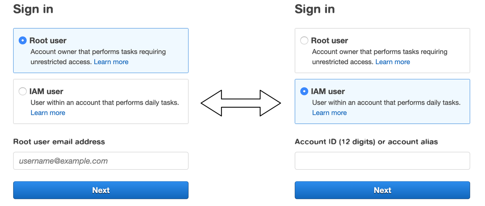
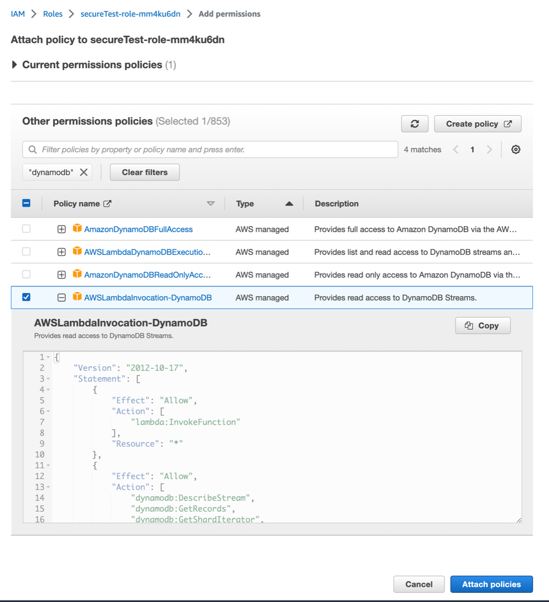
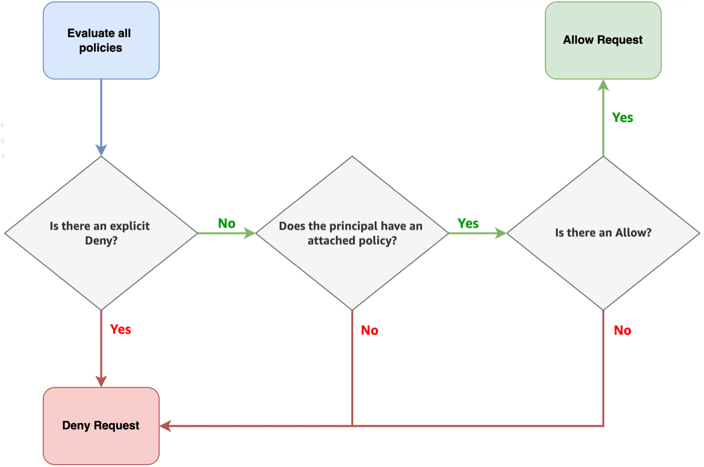

# Get started with IAM

Interactions with AWS services and resources by developers and entities require:

- **Authentication**: proof that the entity requesting access is who they claim to be
- **Authorization**: actions that are allowed or denied

## What is Identity and Access Management?

AWS provides and uses a service called [Identity and Access Management (IAM)](https://aws.amazon.com/iam/ "https://aws.amazon.com/iam/") for authentication and authorization. IAM is used to manage developer accounts and secure the interaction between services and resources.

###### Warning

Security is an important, complex, and broad topic. Large organizations generally have
specific operational procedures that developers need to follow. This guide will explain only
essential concepts necessary to get started with AWS services. If in doubt, consult your
IT department or the official security documentation.

## Fundamentals

With IAM, developers attach _policies,_ JSON documents that define granular permissions, to resources. IAM provides pre-built AWS managed policies for common access levels. You can also define your own policies with the least-privilege level necessary to complete tasks.

Information about IAM policies may come at you fast. If it gets to be too much, put it in **PARC**:

- **P**rincipal: entity that is allowed or denied access
- **A**ction: type of access that is allowed or denied
- **R**esource: AWS resources the action will act upon
- **C**ondition: conditions for which the access is valid

At a high level, these four terms should be enough to get you started connecting serverless resources.

### Account prerequisites

But, before you start, you need an AWS account. The following sections provide the best practice steps to create an account and an administrative user.

If you do not have an AWS account, complete the following steps to create one.

###### To sign up for an AWS account

1. Open [https://portal.aws.amazon.com/billing/signup](https://portal.aws.amazon.com/billing/signup "https://portal.aws.amazon.com/billing/signup").
2. Follow the online instructions.

Part of the sign-up procedure involves receiving a phone call or text message and entering
a verification code on the phone keypad.

When you sign up for an AWS account, an _AWS account root user_ is created. The root user has access to all AWS services
and resources in the account. As a security best practice, assign administrative access to a user, and use only the root user to perform [tasks that require root user access](../../../IAM/latest/UserGuide/id_root-user.md#root-user-tasks "../../../IAM/latest/UserGuide/id_root-user.md#root-user-tasks").
AWS sends you a confirmation email after the sign-up process is
complete. At any time, you can view your current account activity and manage your account by
going to [https://aws.amazon.com/](https://aws.amazon.com/ "https://aws.amazon.com/") and choosing **My
Account**.

After you sign up for an AWS account, secure your AWS account root user, enable AWS IAM Identity Center, and create an administrative user so that you
don't use the root user for everyday tasks.

###### Secure your AWS account root user

1. Sign in to the [AWS Management Console](https://console.aws.amazon.com/ "https://console.aws.amazon.com/") as the account owner by choosing **Root user** and entering your AWS account email address. On the next page, enter your password.

For help signing in by using root user, see [Signing in as the root user](../../../signin/latest/userguide/console-sign-in-tutorials.md#introduction-to-root-user-sign-in-tutorial "../../../signin/latest/userguide/console-sign-in-tutorials.md#introduction-to-root-user-sign-in-tutorial") in the _AWS Sign-In User Guide_. 2. Turn on multi-factor authentication (MFA) for your root user.

For instructions, see [Enable a virtual MFA device for your AWS account root user (console)](../../../IAM/latest/UserGuide/enable-virt-mfa-for-root.md "../../../IAM/latest/UserGuide/enable-virt-mfa-for-root.md") in the _IAM User Guide_.

###### Create a user with administrative access

1. Enable IAM Identity Center.

For instructions, see [Enabling
AWS IAM Identity Center](../../../singlesignon/latest/userguide/get-set-up-for-idc.md "../../../singlesignon/latest/userguide/get-set-up-for-idc.md") in the
_AWS IAM Identity Center User Guide_. 2. In IAM Identity Center, grant administrative access to a user.

For a tutorial about using the IAM Identity Center directory as your identity source, see [Configure user access with the default IAM Identity Center directory](../../../singlesignon/latest/userguide/quick-start-default-idc.md "../../../singlesignon/latest/userguide/quick-start-default-idc.md") in the
_AWS IAM Identity Center User Guide_.

###### Sign in as the user with administrative access

- To sign in with your IAM Identity Center user, use the sign-in URL that was sent to your email address when you created the IAM Identity Center user.

For help signing in using an IAM Identity Center user, see [Signing in to the AWS access portal](../../../signin/latest/userguide/iam-id-center-sign-in-tutorial.md "../../../signin/latest/userguide/iam-id-center-sign-in-tutorial.md") in the _AWS Sign-In User Guide_.

###### Assign access to additional users

1. In IAM Identity Center, create a permission set that follows the best practice of applying least-privilege permissions.

For instructions, see [Create a permission set](../../../singlesignon/latest/userguide/get-started-create-a-permission-set.md "../../../singlesignon/latest/userguide/get-started-create-a-permission-set.md") in the _AWS IAM Identity Center User Guide_. 2. Assign users to a group, and then assign single sign-on access to the group.

For instructions, see [Add groups](../../../singlesignon/latest/userguide/addgroups.md "../../../singlesignon/latest/userguide/addgroups.md") in the _AWS IAM Identity Center User Guide_.

A common confusion arises when signing in to AWS. Remember, for day to day activities, you should **not** be signing in as the root user.



### Principals

IAM implements _authentication_, proving who an entity claims to be,
with _principals,_ which are entities such as IAM users, federated users
from Google, Facebook, etc, IAM roles, AWS accounts, and AWS services.

###### Tip

An IAM role is identical in function to an IAM user, with the important distinction
that it is not uniquely associated with one entity, but assumable by many entities.
Typically, IAM roles correspond to a job function.

A loose analogy for IAM roles are that of professional uniforms: a surgeon's scrubs, a
firefighter's hardhat, or a startup CTO's favorite hoodie. Many people can _assume
the role_ of a surgeon, firefighter, and startup CTO, which identifies them with
a certain job function.

One of the most useful things about IAM roles is they can be associated not only with
human entities, but also with AWS services. These types of roles are known as
_service roles_. This means you can assign an IAM role directly to a
service. With an IAM role assigned to the service instance, you can then associate specific
IAM policies with the instance role, so that the service instance itself can access other
AWS services. This is extremely useful for automation.

### Authorization - PARC

So far we've been talking about principals. Principals represent the **authentication** component. For authorization, you will attach JSON
documents called _IAM policies_ to principals.

#### Principals

As mentioned, _principals_ are the entities that are allowed or denied access.

#### Actions

_Actions_ are the type of access that is allowed or denied. Actions are commonly AWS service API calls that represent create, read, describe, list, update, and delete semantics.

#### Resources

_Resources_ are the AWS resources the action will act upon.

All AWS resources are identified by an [Amazon
Resource Name (ARN)](../../../general/latest/gr/aws-arns-and-namespaces.md "../../../general/latest/gr/aws-arns-and-namespaces.md") . Because AWS services are deployed all over the world,
ARNs function like an addressing system to precisely locate a specific component. ARNs
have hierarchical structures:

```
arn:partition:service:region:account-id:resource-id
arn:partition:service:region:account-id:resource-type/resource-id
arn:partition:service:region:account-id:resource-type:resource-id
```

- `arn` means this string is an ARN
- `partition` is one of the three AWS partitions: AWS regions, AWS
  China regions, or AWS GovCloud (US) regions
- `service` is the specific AWS service, for example: EC2
- `region` is the AWS region, for example: us-east-1 (North
  Virginia)
- `account-id` is the AWS account ID
- `resource-id` is the unique resource ID. (Could also be in the form `resource-type/resource-id`)

**Related resource(s):**

- [IAM identifiers](../../../IAM/latest/UserGuide/reference_identifiers.md "../../../IAM/latest/UserGuide/reference_identifiers.md") provides an exhaustive list in the docs for IAM ARNs

#### Conditions

_Conditions_ are specific rules for which the access is valid.

#### Other Elements

- All IAM policies have an _Effect_ field which is set to either
  `Allow` or `Deny`.
- `Version` field defines which IAM service API version to use when
  evaluating the policy.

- `Statement` field consists of one or many JSON objects that contain the
  specific Action, Effect, Resource, and Condition fields described previously
- `Sid` (statement ID) is an optional identifier for a policy statement; some
  services like Amazon Simple Queue Service and Amazon Simple Notification Service might require this element and have uniqueness
  requirements for it

### Policies

When you set permissions, you attach a JSON policy to a principal. In the following
example, an AWS managed policy named **AWSLambdaInvocation-DynamoDB** will be attached to a role that is related to a
Lambda function:



You can also create custom policies with **statements** which _allow_ or _deny_ a list of **actions** to **resources**, with optional **conditions**.

```
"Statement": [
   { <Principal>,
     <Effect>,
     <Action>,
     <Resource>,
     <Condition>,
   }
]
```

You are not required to provide a `Principal` element in your policy.
Attaching a policy to a principal implicitly specifies the principal to which the
policy applies. Policies can also exist apart from principals, so that common
policies can be re-used for many roles, services, etc.

You must set the `Effect` of the policy to `Allow` to explicitly
grant access to the specified resources. Although `Allow` is the most
common type of policy, you can write policies that explicitly `Deny`
access as well.

```
"Effect": "Allow",    // or "Deny"
```

Next, you must provide one more more `Action` items. The following example
shows an array of API actions, starting with two for Amazon EC2:

```
"Action": [
             "ec2:DescribeInstances",
             "ec2:RunInstances"
              ...
              <additional actions>
            ],
```

Most importantly, you must specify a set of resources in the `Resource`
field. You can usually list specific ARNs, and you might have the option or even
requirement to set a `*` wildcard character, meaning the policy will
apply to all resources.

```
"Resource": "<ARN>",
```

Lastly, you have the option to add a set of `Condition` items to apply the
policy only if certain conditions are met. For example, the following condition will
verify the caller's IP address matches exactly 12.34.56.78. Conditions are optional.
Without them, your policy will be applied unconditionally.

```
"Condition": {
  "IpAddress": { "aws:SourceIp": "12.34.56.78/32"}
}
```

IAM policies can be combined, each with varying degrees of sensitivity and
specificity.

The net effect of combining policies is fine-grained access control for every
resource in an AWS account.

### How policies are evaluated

For IAM principals, requests to AWS are implicitly **_denied_**. This means that if no policies are attached to
a principal, IAM's default behavior is to deny access.

Next, if the principal does have an attached policy, and there is an explicit allow, the
implicit deny is overridden. However, an explicit deny in any policy overrides any allows.
In complex situations, there can be additional steps, but the following diagram represents
this simplified model of how IAM evaluates identity based policies:



###### Warning

Identity based policies do not affect the **root user**,
so actions taken by the **root user** account are
implicitly **\***allowed**\***.

The root user is special in this regard and is the **only** principal that has this type of access.

## Advanced topics

You can do a lot just using AWS managed policies. As you progress on your journey, you should explore the following more advanced topics.

### Resource-based policies

When you create a permissions policy to restrict access to a resource, you can choose an
_identity-based policy_ or a _resource-based
policy_.

**Identity-based policies** are attached to a user, group, or
role. These policies let you specify what that identity can do (its permissions). For
example, you can attach the policy to the group named RemoteDataMinders, stating that group
members are allowed to get items from an Amazon DynamoDB table named `MyCompany`.

**Resource-based policies** are attached to a resource. For
example, you can attach resource-based policies to Amazon S3 buckets, Amazon Simple Queue Service queues, VPC
endpoints, and AWS Key Management Service encryption keys.

With resource-based policies, you can specify who has access to the resource and what actions they can perform on it.

**Related resource(s):**

- [Identity-based and resource-based policies](../../../IAM/latest/UserGuide/access_policies_identity-vs-resource.md "../../../IAM/latest/UserGuide/access_policies_identity-vs-resource.md") in the official documentation
- [AWS Services that work with IAM](../../../IAM/latest/UserGuide/reference_aws-services-that-work-with-iam.md "../../../IAM/latest/UserGuide/reference_aws-services-that-work-with-iam.md") is a comprehensive list of services, including which ones support resource-based policies

### IAM permissions boundaries

With a permissions boundary, you set the maximum permissions that an identity-based policy can grant to an IAM entity.

When you set a permissions boundary for an entity, the entity can perform only the actions that are allowed by both its identity-based policies and its permissions boundaries. Permissions boundaries limit the maximum permissions for the user or role.

For example, assume that the role named `CoreServiceAdmin` should be allowed
to manage only Amazon S3, Amazon CloudWatch, and AWS Lambda. To enforce this rule, you
can set a policy to set the permissions boundary for the `CoreServiceAdmin` role.

**Related resource(s):**

- [Permissions boundaries for IAM entities](../../../IAM/latest/UserGuide/access_policies_boundaries.md "../../../IAM/latest/UserGuide/access_policies_boundaries.md") - official documentation.

## Additional resources

Official AWS documentation:

- [AWS Identity and Access Management
  Documentation](../../../iam.md "../../../iam.md")
- [Example IAM identity-based policies](../../../IAM/latest/UserGuide/access_policies_examples.md "../../../IAM/latest/UserGuide/access_policies_examples.md") - an extensive list of example policies,
  including [AWS Lambda: Allows a lambda function to access an Amazon DynamoDB table](../../../IAM/latest/UserGuide/reference_policies_examples_lambda-access-dynamodb.md "../../../IAM/latest/UserGuide/reference_policies_examples_lambda-access-dynamodb.md") which
  is useful in microservices
- [Grant least privilege](../../../IAM/latest/UserGuide/access_policies.md "../../../IAM/latest/UserGuide/access_policies.md") section of the _Policies and
  permissions_ chapter suggests a method to refine permissions for increased
  security

Resources from the serverless community:

- [Simplifying serverless permissions with AWSAWS SAM Connectors](https://aws.amazon.com/blogs/compute/simplifying-serverless-permissions-with-aws-sam-connectors/ "https://aws.amazon.com/blogs/compute/simplifying-serverless-permissions-with-aws-sam-connectors/") - AWS Compute
  blog post by Kurt Tometich, Senior Solutions Architect, AWS, from Oct 2022 that
  introduces a AWS SAM abstraction that creates minimally scoped IAM policies
- [Building AWS Lambda governance and guardrails](https://aws.amazon.com/blogs/compute/building-aws-lambda-governance-and-guardrails/ "https://aws.amazon.com/blogs/compute/building-aws-lambda-governance-and-guardrails/") - AWS Compute blog post by
  Julian Wood, Senior Solutions Architect, AWS, from Aug 2022 that highlights how Lambda,
  as a serverless service, simplifies cloud security and compliance so you can concentrate
  on your business logic.

## Next Steps

- Work through the Getting Started Resource Center 30-45 min tutorial on [Setting Up Your
  AWS Environment](https://aws.amazon.com/getting-started/guides/setup-environment/ "https://aws.amazon.com/getting-started/guides/setup-environment/") to properly set up your AWS account, secure the root user,
  create an IAM user, and setup AWS CLI and (optionally) Cloud9 environment.
