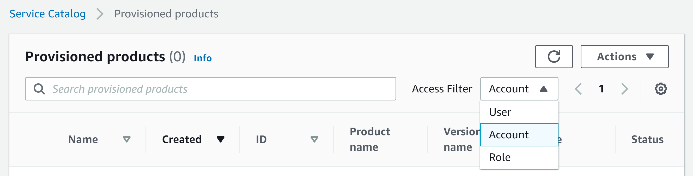
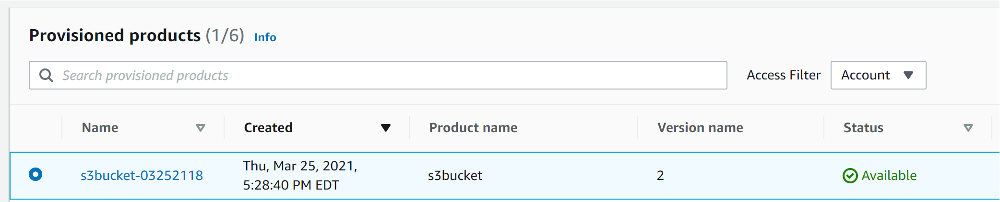
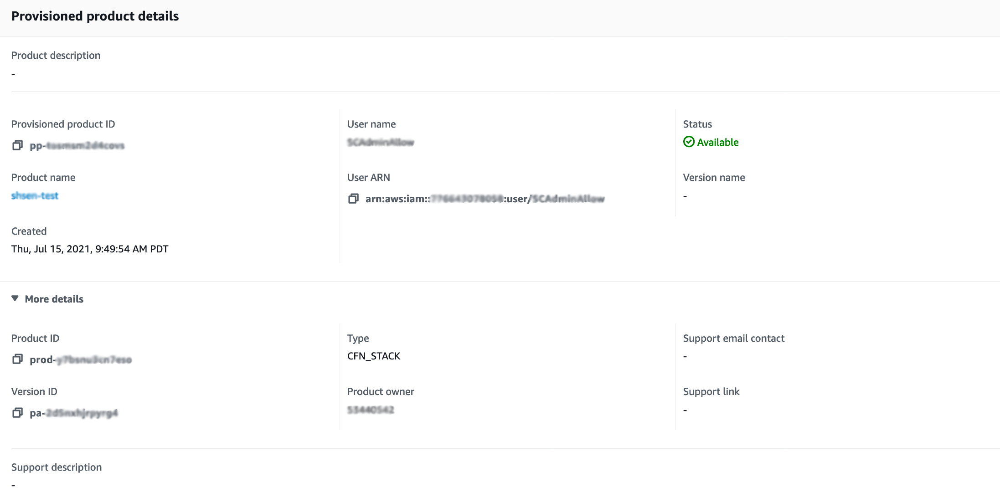
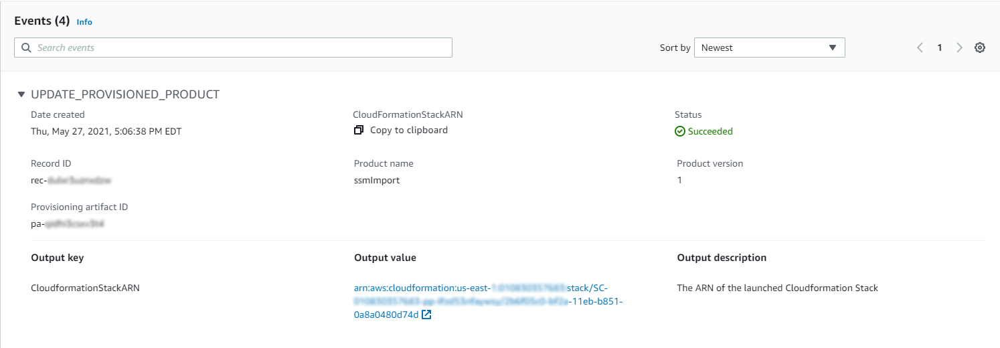

# Tutorial: Identifying User Resource

Allocation

You can identify the user who provisioned a product and resources associated with the
product using the AWS Service Catalog console. This tutorial helps translate this example to your own
specific provisioned products.

To manage all provisioned products for the account, you need `AWSServiceCatalogAdminFullAccess` or
equivalent access to the provisioned product write operations. For more information, see
[Identity and Access Management](controlling_access.md "controlling_access.md") in the _AWS Service Catalog Administrator Guide._

###### To identify the user who provisioned a product and the associated

resources

1. Open [https://console.aws.amazon.com/servicecatalog](https://console.aws.amazon.com/servicecatalog "https://console.aws.amazon.com/servicecatalog").
2. In the left navigation menu, choose **Provisioned
   product**.
3. In the **Access Filter** dropdown menu, choose
   **Account**.

 4. In the **Account** view, choose and open a provisioned
product to display its details.



You can see the details of the provisioned product.

 5. Scroll down to expand the **Events** section. Note the
`Provisioned product ID` and
`CloudformationStackARN` values.

 6. Use the provisioned product ID to identify the AWS CloudTrail record that corresponds to
this launch and identify the requesting user (typically, you enter an email
address during federation). In this example, it is "steve".

```
{
  "eventVersion":"1.03","userIdentity":
  {
    "type":"AssumedRole",
    "principalId":"[id]:steve",
    "arn":"arn:aws:sts::[account number]:assumed-role/SC-usertest/steve",
    "accountId":[account number],
    "accessKeyId":[access key],
    "sessionContext":
    {
      "attributes":
      {
        "mfaAuthenticated":[boolean],
        "creationDate":[timestamp]
      },
      "sessionIssuer":
      {
        "type":"Role",
        "principalId":"AROAJEXAMPLELH3QXY",
        "arn":"arn:aws:iam::[account number]:role/[name]",
        "accountId":[account number],
        "userName":[username]
      }
    }
  },
  "eventTime":"2016-08-17T19:20:58Z","eventSource":"servicecatalog.amazonaws.com",
  "eventName":"ProvisionProduct",
  "awsRegion":"us-west-2",
  "sourceIPAddress":[ip address],
  "userAgent":"Coral/Netty",
  "requestParameters":
  {
    "provisioningArtifactId":[id],
    "productId":[id],
    "provisioningParameters":[Shows all the parameters that the end user entered],
    "provisionToken":[token],
    "pathId":[id],
    "provisionedProductName":[name],
    "tags":[],
    "notificationArns":[]
  },
  "responseElements":
  {
    "recordDetail":
    {
      "provisioningArtifactId":[id],
      "status":"IN_PROGRESS",
      "recordId":[id],
      "createdTime":"Aug 17, 2016 7:20:58 PM",
      "recordTags":[],
      "recordType":"PROVISION_PRODUCT",
      "provisionedProductType":"CFN_STACK",
      "pathId":[id],
      "productId":[id],
      "provisionedProductName":"testSCproduct",
      "recordErrors":[],
      "provisionedProductId":[id]
    }
  },
  "requestID":[id],
  "eventID":[id],
  "eventType":"AwsApiCall",
  "recipientAccountId":[account number]
}
```

7. Use the `CloudformationStackARN` value to identify AWS CloudFormation events to
   find information about the created resources. You can also use the AWS CloudFormation API to
   obtain this information. For more information, see [AWS CloudFormation API Reference](../../../AWSCloudFormation/latest/APIReference.md "../../../AWSCloudFormation/latest/APIReference.md").
   You can perform steps 1 through 4 using the AWS Service Catalog API or the
   AWS CLI. For more information, see [AWS Service Catalog Developer Guide.](../dg/what-is-service-catalog.md "../dg/what-is-service-catalog.md") and [AWS Service Catalog Command Line Reference.](../../../cli/latest/reference/servicecatalog.md "../../../cli/latest/reference/servicecatalog.md")
