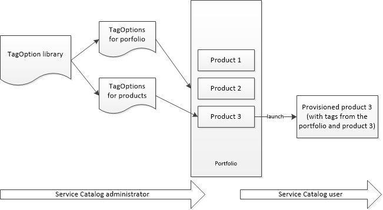

# AWS Service Catalog TagOption Library

To allow administrators to easily manage tags on provisioned products,
AWS Service Catalog provides a TagOption library. A TagOption is a key-value pair managed in AWS Service Catalog. It is
not an AWS tag, but serves as a template for creating an AWS tag based on the
TagOption.

AWS Service Catalog does not support TagOptions for Terraform Open Source or Terraform Cloud products.

The TagOption library makes it easier to enforce the following:

- A consistent taxonomy
- Proper tagging of AWS Service Catalog resources
- Defined, user-selectable options for allowed tags
  Administrators can associate TagOptions with portfolios and products. During a product
  launch (provisioning), AWS Service Catalog aggregates the associated portfolio and product TagOptions,
  and applies them to the provisioned product, as shown in the following diagram.

With the TagOption library, you can deactivate TagOptions and retain their associations to
portfolios or products, and reactivate them when you need them. This approach not only
helps maintain library integrity, it also allows you to manage TagOptions that might be
used intermittently, or only under special circumstances.

You manage TagOptions with the AWS Service Catalog console or the TagOption library API. For more
information, see [Service Catalog API Reference](../dg/API_Reference.md "../dg/API_Reference.md").

###### Contents

- [Launching a Product with TagOptions](tagoptions-launching.md "tagoptions-launching.md")
- [Managing TagOptions](tagoptions-manage.md "tagoptions-manage.md")
- [Using TagOptions with AWS Organizations tag policies](tagoption-policies.md "tagoption-policies.md")
