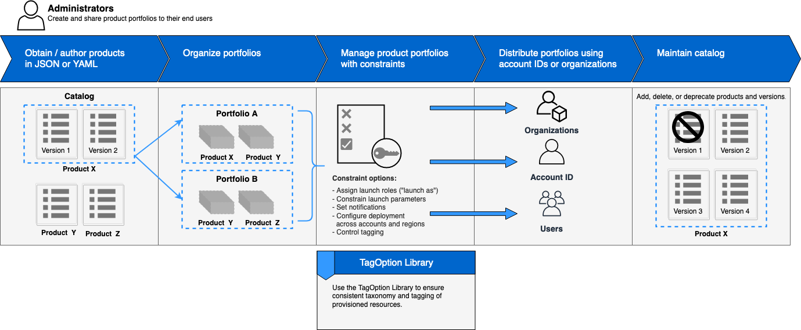
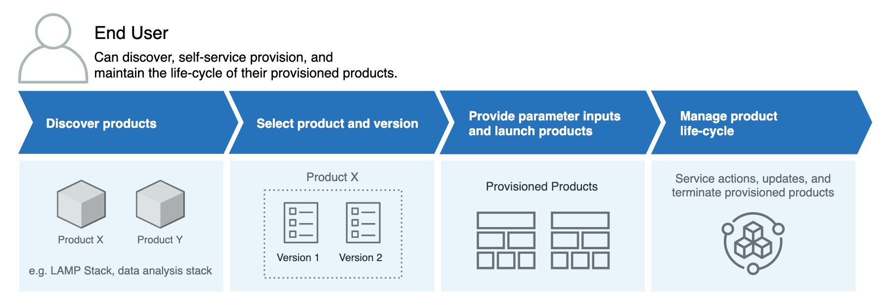

# Overview of Service Catalog

As you get started with Service Catalog, you'll benefit from understanding its components
and the initial workflows for administrators and end users.

## Users

Service Catalog supports the following types of users:

- **Catalog administrators (administrators)** – Manage a
  catalog of products (applications and services), organizing them into portfolios and
  granting access to end users. Catalog administrators prepare AWS CloudFormation templates, configure
  constraints, and manage IAM roles for products to provide for advanced resource
  management.
- **End users** – Receive AWS credentials from
  their IT department or manager and use the AWS Management Console to launch products to which they have
  been granted access. Sometimes referred to as simply _users_, end
  users may be granted different permissions depending on your operational requirements. For
  example, a user may have the maximum permission level (to launch and manage all of the
  resources required by the products they use) or only permission to use particular service
  features.

## Products

A _product_ is an IT service that you want to make available for
deployment on AWS. A product consists of one or more AWS
resources, such as EC2 instances, storage volumes, databases, monitoring configurations, and
networking components, or packaged AWS Marketplace products. A product can be a single
compute instance running AWS Linux, a fully configured multi-tier web
application running in its own environment, or anything in between.

You create a product by importing an AWS CloudFormation template. AWS CloudFormation templates
define the AWS resources required for the product, the relationships between resources, and
the parameters that end users can plug in when they launch the product to configure security
groups, create key pairs, and perform other customizations.

## HashiCorp Terraform Open Source and Terraform Cloud support

AWS Service Catalog enables quick, self-service provisioning with governance for your HashiCorp Terraform Open Source and Terraform Cloud
configurations within AWS. You can use Service Catalog as a single tool to organize, govern, and distribute your Terraform configurations
at scale within AWS. You can access Service Catalog key features, including cataloging of standardized and pre-approved
Terraform templates, access control, least-privilege provisioning, versioning, tagging, and sharing to thousands of AWS accounts.
Your end users see a simple list of products and versions they have access to, and can then deploy those products in a single action.

To learn more and to complete a Terraform product tutorial, review [Getting started with a Terraform product](getstarted-Terraform.md "getstarted-Terraform.md").

## Provisioned Products

AWS CloudFormation stacks make it easier to manage the life cycle of your product by enabling you to
provision, tag, update, and terminate your product instance as a single unit. An AWS CloudFormation
stack includes an AWS CloudFormation template, written in either JSON or YAML format, and its
associated collection of resources. A _provisioned product_ is a
stack. When an end user launches a product, the instance of the product that is
provisioned by Service Catalog is a stack with the resources necessary to run the product. For more
information, see [AWS CloudFormation User Guide](../../../AWSCloudFormation/latest/UserGuide.md "../../../AWSCloudFormation/latest/UserGuide.md").

## Portfolios

A _portfolio_ is a collection of _products_ that
contains configuration information. Portfolios help manage who can use specific products and
how they can use them. With Service Catalog, you can create a customized portfolio for each type of user
in your organization and selectively grant access to the appropriate portfolio. When you add a
new _version_ of a product to a portfolio, that version is automatically
available to all current users.

You also can share your portfolios with other AWS accounts and allow the
administrator of those accounts to distribute your portfolios with additional
_constraints_, such as limiting which EC2 instances a user can create.
Through the use of portfolios, permissions, sharing, and constraints, you can ensure that
users are launching products that are configured properly for the organization’s needs and
standards.

## Versioning

Service Catalog allows you to manage multiple versions of the products in your catalog. This approach
allows you to add new versions of templates and associated resources based on software updates
or configuration changes.

When you create a new version of a product, the update is automatically distributed to all
users who have access to the product, allowing the user to select which version of the product
to use. Users can update running instances of the product to the new version quickly and
easily.

## Permissions

Granting a user access to a portfolio enables that user to browse the portfolio and launch
the products in it. You apply AWS Identity and Access Management (IAM) permissions to control who can
view and modify your catalog. IAM permissions can be assigned to IAM users, groups, and
roles.

When a user launches a product that has an IAM role assigned to it, Service Catalog uses the role
to launch the product's cloud resources using AWS CloudFormation. By assigning an IAM role to each
product, you can avoid giving users permissions to perform unapproved operations and enable
them to provision resources using the catalog.

## Constraints

_Constraints_ control the ways that you can deploy specific AWS resources for a product. You can use them to apply limits to products for
governance or cost control. There are different types of AWS Service Catalog constraints:
_launch constraints_, _notification constraints_, and
_template constraints_.

With launch constraints, you specify a role for a product in a portfolio. Use this role to
provision the resources at launch, so you can restrict user permissions without impacting
users' ability to provision products from the catalog.

Notification constraints enable you to get notifications about stack events using an Amazon SNS topic.

Template constraints restrict the configuration parameters that are available for the user when launching the
product (for example, EC2 instance types or IP address ranges). With template constraints, you reuse generic
AWS CloudFormation templates for products and apply restrictions to the templates on a per-product or per-portfolio basis.

## Initial Administrator Workflow

This diagram shows the initial workflow for an administrator to create a catalog.

## Initial End User Workflow

This diagram shows the initial workflow for an end user.

