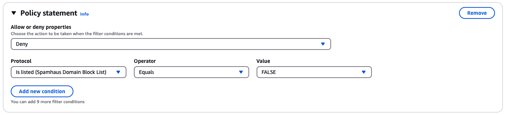
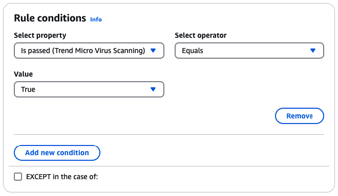

# Email Add Ons

Email Add Ons is a collection of specialized security tools from SES approved
providers that can be used to manage the type of email you allow into your ingress endpoint
and to determine actions to be taken on certain types of email. These tools are certified
security intelligence and enforcement solutions that are ready to be integrated into your
email workflow and can be activated directly from the Mail Manager console.

These Add Ons offer the flexibility to choose from among vetted email security solutions
appropriate to your individual use cases that can be used on a metered-price basis, as
opposed to purchasing a large, single product solution that may not be optimized for any of
your needs. Email Add Ons extends its core threat intelligence and security enforcement
features on a per-workload basis, so there’s no guessing about required capacity. These
benefits allow you to focus on staying ahead of email security issues and maintain high
service standards for your organization.

You can learn more about each Add On directly from the Email Add Ons page located in the
Mail Manager console where you'll have access to product descriptions, key benefits, and pricing
information. Once you decide on an Add On you'd like to use, simply subscribe to it from
Mail Manager console. Once subscribed, you'll be able to select it as a traffic policy condition in
determining email allowed into an ingress endpoint, or as a rule set condition to determine actions
to be taken on specific emails. Primary support for all Add Ons is provided by AWS and
can also be accessed from the Mail Manager console.

The procedure in the next section will walk you through subscribing to an Email Add On in
the Mail Manager console.

## Subscribing to Email Add Ons in the Mail Manager

console

The following procedure shows you how to use the **Email Add Ons**
page in the Mail Manager console to subscribe to an Add On so that it can be used in any of
your traffic policies or rule sets.

###### To subscribe to an Email Add On using the console

1. Sign in to the AWS Management Console and open the Amazon SES console at [https://console.aws.amazon.com/ses/](https://console.aws.amazon.com/ses/ "https://console.aws.amazon.com/ses/").
2. In the left navigation panel, choose **Email Add Ons** under
   **Mail Manager**.
3. On the **Email Add Ons** page, select the title of any
   Add On card to open its overview page where you can learn more about what it
   does, its key benefits, and pricing information. If you'd like to use this
   Add On, choose **Subscribe**.
   - Read the **Terms and Conditions** presented and check
     the **I accept** box followed by
     **Subscribe**.

4. Once you’ve subscribed to an Add On, you’ll be able to integrate it into your
   email workflow by selecting it as a traffic policy condition to deny or allow
   email into your ingress endpoint, or a rule set condition to determine an action
   to take on qualifying messages.

The following examples depict using an Add On in a policy statement condition
and in a rule condition:

###### Traffic policy example using an Add On

Using the **Spamhaus Domain Block List** Add On in a
policy statement condition to block email coming into your ingress endpoint that
originates from a domain listed in Spamhaus:

For details on how to create traffic policies and build policy statement conditions
with Email Add Ons, see [Creating traffic policies and policy statements in
the SES console](eb-filters.md#eb-filters-create-console "eb-filters.md#eb-filters-create-console").

###### Rule condition example using an Add On

Using the **Trend Micro Virus Scanning** Add On in a
rule condition to determine a rule action for email that passes the virus
scan:

For details on how to create rule sets and build rule conditions with
Email Add Ons, see [Creating rule sets and rules in the SES
console](eb-rules.md#eb-rules-create-console "eb-rules.md#eb-rules-create-console"). 5. To view general details or access support for any Add On you're subscribed
to, select its name on the **Email Add Ons** page to open its
overview page:

    * In **General details** you can view the date of when
     you subscribed and the Amazon Resource Name (ARN) of your
     Add On.
    * Select the **Support** tab to access links to AWS
     Support.

6. To unsubscribe from an Add On:
   1. You must first remove it from any of your traffic policies or rule
      sets where you have it defined in a condition; otherwise, the following
      unsubscribe steps will fail.
   2. Select its name on the **Email Add Ons** page to open
      its overview page followed by **Unsubscribe**.
   3. Type `confirm` in the **Confirm** field
      followed by **Unsubscribe**.
