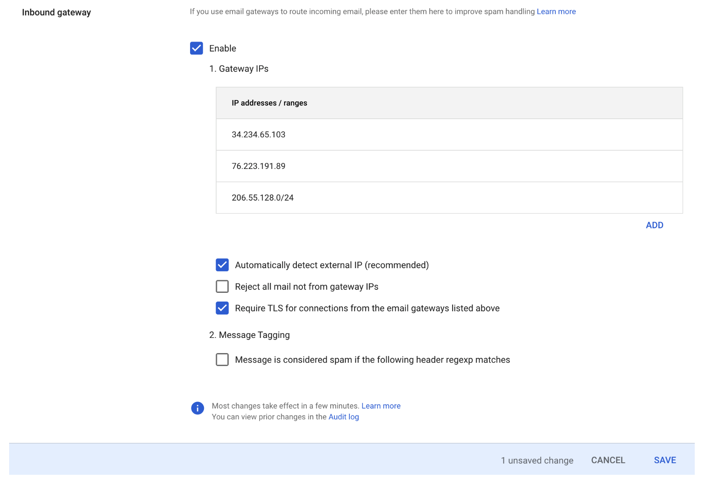
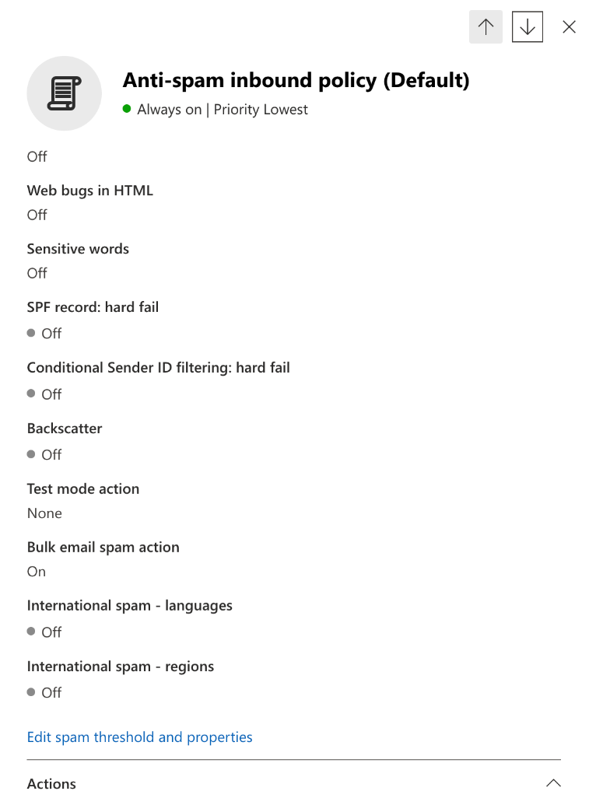
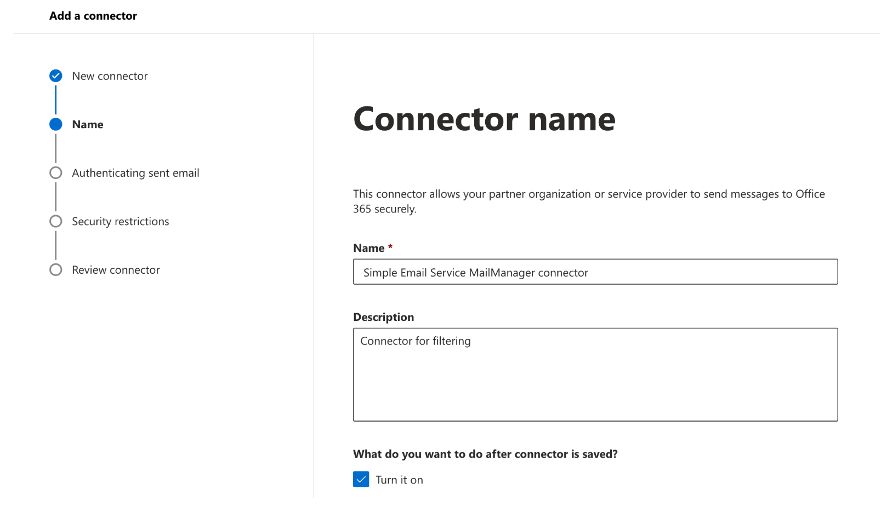
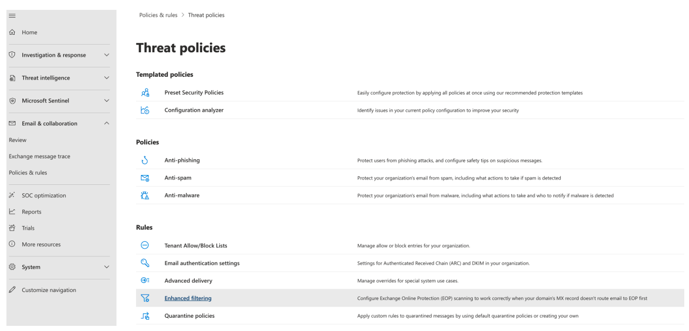
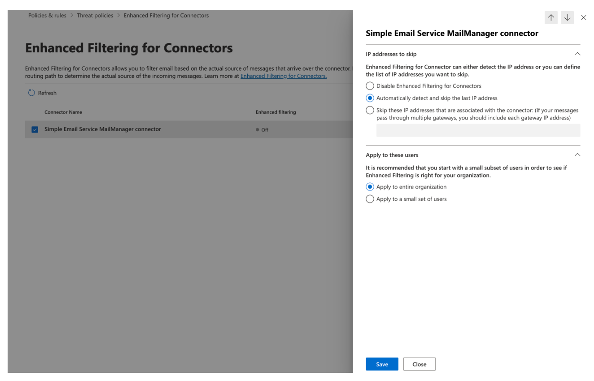

# SMTP relay

Because Mail Manager is deployed between your email environment (such as Microsoft 365, Google
Workspace, or On-Premise Exchange) and the internet, Mail Manager uses SMTP relays to route incoming
emails that are processed by Mail Manager to your email environment. It can also route outbound
emails to another email infrastructure such as another Exchange server or a third-party
email gateway before sending to end recipients.

A SMTP relay is a vital component of your email infrastructure, responsible for efficiently
routing emails between servers when designated by a rule action defined in a rule
set.

Specifically, a SMTP relay can redirect incoming email between SES Mail Manager and an
external email infrastructure such as Exchange, on-premise or third-party email gateways,
and others. Incoming emails to an ingress endpoint will be processed by a rule that will route
specified email to the designated SMTP relay, which in turn, will pass it on to the external
email infrastructure defined in the SMTP relay.

When your ingress endpoint receives email, it uses a traffic policy to determine which emails to
block or allow. The email you allow in passes to a rule set that applies conditional rules
to execute the actions you've defined for specific types of email. One of the rule actions
you can define is _SMTPRelay action_—if you select this action,
the email will be passed along to the external SMTP server defined in your SMTP relay.

For example, you could use the _SMTPRelay action_ to send email from
your ingress endpoint to your on-premise Microsoft Exchange Server. You would set up your Exchange
server to have a _public_ SMTP endpoint that can only be accessed using
certain credentials. When you create the SMTP relay, you enter the server name, port, and
credentials of your Exchange server and give your SMTP relay a unique name, say,
"RelayToMyExchangeServer". Then, you create a rule in your ingress endpoint's rule set that says,
"When _From address_ contains _'gmail.com'_, then
perform _SMTPRelay action_ using the SMTP relay called
_RelayToMyExchangeServer_".

###### Note

All SMTP endpoints you configure with Amazon SES SMTP relay must be public as private SMTP
endpoints are not supported.

Now, when email from _gmail.com_ arrives to your ingress endpoint, the rule
will trigger the _SMTPRelay action_ and contact your Exchange server
using the credentials you provided when creating your SMTP relay and deliver the email to your
Exchange server. Thus, email received from _gmail.com_ is
_relayed_ to your Exchange server.

You must first create an SMTP relay before it can be designated in a rule action. The
procedure in the next section will walk you through creating an SMTP relay in the SES
console.

## Creating an SMTP relay in the SES

console

The following procedure shows you how to use the **SMTP relays** page in
the SES console to create SMTP relays and manage the ones you've already
created.

###### To create and manage SMTP relays using the console

1. Sign in to the AWS Management Console and open the Amazon SES console at [https://console.aws.amazon.com/ses/](https://console.aws.amazon.com/ses/ "https://console.aws.amazon.com/ses/").
2. In the left navigation panel, choose **SMTP relays** under
   **Mail Manager**.
3. On the **SMTP relays** page, select **Create
   SMTP relay**.
4. On the **Create SMTP relay** page, enter a unique name for your
   SMTP relay.
5. Depending on whether you want to configure an inbound (non-authenticated) or
   outbound (authenticated) SMTP relay, follow the respective instructions:

Inbound

###### To configure an inbound SMTP relay

    1. When SMTP relay is used as an inbound gateway to route
     incoming emails processed by Mail Manager to your external email
     environment, you will first need to configure the email
     hosting environment. While every email hosting provider has
     their own GUI and configuration workflow unique to them, the
     principals of configuring them to work with inbound
     gateways, such as your Mail Manager SMTP relay, will be similar.

    To help illustrate this, we have provided examples of how
     to configure Google Workspaces and Microsoft Office 365 to
     work with your SMTP relay as an inbound gateway in the
     following sections:

    	* [Setting up Google
    	 Workspaces](#eb-relay-inbound-google "#eb-relay-inbound-google")
    	* [Setting up Microsoft Office
    	 365](#eb-relay-inbound-ms365 "#eb-relay-inbound-ms365")
    ###### Note

    Ensure that your intended recipient destinations are
     SES verified email identities. For example, if
     you want to deliver email to recipients
     *abc@example.com*,
     *admin@example.com*,
     *postmaster@acme.com*, and
     *support@acme.com*, then we'd
     recommend that you verify the `example.com`
     and `acme.com` domains in SES. If a
     recipient destination is not verified, SES will
     not attempt to deliver the email to the public SMTP
     server.
    2. After you've configured Google Workspaces or Microsoft
     Office 365 to work with inbound gateways, enter the host
     name of the public SMTP server with the values below
     respective to your provider:

    	* Google Workspaces:
    	 `aspmx.l.google.com`
    	* Microsoft Office 365:
    	 `*<your\_domain>*.mail.protection.outlook.com`

    	Replace the dots with "-" in your domain name. For
    	 example, if your domain is
    	 *acme.com*, you would enter
    	 `acme-com.mail.protection.outlook.com`
    3. Enter port number 25 for the public SMTP server.
    4. Leave the Authentication section blank (do not select or
     create a secret ARN).

Outbound

###### To configure an outbound SMTP relay

    1. Enter the host name of the public SMTP server you want
     your relay to connect to.
    2. Enter the port number for the public SMTP server.
    3. Setup authentication for your public SMTP server by
     selecting one of your secrets from **Secret
     ARN**. *If you select a previously
     created secret, it must contain the policies indicated
     in the following steps for creating a new
     secret.*

    	* You have the option to create a new secret by
    	 choosing **Create new**—the
    	 AWS Secrets Manager console will open where you can continue
    	 to create a new key:
    	1. Choose **Other type of secret**
    	 in **Secret type**.
    	2. Enter the following keys and values in
    	 **Key/value pairs**:

    	| Key | value |
    	| --- | --- |
    	| `username` | *my\_username* |
    	| `password` | *my\_password* |

    	###### Note

    	For both of the keys, you must only enter
    	 `username` and `password` as
    	 shown (anything else will cause authentication to
    	 fail). For the values, enter your own username and
    	 password respectively.
    	3. Select **Add new key** to create
    	 a KMS customer managed key (CMK) in **Encryption
    	 key**—the AWS KMS console will
    	 open.
    	4. Choose **Create key** on the
    	 **Customer manged keys**
    	 page.
    	5. Keep the default values on the **Configure
    	 key** page and select
    	 **Next**.
    	6. Enter a name for your key in
    	 **Alias** (optionally, you can
    	 add a description and tag), followed by
    	 **Next**.
    	7. Select any users (other than yourself) or roles
    	 you want to permit to administer the key in
    	 **Key administrators** followed
    	 by **Next**.
    	8. Select any users (other than yourself) or roles
    	 you want to permit to use the key in **Key
    	 users** followed by
    	 **Next**.
    	9. Copy and paste the [KMS CMK policy](eb-policies.md#eb-policies-relay-cmk "eb-policies.md#eb-policies-relay-cmk") into
    	 the **Key policy** JSON text editor
    	 at the `"statement"` level by adding it
    	 as an additional statement separated by a comma.
    	 Replace the region and account number with your
    	 own.
    	10. Choose **Finish**.
    	11. Select your browser's tab where you have the
    	 AWS Secrets Manager **Store a new secret**
    	 page open and select the *refresh
    	 icon* (circular arrow) next to the
    	 **Encryption key** field, then
    	 click inside the field and select your newly created
    	 key.
    	12. Enter a name in the **Secret
    	 name** field on the **Configure
    	 secret** page.
    	13. Select **Edit permissions** in
    	 **Resource permissions**.
    	14. Copy and paste the [Secrets resource
    	 policy](eb-policies.md#eb-policies-relay-secrets "eb-policies.md#eb-policies-relay-secrets")
    	 into the **Resource permissions**
    	 JSON text editor and replace the region and account
    	 number with your own. (Be sure to delete any example
    	 code in the editor.)
    	15. Choose **Save** followed by
    	 **Next**.
    	16. Optionally configure rotation followed by
    	 **Next**.
    	17. Review and store your new secret by choosing
    	 **Store**.
    	18. Select your browser's tab where you have the
    	 SES **Create SMTP relay**
    	 page open and choose **Refresh
    	 list**, then select your newly created
    	 secret in **Secret ARN**.

6. Select **Create SMTP relay**.
7. You can view and manage the SMTP relays you've already created from the
   **SMTP relays** page. If there's an SMTP relay you want to
   remove, select it's radio button followed by **Delete**.
8. To edit an SMTP relay, select its name. On the details page, you can change the
   relay's name, the external SMTP server's name, port, and login credentials by
   selecting the corresponding **Edit** or
   **Update** button followed by **Save
   changes**.

## Setting up Google Workspaces for inbound

(non-authenticated) SMTP relay

The following walkthrough example shows you how to setup Google Workspaces to work
with a Mail Manager inbound (non-authenticated) SMTP relay.

**Prerequisites**

- Access to the Google administrator console ([Google administrator console](https://admin.google.com/ "https://admin.google.com/") > Apps
  > Google Workspace > Gmail).
- Access to the domain nameserver hosting the MX records for the domains which
  will be used for Mail Manager setup.

###### To setup Google Workspaces to work with an inbound SMTP relay

- **Add Mail Manager IP addresses to the Inbound gateway
  configuration**
  1.  In the [Google administrator
      console](https://admin.google.com/ "https://admin.google.com/"), go to **Apps > Google Workspace >
      Gmail**.
  2.  Select **Spam, Phishing, and Malware**, then go to
      **Inbound gateway** configuration.
  3.  Enable **Inbound gateway**, and configure it with the
      following details:

  

      + In **Gateway IPs**, select **Add** , and add the ingress endpoint IPs specific to your region
       from the [SMTP
       Relay IP Ranges](../../../general/latest/gr/ses.md#ses_mm_relay_ip_ranges "../../../general/latest/gr/ses.md#ses_mm_relay_ip_ranges") table.
      + Select **Automatically detect external
       IP**.
      + Select **Require TLS for connections from the email
       gateways listed above**.
      + Select **Save** at the bottom of the dialog
       box to save the configuration. Once saved, the administrator
       console will show the **Inbound gateway** as
       enabled.

## Setting up Microsoft Office 365 for inbound

(non-authenticated) SMTP relay

The following walkthrough example shows you how to setup Microsoft Office 365 to work
with a Mail Manager inbound (non-authenticated) SMTP relay.

**Prerequisites**

- Access to the Microsoft Security admin center ([Microsoft Security admin
  center](https://security.microsoft.com/homepage "https://security.microsoft.com/homepage") > Email & collaboration > Policies & Rules > Threat
  policies).
- Access to the domain nameserver hosting the MX records for the domains which
  will be used for Mail Manager setup.

###### To setup Microsoft Office 365 to work with an inbound SMTP relay

1. **Add Mail Manager IP addresses to the Allow list**
   1. In the [Microsoft
      Security admin center](https://security.microsoft.com/homepage "https://security.microsoft.com/homepage"), go to **Email &
      collaboration > Policies & Rules > Threat
      policies**.
   2. Select **Anti-spam** under
      **Polices**.
   3. Select **Connection filter policy** followed by
      **Edit connection filter policy**.
      - In the **Always allow messages from the following IP
        addresses or address range** dialog, add the
        ingress endpoint IPs specific to your region from the [SMTP
        Relay IP Ranges](../../../general/latest/gr/ses.md#ses_mm_relay_ip_ranges "../../../general/latest/gr/ses.md#ses_mm_relay_ip_ranges") table.
      - Select **Save**.

   4. Return to the **Anti-spam** option and choose
      **Anti-spam inbound policy**.
      - At the bottom of the dialog, select **Edit spam
        threshold and properties**:

      
      - Scroll to **Mark as spam** and ensure that
        **SPF record: hard fail** is set to
        **Off**.
      - Select **Save**.

2. **Enhanced Filtering configuration (recommended)**

This option will allow Microsoft Office 365 to properly identify the original
connecting IP before the message was received by SES Mail Manager.

    1. **Create an inbound connector**

    	* Login to the new [Exchange admin center](https://admin.exchange.microsoft.com/#/homepage "https://admin.exchange.microsoft.com/#/homepage") and go to **Mail
    	 flow** > **Connectors**.
    	* Select **Add a connector**.
    	* In **Connection from**, select
    	 **Partner organization** followed by
    	 **Next**.
    	* Fill in the fields as follows:

    		+ **Name** – Simple Email
    		 Service Mail Manager connector
    		+ **Description** – Connector
    		 for filtering

    		
    	* Select **Next**.
    	* In **Authenticating sent email**, select
    	 **By verifying that the IP address of the sending
    	 server matches one of the following IP addresses, which
    	 belong to your partner organization** and add the
    	 ingress endpoint IPs specific to your region from the [SMTP
    	 Relay IP Ranges](../../../general/latest/gr/ses.md#ses_mm_relay_ip_ranges "../../../general/latest/gr/ses.md#ses_mm_relay_ip_ranges") table.

    	
    	* Select **Next**.
    	* In **Security restrictions**, accept the
    	 default **Reject email messages if they aren’t sent over
    	 TLS** setting, followed by
    	 **Next**.
    	* Review your settings and select **Create
    	 connector**.
    2. **Enable enhanced filtering**

    Now that the inbound connector has been configured, you will need to
     enable the enhanced filtering configuration of the connector in the
     **Microsoft Security admin center**.

    	* In the [Microsoft Security admin center](https://security.microsoft.com/homepage "https://security.microsoft.com/homepage"), go to
    	 **Email & collaboration > Policies & Rules >
    	 Threat policies**.
    	* Select **Enhanced filtering** under
    	 **Rules**.

    	
    	* Select the **Simple Email Service Mail Manager
    	 connector** that you created previously to edit its
    	 configuration parameters.
    	* Select both **Automatically detect and skip the last
    	 IP address** and **Apply to entire
    	 organization**.

    	
    	* Select **Save**.
