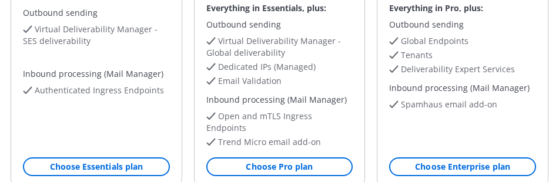
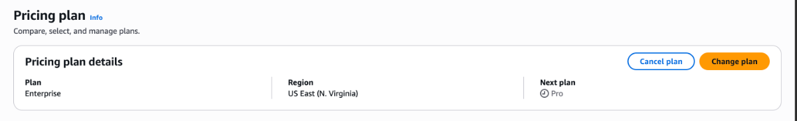

# Pricing plans

With Amazon Simple Email Service (SES) pricing plans, you get simpler billing, packaged
features, and volume discounts. You choose a single plan that combines the
capabilities you need at a lower overall cost. When your sending needs grow,
you can upgrade your plan at any time.

Amazon SES offers three plans—Essentials, Pro, and Enterprise. Each plan includes
everything in the plans before it, plus additional features. For more information
about pricing and plan comparisons, see [Amazon SES Pricing](https://aws.amazon.com/ses/pricing/ "https://aws.amazon.com/ses/pricing/").

With a pricing plan, you know which feature charges your plan covers and
which ones you pay for as optional add-ons. When you choose a plan, no features
turn on automatically. You still enable or disable each feature individually,
regardless of which plan you choose. Turn on and start using the features that
your plan includes to get the most value from it.

## Choose and manage your plan

You select and manage your pricing plan on the Amazon SES console
**Pricing plan** page. Plans apply for each account and
each AWS Region, so you manage your plan separately in each Region
where you use Amazon SES.

The **Pricing plan** page shows your current plan name,
the AWS Region, and your next plan if you have a change scheduled.

### Choosing a plan

If you do not have a plan, you are on à la carte pricing (pay-per-use
pricing for individual features). To choose a plan, use one of the
following methods:

- ****Pricing plan**
  page** – Open the **Pricing plan** page in
  the Amazon SES console, review the available plans (Essentials, Pro, and
  Enterprise), and choose the plan that fits your needs.
- ****Get set up**
  wizard** – New customers can choose a plan during the Amazon SES
  **Get set up** wizard in the **Select pricing
  plan** step.

The following screenshot shows the plan options and
**Choose plan** buttons on the **Pricing
plan** page.

### Changing or canceling your plan

You can change or cancel your plan from the **Pricing
plan** page in the Amazon SES console. The page displays your
**Plan** and **Region**, and shows a
**Next plan** field when you have a scheduled plan
change, indicating which plan your account moves to at the next
billing cycle.

- **Change your plan** – Choose
  **Change plan** to switch to a different plan
  (Essentials, Pro, or Enterprise).
- **Cancel your plan** – Choose
  **Cancel plan** to return to à la carte
  pricing.

The following screenshot shows the **Pricing plan
details** card.

#### When plan changes take effect

Upgrades take effect immediately when you submit the request. If
you did not explicitly choose a plan and were defaulted to the
Essentials plan, your first downgrade or cancellation to à la carte
pricing also takes effect immediately. All other downgrades or
cancellations take effect at the start of your next billing cycle.
