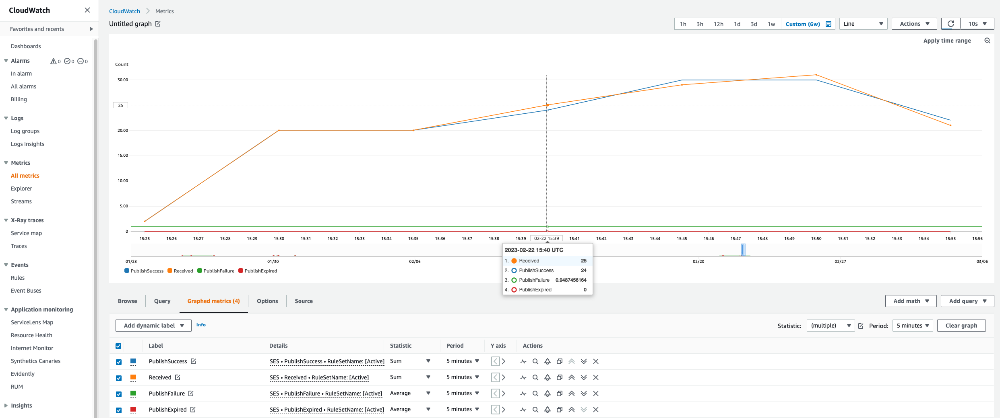
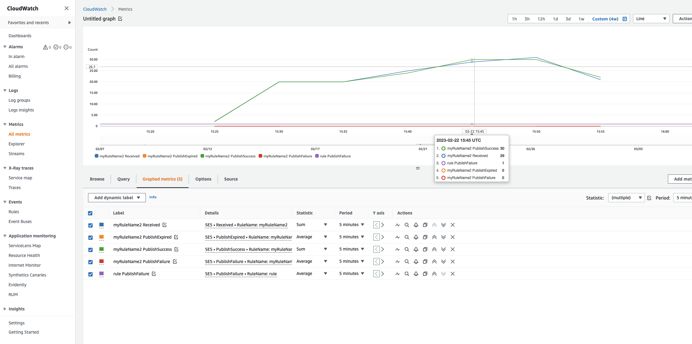

# Viewing metrics for Amazon SES email receiving

If you've enabled email receiving in Amazon SES and you've created receipt rules for your
email, you can view the metrics for those receipt rule sets and rules using Amazon CloudWatch.

In the CloudWatch console, you'll find the metrics under **Metrics** >
**All metrics** > **SES** > **Receipt
Rule Set Metrics** and **Receipt Rule Metrics**.

###### Note

**Receipt Rule Set Metrics** and **Receipt Rule
Metrics** will not appear under **SES** if you have
not yet:

- [enabled email
  receiving](receiving-email-setting-up.md "receiving-email-setting-up.md")
- [created any
  receipt rules](receiving-email-receipt-rules-console-walkthrough.md "receiving-email-receipt-rules-console-walkthrough.md")
- received any mail that would match any of your rules.
  The following message metrics are available:

- Message receiving

| Scope                    | Metric         | Description                                                                                                                    | Dimension   |
| ------------------------ | -------------- | ------------------------------------------------------------------------------------------------------------------------------ | ----------- | ---------------------------------------------------------------------------------------------------------------------------------------------------------------------------------------------------------------------------------------------------------------------------------------------------------------------------------------------------------------------------------------------------------------------------------------------------------------------------------------------------------------------------------------------------------------------------------------------------------------------------------------------------------------------------------------------------------------------------------------------------------------------------------------------------------------------------------------------------------------------------------------------------------------------------------------------------------------------------------------------------------------------------------------------------------------------------------------------------------------------------------------------------------------------------------------------------------------------------------------------------------------------------------------------------------------------------------------------------------------------- |
| Receipt Rule Set Metrics | Received       | SES successfully received a message that has at least one rule that applies. This metric can only have a value of `1`.         | RuleSetName |
| Receipt Rule Metrics     | Received       | SES successfully received a message and will try to process the applied rule. This metric can only have a value of `1`.        | RuleName    |  • Message publishing                                                                                                                                                                                                                                                                                                                                                                                                                                                                                                                                                                                                                                                                                                                                                                                                                                                                                                                                                                                                                                                                                                                                                                                                                                                                                                                                               |
| Scope                    | Metric         | Description                                                                                                                    | Dimension   |
| ---                      | ---            | ---                                                                                                                            | ---         |
| Receipt Rule Set Metrics | PublishSuccess | SES successfully executed all rules that apply within a rule set.                                                              | RuleSetName |
| Receipt Rule Metrics     | PublishSuccess | SES successfully executed a rule that applies to the receiving message.                                                        | RuleName    |
| Receipt Rule Set Metrics | PublishFailure | SES encountered an error when it tried to execute rules within a rule set, execution will be retried.                          | RuleSetName |
| Receipt Rule Metrics     | PublishFailure | SES encountered an error when it tried to execute the actions in a rule—depending on the error, execution may be retried.      | RuleName    |
| Receipt Rule Set Metrics | PublishExpired | SES will no longer retry to execute the rules because they didn't succeed within 36 hours, or encountered non-retriable error. | RuleSetName |
| Receipt Rule Metrics     | PublishExpired | SES will no longer retry to execute the rule's actions because they didn’t succeed within 36 hours.                            | RuleName    | ###### Note  • In the preceding tables, the term _applies_ means that the sender is not blocklisted by IP Filters or is on SES's internal blocklist, and the rule has matching recipient conditions and matching TLS policy.  • Publish failure errors can occur, for example, if you deleted or revoked permissions to an Amazon S3 bucket, Amazon SNS topic, or Lambda function that an action in one of your receipt rules was configured to use.  • Because only one rule set can be active at a time, SES publishes an aggregate metric displayed as _RuleSetName:[Active]_ for all rules sets that were active for the time range you select in CloudWatch. This has the advantage of letting you freely change rule sets without any change to your alarming setup. ###### Important Changes you make to fix your receipt rule set will apply only to emails that Amazon SES receives after the update. Emails are always evaluated against the receipt rule set that was in place at the time the email was received. Metrics for an SES _receipt rule set_ displayed in the CloudWatch console.  Metrics for an SES _receipt rule_ displayed in the CloudWatch console.  |
