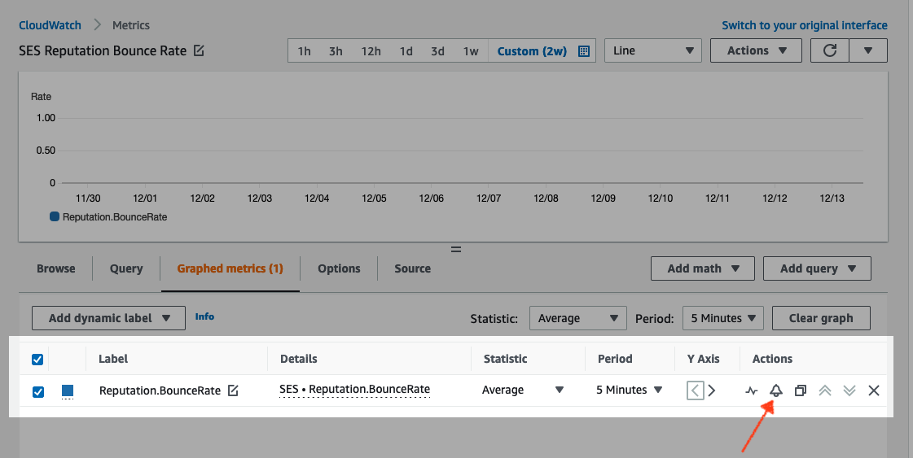

# Creating reputation monitoring alarms

using CloudWatch

Amazon SES automatically publishes a series of reputation-related metrics to Amazon CloudWatch. You can
use these metrics to create alarms that notify you when your bounce or complaint rates reach
levels that could impact your account's ability to send email.

###### Note

The CloudWatch portion of the procedures in this section are intended to just present the
core steps for setting up a CloudWatch alarm to monitor your SES sender reputation.
They don't explore advanced configurations regarding optional settings for CloudWatch alarms.
For complete information about configuring CloudWatch alarms, see [Using Amazon CloudWatch alarms](../../../AmazonCloudWatch/latest/monitoring/AlarmThatSendsEmail.md "../../../AmazonCloudWatch/latest/monitoring/AlarmThatSendsEmail.md") in the
_Amazon CloudWatch User Guide_.

###### Prerequisites

- Create an Amazon SNS topic, and then subscribe to it using your preferred endpoint
  (such as email or SMS). For more information, see [Creating an Amazon SNS topic](../../../sns/latest/dg/sns-tutorial-create-topic.md "../../../sns/latest/dg/sns-tutorial-create-topic.md")
  and [Subscribing to an Amazon SNS topic](../../../sns/latest/dg/sns-tutorial-create-subscribe-endpoint-to-topic.md "../../../sns/latest/dg/sns-tutorial-create-subscribe-endpoint-to-topic.md") in the
  _Amazon Simple Notification Service Developer Guide_.
- If you've never sent an email in the current Region, you might not see the
  **SES** namespace. To ensure that you have metrics, send a test
  email to the [mailbox simulator](send-an-email-from-console.md#send-email-simulator "send-an-email-from-console.md#send-email-simulator").

###### To create a CloudWatch alarm to monitor sending reputation

1. Sign in to the AWS Management Console and open the Amazon SES console at [https://console.aws.amazon.com/ses/](https://console.aws.amazon.com/ses/ "https://console.aws.amazon.com/ses/").
2. In the navigation pane on the left side of the screen, choose **Reputation
   metrics**.
3. On the **Reputation metrics** page under the
   **Account-level** tab, in either the **Bounce
   rate** or **Complaint rate** pane, choose
   **View in CloudWatch** - this will open the CloudWatch console with your
   chosen metric.
4. Under the **Graphed metrics** tab, on the line of your chosen
   metric, for this example, **Reputation.BounceRate**, choose the
   _alarm bell_ icon in the **Actions** column
   (see image below) - this will open the **Specify metric and
   conditions** page.

 5. Scroll down to the **Conditions** pane, and choose
**Static** in the **Threshold type**
field.

    1. In the **Whenever `metric`
     is...** field, choose
     **Greater/Equal**.
    2. In the **than...** field, specify the value that should
     cause CloudWatch to raise an alarm.

    	* If you're creating an alarm to monitor your bounce rate, note that
    	 Amazon SES recommends that you maintain a bounce rate under 5%. If the
    	 bounce rate for your account is greater than 10%, we might pause
    	 your account's ability to send email. For this reason, you should
    	 configure CloudWatch to send you a notification when the bounce rate for
    	 your account is greater than or equal to 0.05 (5%).
    	* If you're creating an alarm to monitor your complaint rate, note
    	 that Amazon SES recommends that you maintain a complaint rate under 0.1%.
    	 If the complaint rate for your account is greater than 0.5%, we
    	 might pause your account's ability to send email. For this reason,
    	 you should configure CloudWatch to send you a notification when the
    	 complaint rate for your account is greater than or equal to 0.001
    	 (0.1%).
    3. Expand **Additional configuration** and choose
     **Treat missing data as ignore (maintain the alarm
     state)** in the **Missing data treatment**
     field.
    4. Choose **Next**.

6. On the **Configure actions** pane, choose **In
   Alarm** in the **Alarm state trigger** field.
   1. Choose **Select an existing SNS topic** in the
      **Select an SNS topic** field.
   2. Choose the topic that you created and subscribed to in the prerequisites
      in the **Send a notification to...** search box.
   3. Choose **Next**.

7. On the **Add name and description** pane, enter a name and
   description for the alarm, and then choose **Next**.
8. On the **Preview and create** pane, confirm your settings, and if
   satisfied, choose **Create alarm**. If there's something you'd like
   to change, select the **Previous** button for each section you'd
   like to go back to and edit.
