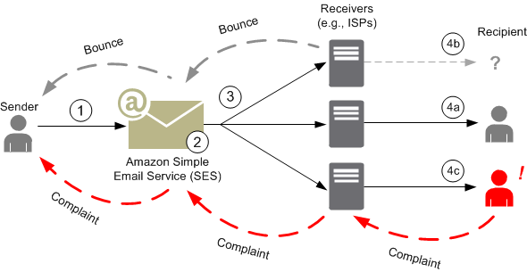
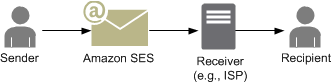
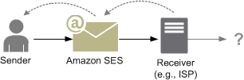
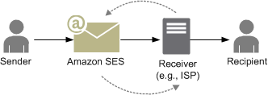
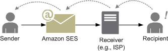
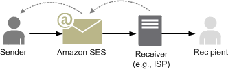

# How email sending works in Amazon SES

This topic describes what happens when you send an email with SES, and the various
outcomes that can occur after the email is sent. The following figure is a high-level
overview of the sending process:

######

1.  A client application, acting as an email sender, makes a request to SES to
    send email to one or more recipients.
2.  If the request is valid, SES accepts the email.
3.  SES sends the message over the Internet to the recipient's receiver. Once
    the message is passed to SES, it is usually sent immediately, with the first
    delivery attempt normally occurring within milliseconds.
4.  At this point, there are different possibilities. For example:

        1. The ISP successfully delivers the message to the recipient's inbox.
        2. The recipient's email address does not exist, so the ISP sends a bounce
         notification to SES. SES then forwards the notification to the
         sender.
        3. The recipient receives the message but considers it to be spam and
         registers a complaint with the ISP. The ISP, which has a feedback loop set
         up with SES, sends the complaint to SES, which then forwards
         it to the sender.

    The following sections review the individual possible outcomes after a sender sends an
    email request to SES and after SES sends an email message to the recipient.

## After a sender sends an

email request to SES

When the sender makes a request to SES to send an email, the call may succeed
or fail. The following sections describe what happens in each case.

### Successful

sending request

If the request to SES succeeds, SES returns a success response to
the sender. This message includes the _message ID_, a string of
characters that uniquely identifies the request. You can use the message ID to
identify the sent email or to track problems encountered during sending (you must
[store your own mapping](faqs-enforcement.md#cm-feedback-loop-q8 "faqs-enforcement.md#cm-feedback-loop-q8") between an
identifier and the SES message ID that SES passes back to you when it
accepts the email). SES then assembles an email message based on the request
parameters, scans the message for questionable content and viruses and then sends it
out over the Internet using Simple Mail Transfer Protocol (SMTP). Your message is
usually sent immediately; the first delivery attempt typically occurs within
milliseconds.

###### Note

If SES accepts the sender's request and then determines that the
message contains a virus, SES stops processing the message and doesn't
attempt to deliver it to the recipient's mail server.

### Failed sending

request

If the sender's email-sending request to SES fails, SES responds to
the sender with an error and drops the email. The request could fail for several
reasons. For example, the request may not be formatted properly or the email address
may not have been verified by the sender.

The method through which you can determine if the request has failed depends on
how you call SES. The following are examples of how errors and exceptions are
returned:

- If you are calling SES through the Query (HTTPS) API
  (`SendEmail` or `SendRawEmail`), the actions will
  return an error. For more information, see the [Amazon Simple Email Service API Reference](../APIReference.md "../APIReference.md").
- If you are using an AWS SDK for a programming language that uses
  exceptions, the call to SES will throw a
  _MessageRejectedException_. (The name of the
  exception may vary slightly depending on the SDK.)
- If you are using the SMTP interface, then the sender receives an SMTP
  response code, but how the error is conveyed depends on the sender's client.
  Some clients may display an error code; others may not.

For information about errors that can occur when you send an email with
SES, see [Amazon SES email sending errors](troubleshoot-error-messages.md "troubleshoot-error-messages.md").

## After Amazon SES sends an

email

If the sender's request to SES succeeds, then SES sends the email and
one of the following outcomes occurs:

- Successful delivery and the recipient does not object to
  the email – The email is accepted by the ISP, and the ISP
  delivers the email to the recipient. A successful delivery is shown in the
  following figure.

- Hard bounce – The email is rejected by
  the ISP because of a persistent condition or rejected by SES because the
  email address is on the SES suppression list. An email address is on the
  SES suppression list if it has recently caused a hard bounce for any
  SES customer. A hard bounce with an ISP can occur because the recipient's
  address is invalid. A hard bounce notification is sent from the ISP back to
  SES, which notifies the sender through email or through Amazon Simple Notification Service
  (Amazon SNS), depending on the sender's setup. SES notifies the sender of
  suppression list bounces by the same means. The path of a hard bounce from an
  ISP is shown in the following figure.

- Soft bounce – The ISP cannot deliver the
  email to the recipient because of a temporary condition, such as the ISP is too
  busy to handle the request or the recipient's mailbox is full. A soft bounce can
  also occur if the domain does not exist. The ISP sends a soft bounce
  notification back to SES, or, in the case of a nonexistent domain,
  SES cannot find an email server for the domain. In either case,
  SES retries the email for an extended period of time. If SES
  cannot deliver the email in that time period, it sends you a bounce notification
  through email or through Amazon SNS. If SES can deliver the email to the
  recipient during a retry, the delivery is successful. A soft bounce is shown in
  the following figure. In this case, SES retries sending the email, and
  the ISP is eventually able to deliver it to the recipient.

- Complaint – The email is accepted by the
  ISP and delivered to the recipient, but the recipient considers the email to be
  spam and clicks a button such as "Mark as spam" in his or her email client. If
  SES has a feedback loop set up with the ISP, then a complaint
  notification is sent to SES, which forwards the complaint notification to
  the sender. Most ISPs do not provide the email address of the recipient who
  submitted the complaint, so the complaint notification from SES provides
  the sender a list of recipients who might have sent the complaint, based on the
  recipients of the original message and the ISP from which SES received
  the complaint. The path of a complaint is shown in the following figure.

- Auto response – The email is accepted by
  the ISP, and the ISP delivers it to the recipient. The ISP then sends an
  automatic response such as an out-of-the-office (OOTO) message to SES.
  SES forwards the auto response notification to the sender. An auto
  response is shown in the following figure.

Make sure that your SES-enabled program does not retry sending messages
that generate an auto response.

###### Tip

You can use the SES mailbox simulator to test a successful
delivery, bounce, complaint, OOTO, or what happens when an address is on the
suppression list. For more information, see [Using the mailbox simulator manually](send-an-email-from-console.md#send-email-simulator "send-an-email-from-console.md#send-email-simulator").
