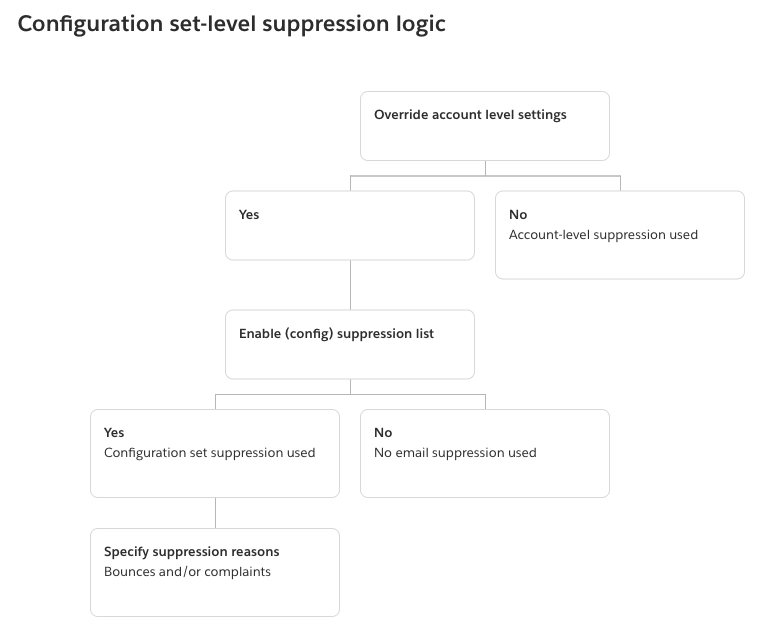

# Using configuration set-level

suppression to override your account-level suppression list

While the account-level suppression list is set for your entire account, you can customize
it separately for different configuration sets by overriding it with configuration set-level
suppression. This finer granularity allows you to use customized suppression settings for
different email sending groups that you've assigned to their own configuration sets. For
example, let's say your account-level suppression list is configured for both bounce and
complaint addresses to be added, but you have a particular email demographic defined in a
configuration set for which you're only interested in complaint addresses being added - you
would achieve this by enabling this configuration set's suppression overrides so that email
addresses are added to your account-level suppression list just for complaints (not bounces
and complaints like is set in your account-level suppression list) from email sent with this
configuration set.

With configuration set-level suppression, there are different levels of overriding your
account-level suppression, including not using any suppression at all. To help understand
these various levels of suppression that can be set in the following console procedures, the
following relationship map models the decision set of choices you can make for the enabling
or disabling of various levels of overrides, that depending on their combination, can be
used to implement three different levels of suppression:

- No overrides (default) – the configuration
  set uses your account-level suppression list settings.
- Override account level settings – this will
  negate any account-level suppression list settings; email sent with this
  configuration set will not use any suppression settings at all.
- Override account level settings with configuration set-level
  suppression enabled – email sent with this configuration set will
  only use the suppression conditions you enabled for it (bounces, complaints, or
  bounces and complaints) - regardless of what your account-level suppression list
  settings are, it will override them.

###### Note

For any suppression condition _not_ specified at the
configuration set-level, suppression behavior will fall back to the global
suppression list since account-level settings have been overridden.

Keep in mind that configuration set-level suppression is not an actual suppression
_list_, rather, it's simply a mechanism to override your
account-level suppression list with custom suppression settings defined in a configuration
set - this means any email sent using the configuration set will only use its own
suppression settings and ignore any account-level suppression settings. In other words,
configuration set-level suppression is interacting with your account-level suppression list
by simply changing (overriding) the suppression reasons that determine what email addresses
get added to your account-level suppression list.

## Enabling configuration

set-level suppression

###### To enable configuration set-level suppression using the Amazon SES new

console:

1. Sign in to the AWS Management Console and open the Amazon SES console at [https://console.aws.amazon.com/ses/](https://console.aws.amazon.com/ses/ "https://console.aws.amazon.com/ses/").
2. In the navigation pane, under **Configuration**, choose
   **Configuration sets**.
3. In **Configuration sets**, choose the name of the
   configuration set you want to configure with customized suppression.
4. In the **Suppression list options** pane, choose
   **Edit**.
5. The **Suppression list options** section provides a decision
   set to define customized suppression starting with the option to use this
   configuration set to override your account-level suppression. The [configuration
   set-level suppression logic map](sending-email-suppression-list-config-level.md "sending-email-suppression-list-config-level.md") will help you understand the effects
   of the override combinations. These multitiered selections of overrides can be
   combined to implement three different levels of suppression:
   1. **Use account-level suppression:** Do not override
      your account-level suppression and do not implement any configuration
      set-level suppression - basically, any email sent using this
      configuration set will just use your account-level suppression. To do
      this:
      1. In **Suppression list settings**, uncheck the
         **Override account level settings**
         box.

   2. **Do not use any suppression:** Override your
      account-level suppression without enabling any configuration set-level
      suppression - this means any email sent using this configuration set
      will not use any of your account-level suppression; in other words, all
      suppression is cancelled. To do this:
      1. In **Suppression list settings**, check the
         **Override account level settings**
         box.
      2. In **Suppression list**, uncheck the
         **Enabled** box.

   3. **Use configuration set-level suppression:** Override
      your account-level suppression list with custom suppression settings
      defined in this configuration set - this means any email sent using this
      configuration set will only use its own suppression settings and ignore
      any account-level suppression settings. To do this:
      1. In **Suppression list settings**, check the
         **Override account level settings** box.
      2. In **Suppression list**, check
         **Enabled**.
      3. In **Specify the reason(s)...**, select one
         of the suppression reasons for this configuration set to
         use.

6. Choose **Save changes**.
