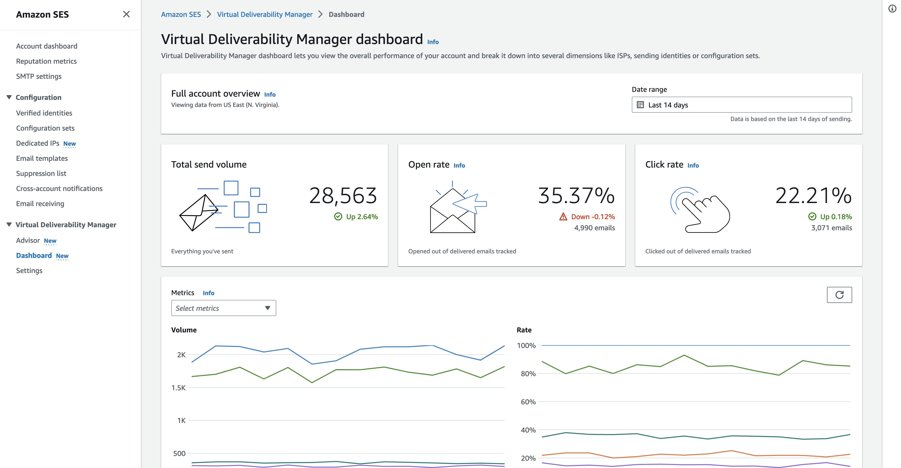
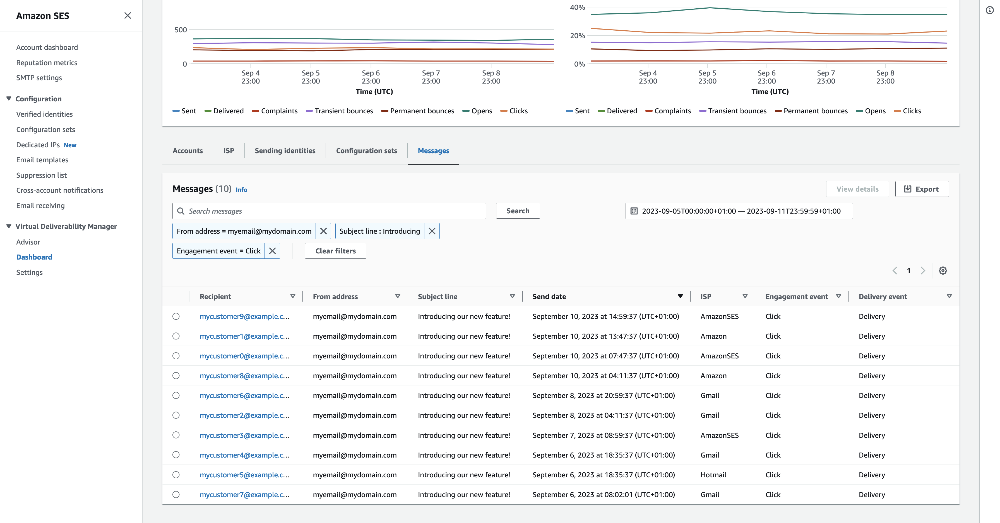

# Virtual Deliverability Manager dashboard

The dashboard offers high level views of your account’s deliverability program, such as
easy to read cards and time series graphs that show deliverability and reputation through
open/click and delivery rates and bounce/complaint stats. The dashboard also offers a more
detailed view, enabling you to drill down to more detailed specific table data when there’s
an issue that's tied to a particular ISP, sending identity, or configuration set that's
associated with an email campaign.

Being able to see things from a high overall level with the ability to also view the
specific details allows you to focus on the problematic areas of your deliverability rather
than needing to review your email program as a whole. This level of insight also gives you
the ability to catch trends and possible problems before they turn into larger
deliverability problems, like deferrals or blocks.

An account overview in the Virtual Deliverability Manager dashboard showing the cards and time series
graphs.


The _Messages_ table selected in the Virtual Deliverability Manager dashboard showing sent
messages matching the date range and filter criteria.


Granular data provided by the dashboard can help you to improve your sender reputation and
calculate ideal times and dates for better engagement and conversions for your email program
with the ability to drill-down to specific data sets:

- ISP data – Valuable
  when you have a deliverability issue to a specific ISP or mailbox
  provider—instead of trying to adjust your entire account, which may otherwise
  be doing well, you can focus on the problematic endpoint and align with its best
  practices to improve sender reputation to that ISP and restore good inbox
  deliverability to reach your recipients. It's also important to understand your ISP
  distribution—as you may send more heavily to one ISP or mailbox provider than
  to others. You need to ensure that traffic is always being delivered and engaged by
  the end recipients to have a positive impact your email conversion.
- Sending identity &
  configuration set data – Useful in helping you to identify
  sending identities and configuration sets that are contributing to your overall
  account deliverability issue. You can focus on those specifically, adjust your
  configurations, and possibly reduce sending with a particular identity until the
  issue is resolved. For example, a sending identity accidentally sent to a
  suppression list, resulting in all traffic going through that identity. That
  identity is associated with a configuration set, causing deliverability issues. It’s
  valuable in such cases to be able to identify the sending identity or configuration
  set so that you can focus on rectifying that problem specifically, rather than
  combing through your entire account to try to identify the root cause of the
  deliverability issue.
  Drill-down data displayed in the Virtual Deliverability Manager dashboard for the selected sending identity,
  _example.com_—cards display deliverability and reputation
  metrics. The table displays all of the ISPs that the sending identity sent mail to with
  metric rates for each ISP within the date range entered.


## Using the Virtual Deliverability Manager dashboard in the Amazon SES

console

The following procedure shows you how to use the Virtual Deliverability Manager dashboard in the Amazon SES console
to view your overall deliverability and reputation statistics and to drill-down into
problematic areas.

###### To use the Virtual Deliverability Manager dashboard to view high level and more detailed data of your

account’s deliverability metrics

1. Sign in to the AWS Management Console and open the Amazon SES console at [https://console.aws.amazon.com/ses/](https://console.aws.amazon.com/ses/ "https://console.aws.amazon.com/ses/").
2. In the left navigation pane, choose **Dashboard** under
   **Virtual Deliverability Manager**.

###### Note

    * **Dashboard** will not be visible if you haven't
     enabled Virtual Deliverability Manager for your account. For more information, see [Getting started with Virtual Deliverability Manager](vdm-get-started.md "vdm-get-started.md").
    * Dashboard metrics are displayed in near real-time.
    * Dashboard messages are displayed within a few minutes from send time.

3.  In the **Full account
    overview** panel, choose a date range to be used for all metrics in
    the cards, time series graphs, and drill-down tables.
    1. In the **Date range** field, choose
       **Relative range** (default) or **Absolute
       range**.
       - **Relative range** – Select the radio
         button that corresponds with the number of days desired.
         - _Custom range_ – Enter a
           range in either days (up to 60), weeks (up to 8), or
           months (up to 2).

       - **Absolute range** – The first date
         you choose will be the _Start date_, the
         second date will be the _End date_, not to
         exceed 60 days total. To specify a single day, choose it for
         both the _Start_ and _End
         date_.

    ###### Note

    The following applies to all date ranges in the dashboard:

        * All dates & times are UTC.
        * For **Relative range** dates, the last
         day ends on its UTC midnight timestamp. For example, if you
         choose *Last 7 days*, the seventh day
         would be yesterday, ending at midnight.
        * If the date range is greater than 30 days, the *%
         Difference* column in the *Account
         statistics* table and the change percentages
         in the cards will not have a value (indicated by dash
         `-`).

    [Show moreShow less](# "#")

4.  The cards, time series graphs, and all of the drill-down tables,
    _Accounts statistics_, _ISP_,
    _Sending identities_, and _Configuration
    sets_, display metric totals calculated from the date range
    entered, and use the metric math described in [How dashboard metrics are
    calculated](#vdm-dashboard-rates "#vdm-dashboard-rates").
    - To create a local `.csv` file of the data you’re currently
      viewing in either the _ISP_, _Sending
      identities_, or _Configuration sets_
      table, select its **Export** button.

5.  Time series graphs charting
    **Volume** and **Rate** progression for
    the date range you entered are shown in the **Metrics** pane.
    Hovering over a date interval in the graphs will show the exact volume count or
    rate percentage based on a daily aggregation. You can filter the metrics you
    want to see using the _Select metrics_ dropdown.
6.  Choose the **Accounts** tab to display the **Accounts
    statistics** table.
    - This table gives an overview of your deliverability and reputation
      metrics, showing the total **Volume**, **%
      Rate**, and **% Difference** for
      _Sent_, _Delivered_,
      _Complaints_, _Transient & Permanent
      bounces_, _Opens & Clicks_ as
      calculated from the date range entered.

    ###### Note

    If the date range is greater than 30 days, the _%
    Difference_ column will not have a value (indicated by
    dash `-`).

7.  Choose the **ISP** tab to display the
    **ISP** table.

        * This table displays metrics for *Send volume*,
         *Delivered*, *Transient & Permanent
         bounces*, *Complaints*, *Opens
         & Clicks* for each ISP you’ve sent to as calculated
         from the date range entered.
        * To filter specific ISPs, inside the *Compare ISPs*
         search box, choose the corresponding check box for each ISP to
         include.
        * To create a local `.csv` file of the data you’re currently
         viewing in this table, select its **Export**
         button.

    [Show moreShow less](# "#")

8.  Choose the **Sending identities** tab to display the
    **Sending identities** table.

        * This table displays metrics for *Send volume*,
         *Delivered*, *Transient & Permanent
         bounces*, *Complaints*, *Opens
         & Clicks* for each sending identity you’ve used as
         calculated from the date range entered.
        * To filter specific sending identities, inside the *Compare
         identities* search box, choose the corresponding check box
         for each identity to include.
        * To drill-down on a specific sending identity, choose its name in the
         **Sending identity** column.


        	+ Cards will appear displaying *Delivery
        	 rate*, *Complaints*,
        	 *Transient & Permanent bounces*,
        	 *Open & Click rates* for the selected
        	 sending identity as calculated from the date range
        	 entered.
        	+ The time series graphs will refresh displaying all the metrics
        	 for the selected sending identity as calculated from the date
        	 range entered.
        	+ An ISP table will be displayed listing all the ISPs the
        	 sending identity sent mail to with metrics given for each ISP as
        	 calculated from the date range entered.
        * To create a local `.csv` file of the data you’re currently
         viewing in this table, select its **Export**
         button.

    [Show moreShow less](# "#")

9.  Choose the **Configuration sets** tab to display the
    **Configuration sets** table.

        * This table displays metrics for *Send volume*,
         *Delivered*, *Transient & Permanent
         bounces*, *Complaints*, *Opens
         & Clicks* for each configuration set that’s been used
         to send mail as calculated from the date range entered.
        * To filter specific configuration sets, inside the *Compare
         configuration sets* search box, choose the corresponding
         check box for each configuration set to include.
        * To drill down on a specific configuration set, choose its name in the
         **Configuration set** column.


        	+ Cards will appear displaying *Delivery
        	 rate*, *Complaints*,
        	 *Transient & Permanent bounces*,
        	 *Open & Click rates* for the selected
        	 configuration set as calculated from the date range
        	 entered.
        	+ The time series graphs will refresh displaying all the metrics
        	 for the selected configuration set as calculated from the date
        	 range entered.
        	+ An ISP table will be displayed listing all the ISPs the
        	 configuration set was used to send mail to with metrics given
        	 for each ISP as calculated from the date range entered.
        * To create a local `.csv` file of the data you’re currently
         viewing in this table, select its **Export**
         button.

    [Show moreShow less](# "#")

10. Choose the **Messages** tab to
    display the **Messages** table.

This is an
interactive table that provides a way for you to search and find your sent
messages. For each message, you can track its current delivery and engagement
status, event history, and see the response returned by the mailbox provider.
The following points cover the ways you can search for particular
messages:

    * Selecting inside the date range picker, you can filter on messages
     you’ve sent within the last 30 days. If you don’t select a date range,
     your search will default to the last 7 days including the current day
     within your timezone.
    * In the *Search messages* field you can filter on
     *Recipient*, *From address*,
     *Subject line*, *ISP*,
     *Engagement event*, *Delivery
     event*, and *Message ID* — the
     following properties apply:


    	+ Depending on the filter type, you either enter a case
    	 sensitive text string, or select a value from a list.
    	+ *Engagement event* is limited to a single
    	 value, *Subject line* can have up to two
    	 values, and all other filters can have up to five values per
    	 search. Filtering by *Message ID* will
    	 exclude any other filters you may have selected including the
    	 date range.
    	+ The *Message ID* column is hidden by
    	 default, but can be displayed by selecting the gear icon to
    	 customize how you view the **Messages**
    	 table.
    * After you’ve selected your filters and date range, choose
     **Search** and the table will be populated with
     messages matching your search criteria. The table can load up to 100
     messages. *If your search returns more than 100 messages, the
     100 messages in the table are a random sample of the total
     returned.*
    * Selecting a message’s radio button followed by selecting
     **View details** will produce a **Message
     info** sidebar containing details of the message’s full
     event history, the most recent at top, and any responses or diagnostic
     codes returned by the mailbox provider.
    * To create a local `.csv` file of the data you’re currently
     viewing in this table, select its **Export**
     button.

## Accessing your Virtual Deliverability Manager metric data using the

AWS CLI

The following example shows you how to access your Virtual Deliverability Manager metric data using the AWS CLI.
This is the same data used in the Virtual Deliverability Manager dashboard in the console.

###### To access your deliverability metric data using the AWS CLI

You can use the [`BatchGetMetricData`](../APIReference-V2/API_BatchGetMetricData.md "../APIReference-V2/API_BatchGetMetricData.md") operation in the Amazon SES API v2 to
access your deliverability metric data. You can call this operation from the AWS CLI
as shown in the following examples.

- Access your deliverability metric data:

```
aws --region us-east-1 sesv2 batch-get-metric-data --cli-input-json file://sends.json
```

- The input file looks similar to this:

```
{
 "Queries": [
   {
     "Id": "Retrieve-Account-Sends",
     "Namespace": "VDM",
     "Metric": "SEND",
     "StartDate": "2022-11-04T00:00:00",
     "EndDate": "2022-11-05T00:00:00"
    }
 ]
}
```

More information about parameter values and related data types can be found by
linking from the [`BatchGetMetricDataQuery`](../APIReference-V2/API_BatchGetMetricDataQuery.md "../APIReference-V2/API_BatchGetMetricDataQuery.md") data type in the
Amazon SES API v2 reference.

## Filtering and exporting your

deliverability metric data using the AWS CLI

This example shows you how to use the [`CreateExportJob`](../APIReference-V2/API_CreateExportJob.md "../APIReference-V2/API_CreateExportJob.md")
operation to filter and export your deliverability metric data to a .csv or .json file
using the AWS CLI. This is the same data used in the Virtual Deliverability Manager dashboard's
**ISP**, **Sending identities**, and
**Configuration sets** tables.

###### To filter and export your deliverability metric data to a .csv or .json file

using the AWS CLI

You can use the [`CreateExportJob`](../APIReference-V2/API_CreateExportJob.md "../APIReference-V2/API_CreateExportJob.md") operation along with the [`MetricsDataSource`](../APIReference-V2/API_MetricsDataSource.md "../APIReference-V2/API_MetricsDataSource.md") data type in the Amazon SES API v2 to filter
and export your metric data to a .csv or .json file. You call this operation from
the AWS CLI as shown in the following example.

- Filter and export your deliverability metric data using an input file:

```
aws --region us-east-1 sesv2 create-export-job --cli-input-json file://metric-export-input.json
```

- In this example, the input file is using [`MetricsDataSource`](../APIReference-V2/API_MetricsDataSource.md "../APIReference-V2/API_MetricsDataSource.md") parameters to filter on all the
  ISPs you've sent mail to, showing the rate of successful delivery within the
  given date range, and a .csv format specified for the output file:

```
{
    "ExportDataSource": {
        "MetricsDataSource": {
            "Dimensions": {
                "ISP": ["*"]
            },
            "Namespace": "VDM",
            "Metrics": [
                {
                    "Name": "DELIVERY",
                    "Aggregation": "RATE"
                }
            ],
            "StartDate": "2023-06-13T00:00:00",
            "EndDate": "2023-06-20T00:00:00"
        }
    },
    "ExportDestination": {
        "DataFormat": "CSV"
    }
}
```

More information about parameter values and related data types can be found in
[`MetricsDataSource`](../APIReference-V2/API_MetricsDataSource.md "../APIReference-V2/API_MetricsDataSource.md") as an object of the type [`ExportDataSource`](../APIReference-V2/API_ExportDataSource.md "../APIReference-V2/API_ExportDataSource.md") in the Amazon SES API v2 reference.

## Finding your sent messages, their

delivery & engagement status, and exporting the results using the AWS CLI

These examples show you how to use the [`CreateExportJob`](../APIReference-V2/API_CreateExportJob.md "../APIReference-V2/API_CreateExportJob.md")
operation to search and find particular messages you've sent, see their current delivery
and engagement status, and export the results of your search to a .csv or .json file
using the AWS CLI. This is the same data used in the Virtual Deliverability Manager dashboard's
**Messages** table.

###### To find sent messages, their delivery and engagement status, and export the

results to a .csv or .json file using the AWS CLI

You can use the [`CreateExportJob`](../APIReference-V2/API_CreateExportJob.md "../APIReference-V2/API_CreateExportJob.md") operation along with the [`MessageInsightsDataSource`](../APIReference-V2/API_MessageInsightsDataSource.md "../APIReference-V2/API_MessageInsightsDataSource.md") data type in the Amazon SES API v2
to apply filters in order to find particular messages you've sent, see their
delivery and engagement status, and export the results to a .csv or .json file. You
call this operation from the AWS CLI as shown in the following examples.

###### Note

If your filtered search returns more than 10,000 messages, the 10,000 messages in
the API's result set are a random sample of the total returned.

- Find sent messages, see their current status, and export results using an
  input file:

```
aws --region us-east-1 sesv2 create-export-job --cli-input-json file://message-insights-export-input.json
```

- In this example, the input file is using [`MessageInsightsDataSource`](../APIReference-V2/API_MessageInsightsDataSource.md "../APIReference-V2/API_MessageInsightsDataSource.md") parameters to filter on
  a subject equal to "Sale Ends Tonight!", and a .csv format specified for the
  output file:

```
{
    "ExportDataSource": {
        "MessageInsightsDataSource": {
            "StartDate": "2023-07-01T00:00:00",
            "EndDate": "2023-07-10T00:00:00",
            "Include": {
                "Subject": [
                    "Sale Ends Tonight!"
                ]
            }
        }
    },
    "ExportDestination": {
        "DataFormat": "CSV"
    }
}
```

- In this example, the input file is using [`MessageInsightsDataSource`](../APIReference-V2/API_MessageInsightsDataSource.md "../APIReference-V2/API_MessageInsightsDataSource.md") parameters to filter on
  a subject that starts with “Hello”, sent with a FromEmailAddress containing
  “information” to destinations ending with “@example.com”, and a .json format
  specified for the output file:

```
{
    "ExportDataSource": {
        "MessageInsightsDataSource": {
            "StartDate": "2023-07-01T00:00:00",
            "EndDate": "2023-07-10T00:00:00",
            "Include": {
                "Subject": [
                    "Hello*"
                ],
                "FromEmailAddress": [
                    "*information*"
                ],
                "Destination": [
                    "*@example.com"
                ]
            }
        }
    },
    "ExportDestination": {
        "DataFormat": "JSON"
    }
}
```

- In this example, the input file is using [`MessageInsightsDataSource`](../APIReference-V2/API_MessageInsightsDataSource.md "../APIReference-V2/API_MessageInsightsDataSource.md") parameters to filter on
  a subject that starts with “Hello”, exclude results that have
  "noreply@example.com" as a FromEmailAddress, and a .csv format specified for the
  output file:

```
{
    "ExportDataSource": {
        "MessageInsightsDataSource": {
            "StartDate": "2023-07-01T00:00:00",
            "EndDate": "2023-07-10T00:00:00",
            "Include": {
                "Subject": [
                    "Hello*"
                ]
            },
            "Exclude": {
                "FromEmailAddress": [
                    "noreply@example.com"
                ]
            }
        }
    },
    "ExportDestination": {
        "DataFormat": "CSV"
    }
}
```

- In this example, the input file is using [`MessageInsightsDataSource`](../APIReference-V2/API_MessageInsightsDataSource.md "../APIReference-V2/API_MessageInsightsDataSource.md") parameters to filter on
  a subject that starts with “Hello”, sent with a FromEmailAddress containing
  “information” to destinations ending with “@example.com”, using Gmail as the
  ISP, a last delivery event of “DELIVERY”, a last engagement event that’s either
  “OPEN” or “CLICK”, and a .json format specified for the output file:

```
{
    "ExportDataSource": {
        "MessageInsightsDataSource": {
            "StartDate": "2023-07-01T00:00:00",
            "EndDate": "2023-07-10T00:00:00",
            "Include": {
                "Subject": [
                    "Hello*"
                ],
                "FromEmailAddress": [
                    "*information*"
                ],
                "Destination": [
                    "*@example.com"
                ],
                "Isp": [
                    "Gmail"
                ],
                "LastDeliveryEvent": [
                    "DELIVERY"
                ],
                "LastEngagementEvent": [
                    "OPEN", "CLICK"
                ]
            }
        }
    },
    "ExportDestination": {
        "DataFormat": "JSON"
    }
}
```

- In this example, the input file is using [`MessageInsightsDataSource`](../APIReference-V2/API_MessageInsightsDataSource.md "../APIReference-V2/API_MessageInsightsDataSource.md") parameters to filter on
  destinations ending with “@example1.com”, or “@example2.com”, or
  “@example3.com”, exclude messages with a LastDeliveryEvent equal to “SEND” or
  “DELIVERY”, and a .csv format specified for the output file:

```
{
    "ExportDataSource": {
        "MessageInsightsDataSource": {
            "StartDate": "2023-07-01T00:00:00",
            "EndDate": "2023-07-10T00:00:00",
            "Include": {
                "Destination": [
                    "*@example1.com",
                    "*@example2.com",
                    "*@example3.com"
                ]
            },
            "Exclude": {
                "LastDeliveryEvent": [
                    "SEND",
                    "DELIVERY"
                ]
            }
        }
    },
    "ExportDestination": {
        "DataFormat": "CSV"
    }
}
```

More information about parameter values and related data types can be found in
[`MessageInsightsDataSource`](../APIReference-V2/API_MessageInsightsDataSource.md "../APIReference-V2/API_MessageInsightsDataSource.md") as an object of the type
[`ExportDataSource`](../APIReference-V2/API_ExportDataSource.md "../APIReference-V2/API_ExportDataSource.md") in the Amazon SES API v2
reference.

## Managing your export jobs using the

AWS CLI

These examples show you how to manage your export jobs by listing them, getting
information about them, and canceling them using the AWS CLI.

###### To list your export jobs using the AWS CLI

You can use the [`ListExportJobs`](../APIReference-V2/API_ListExportJobs.md "../APIReference-V2/API_ListExportJobs.md") operation in the Amazon SES API v2 to list
your export jobs. You can call this operation from the AWS CLI as shown in the
following examples.

- List your export jobs:

```
aws --region us-east-1 sesv2 list-export-jobs --export-source-type=METRICS_DATA
```

```
aws --region us-east-1 sesv2 list-export-jobs --job-status=CREATED
```

```
aws --region us-east-1 sesv2 list-export-jobs --cli-input-json file://list-export-jobs-input.json
```

- The input file looks similar to this:

```
{
  "NextToken": "",
  "PageSize": 0,
  "ExportSourceType": "METRICS_DATA",
  "JobStatus": "CREATED"
}
```

More information about parameter values for the [`ListExportJobs`](../APIReference-V2/API_ListExportJobs.md "../APIReference-V2/API_ListExportJobs.md") operation can be found in the
Amazon SES API v2 reference.

###### To get information about your export job using the AWS CLI

You can use the [`GetExportJob`](../APIReference-V2/API_GetExportJob.md "../APIReference-V2/API_GetExportJob.md") operation in the Amazon SES API v2 to get
information about your export job. You can call this operation from the AWS CLI as
shown in the following examples.

- Get information about your export job:

```
aws --region us-east-1 sesv2 get-export-job --job-id=<JobId>
```

```
aws --region us-east-1 sesv2 get-export-job --cli-input-json file://get-export-job-input.json
```

- The input file looks similar to this:

```
{
    "JobId": "e2220d6b-dce5-45f2-bf60-3287a465b732"
}
```

More information about parameter values for the [`GetExportJob`](../APIReference-V2/API_GetExportJob.md "../APIReference-V2/API_GetExportJob.md")
operation can be found in the Amazon SES API v2 reference.

###### To cancel your export job using the AWS CLI

You can use the [`CancelExportJob`](../APIReference-V2/API_CancelExportJob.md "../APIReference-V2/API_CancelExportJob.md") operation in the Amazon SES API v2 to
cancel your export job. You can call this operation from the AWS CLI as shown in the
following examples.

- Cancel your export job:

```
aws --region us-east-1 sesv2 cancel-export-job --job-id=<JobId>
```

```
aws --region us-east-1 sesv2 cancel-export-job --cli-input-json file://cancel-export-job-input.json
```

- The input file looks similar to this:

```
{
    "JobId": "e2220d6b-dce5-45f2-bf60-3287a465b732"
}
```

More information about parameter values for the [`CancelExportJob`](../APIReference-V2/API_API_CancelExportJob.md "../APIReference-V2/API_API_CancelExportJob.md") operation can be found in the
Amazon SES API v2 reference.

## Seeing a message’s full event history and

ISP responses using the AWS CLI

The following example shows you how to see details of a message’s full event history
and any responses or diagnostic codes returned by the mailbox provider using the AWS CLI.
This is the same data used in the **Message info** sidebar after
selecting a message’s radio button in the Virtual Deliverability Manager dashboard's
**Messages** table.

###### To see a message's event history and ISP responses using the AWS CLI

You can use the [`GetMessageInsights`](../APIReference-V2/API_GetMessageInsights.md "../APIReference-V2/API_GetMessageInsights.md") operation in the Amazon SES API v2 to
see details of a sent message. You can call this operation from the AWS CLI as shown
in the following example.

- See message details about a sent email identified by its message-id:

```
aws --region us-east-1 sesv2 get-message-insights --message-id 01000100001000dd-2a19190d-99d4-0000-9f00-deb5bbf2bfbe-000001
```

More information about parameter values for the [`GetMessageInsights`](../APIReference-V2/API_GetMessageInsights.md "../APIReference-V2/API_GetMessageInsights.md") operation can be found in the
Amazon SES API v2 reference.

## How Virtual Deliverability Manager dashboard metrics are calculated

All of the rate cards and drill-down tables displayed in the Virtual Deliverability Manager dashboard calculate
metrics for the date range entered in the _Full account overview_
panel.

The metric rate percentages displayed in the dashboard are calculated as described in
the table. The last four columns represent qualifiers to the basic math that's used to
derive the displayed metrics. For example, your _Open rate_ is
calculated as the open total divided by the delivered total for HTML messages that are
delivered with engagement tracking turned on. They don't reflect any of the messages
that you sent without engagement tracking and are not HTML encoded.

| Rate %                | How it's calculated                                             | With engagement tracking enabled & HTML | And with at least 1 tracked link | Delivered to ISPs with an SES [FBL](faqs-enforcement.md#cm-feedback-loop "faqs-enforcement.md#cm-feedback-loop") | Excluded if on your account-level suppression list |
| --------------------- | --------------------------------------------------------------- | --------------------------------------- | -------------------------------- | ---------------------------------------------------------------------------------------------------------------- | -------------------------------------------------- |
| Open rate             | _open total / delivered total_                                  | ✓                                       |                                  |                                                                                                                  |                                                    |
| Click rate            | _click total / delivered total_                                 | ✓                                       | ✓                                |                                                                                                                  |                                                    |
| Complaint rate        | _complaint total / delivered total_                             |                                         |                                  | ✓                                                                                                                | ✓                                                  |
| Delivery rate         | _delivered total / sent total_                                  |                                         |                                  |                                                                                                                  |                                                    |
| Transient bounce rate | _transient bounce total / sent total_                           |                                         |                                  |                                                                                                                  | ✓                                                  |
| Permanent bounce rate | _permanent bounce total / sent total_                           |                                         |                                  |                                                                                                                  | ✓                                                  |
| Total send volume     | _Rate % not displayed<br>(everything you’ve sent; always 100%)_ |                                         |                                  |                                                                                                                  |                                                    |

How the difference rate and volume totals are calculated for all metrics:

- Difference % – Difference in metric total
  as compared to previous metric total for the given date range. For example, if
  _Last 7 days_ is the specified date range,
  _Metric rate of last 7 days - Metric rate of previous 7
  days_.
  - The difference % for _Total send volume_ is
    calculated differently. For example, _(Send volume of last 7
    days - Send volume of previous 7 days) / Send volume of previous 7
    days_.

- Volume – Total count of each
  metric.

###### Note

- The _Delivered_ column in the drill-down tables
  displays the straight delivered volume without the delivered qualifiers used
  for calculating open, click, and complaint rates.
- Virtual Deliverability Manager only tracks metrics from emails that have one
  recipient—emails with multiple recipients are not counted in any of
  the Virtual Deliverability Manager dashboard metrics.
  - In these cases, your Virtual Deliverability Manager metric counts will be lower than your
    Amazon CloudWatch metric counts because CloudWatch metrics include emails with
    multiple recipients.

- Emails sent to the _SES mailbox simulator_ are
  not counted in any of the Virtual Deliverability Manager dashboard metrics.
- Emails sent through a delegate sender's account (formerly cross-account
  sending) are not counted in any of the Virtual Deliverability Manager dashboard metrics.

###### Important

Apple Mail's Privacy Protection and its impact to engagement rates: As a result of
Apple implementing their Mail Privacy Protection (MPP) feature for Apple devices as
of iOS15, engagement numbers have become inflated as MPP triggers opens as the Apple
Mail app is initiated, not necessarily when a recipient opens and/or clicks a
message. This causes engagement data to look much higher than it typically would be
and this is something email marketers will have to take into account when reviewing
engagement. There are several other ways of identifying engagement, such as web
activity, app/portal usage and also using proxy data from non-Apple devices to build
an aggregate metric. The important thing to focus on is the trends of engagement as
that can indicate if there's a problem with your email sending. For more
information, see [Apple Mail's Privacy Protection](https://aws.amazon.com/blogs/messaging-and-targeting/apple-mails-ios15-privacy-protection-impact-to-senders-2/ "https://aws.amazon.com/blogs/messaging-and-targeting/apple-mails-ios15-privacy-protection-impact-to-senders-2/").
