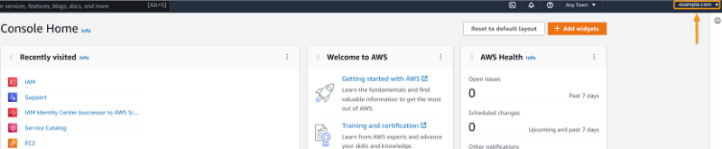
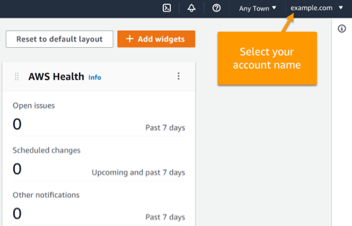
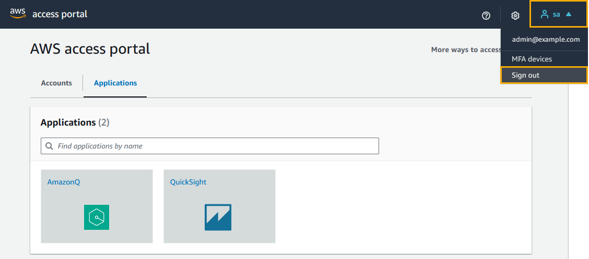
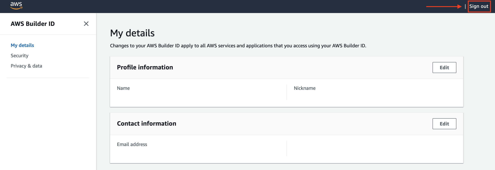

# Sign out of AWS

How you sign out of your AWS account depends on what type of AWS user you are. You can be
an account root user, an IAM user, a user in IAM Identity Center, a federated identity, or an AWS Builder ID user. If
you're not sure what kind of user you are, see [Determine your user type](user-types-list.md "user-types-list.md").

###### Topics

- [Sign out of the AWS Management Console](#console-signing-out-root-IAM-users "#console-signing-out-root-IAM-users")
- [Sign out of your
  AWS access portal](#aws-access-portal-signing-out-iam-identity-center-user "#aws-access-portal-signing-out-iam-identity-center-user")
- [Sign out of AWS Builder ID](#sign-out-all-aws_builder_id "#sign-out-all-aws_builder_id")

## Sign out of the AWS Management Console

###### To sign out of the AWS Management Console

1. After you're signed in to the AWS Management Console, you arrive at a page similar to the one shown in
   the following image. Your account name or IAM user name is shown in the upper right
   corner.

 2. In the navigation bar on the upper right, choose your user name.

 3. Choose a **Sign out** option. The button options differ based on how many
accounts you are signed in to.

    * Select **Sign out** if you are signed in to only one account.
    * Select **Sign out of all sessions** to sign out of all your identities
     simultaneously.
    * Select **Sign out of current session** to sign out of the identity you
     have selected.

4. You are returned to the AWS Management Console webpage.

For more information about signing in to multiple accounts, see [Signing in to multiple accounts](../../../awsconsolehelpdocs/latest/gsg/multisession.md "../../../awsconsolehelpdocs/latest/gsg/multisession.md") in
the _AWS Management Console Getting Started Guide_.

## Sign out of your

AWS access portal

###### To sign out of your AWS access portal

1. In the navigation bar on the upper right, choose your user name.
2. Select **Sign out** as shown in the following image.

 3. If you successfully sign out, you now see your AWS access portal sign in page.

If you use an external identity provider (IdP) as your identity source, the active session
for your credentials is not terminated when you sign out. If you navigate back to the
AWS access portal, you may be automatically signed in without having to provide your
credentials.

## Sign out of AWS Builder ID

To sign out of an AWS service that you've accessed using your AWS Builder ID, you must sign out
of the service. If you want to sign out of your AWS Builder ID profile, see the following
procedure.

###### To sign out of your AWS Builder ID profile

1. After you have signed in to your AWS Builder ID profile at [https://profile.aws.amazon.com/](https://profile.aws.amazon.com/ "https://profile.aws.amazon.com/"), you arrive at **My details**.
2. In the top right of your AWS Builder ID profile page, choose **Sign
   out**.

 3. You're signed out when you no longer see your AWS Builder ID profile.
