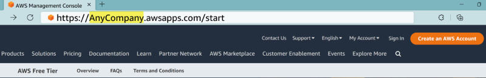
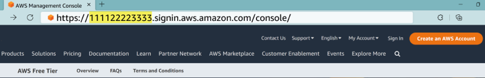

# Determine your sign-in URL

###### Warning

We're currently releasing our new experience to a limited number of customers. You might not be able to access this experience yet.

Use one of the following URLs to access AWS depending on what kind of AWS user you
are. For more information, see [Determine your user type](user-types-list.md "user-types-list.md").

###### Topics

- [AWS account sign-in URL](#root-user-url "#root-user-url")
- [AWS Settings](#aws-settings-url "#aws-settings-url")
- [AWS access portal](#access-portal-url "#access-portal-url")
- [IAM user sign-in URL](#IAM-user-url "#IAM-user-url")
- [Federated identity URL](#federated-identities-url "#federated-identities-url")
- [AWS Builder ID URL](#builder-id-url "#builder-id-url")

## AWS account sign-in URL

If you need to access a project and sign in with a method you already have,
like Google or GitHub, use the AWS account sign-in URL. You also need to use the
AWS account sign-in URL if you want root user or IAM user access.

The URL is the following: `https://console.aws.amazon.com/`

## AWS Settings

AWS Settings is available if you sign in using our new AWS experience. AWS
Settings lets you access all projects you own, and projects shared with
you. You can also use AWS Settings to modify your billing settings and invite team
members.

The URL is the following: `settings.aws.com`

## AWS access portal

The AWS access portal is a specific sign-in URL for users in IAM Identity Center to sign in and access
your account. When an administrator creates the user in IAM Identity Center the administrator chooses
whether the user receives either an email invitation to join IAM Identity Center or a message from the
administrator or help desk employee that contains a one-time password and AWS access portal
URL. The format of specific sign-in URL is like the following examples:

```
https://`d-xxxxxxxxxx`.awsapps.com/start
```

or

```
https://`your_subdomain`.awsapps.com/start
```

The specific sign-in URL varies because your administrator can customize it. The
specific sign-in URL might begin with the letter D followed by 10 randomized numbers and
letters. Your subdomain might also be used in the sign-in URL and may include your company
name like the following example:



###### Note

We recommend that you bookmark the specific sign-in URL for your AWS access portal so
that you can access it later.

For more information about your AWS access portal, see [Using the
AWS access portal](../../../singlesignon/latest/userguide/using-the-portal.md "../../../singlesignon/latest/userguide/using-the-portal.md").

## IAM user sign-in URL

IAM users can access the AWS Management Console with a specific IAM user sign-in URL. The
IAM user sign-in URL combines your AWS account ID or alias and
`signin.aws.amazon.com/console`

An example of what an IAM user sign-in URL looks like:

```
https://`account_alias_or_id`.signin.aws.amazon.com/console/
```

If your account ID is 111122223333, your sign-in URL would be:



If you're experiencing issues accessing your AWS account with your IAM user sign-in
URL, see [Resilience in
AWS Identity and Access Management](../../../IAM/latest/UserGuide/disaster-recovery-resiliency.md "../../../IAM/latest/UserGuide/disaster-recovery-resiliency.md") for more information.

## Federated identity URL

The sign-in URL for a federated identity varies. The external identity or external
Identity Provider (IdP) determines the sign-in URL for federated identities. The external
identity could be Windows Active Directory, Login with Amazon, Facebook, or Google. Contact
your administrator for more details on how to sign in as a federated identity.

For more information about federated identities, see [About web identity
federation](../../../IAM/latest/UserGuide/id_roles_providers_oidc.md "../../../IAM/latest/UserGuide/id_roles_providers_oidc.md").

## AWS Builder ID URL

The URL for your AWS Builder ID profile is [https://profile.aws.amazon.com/](https://profile.aws.amazon.com/ "https://profile.aws.amazon.com/").
When using your AWS Builder ID, the sign-in URL depends on what service you want to access. For
example, to sign in to Amazon CodeCatalyst, go to [https://codecatalyst.aws/login](https://codecatalyst.aws/login "https://codecatalyst.aws/login").
