# Troubleshooting AWS account sign-in

issues

Use the information here to help you troubleshoot sign-in and other AWS account issues.
For step-by-step directions on signing in to an AWS account, see [Sign in to the AWS Management Console](how-to-sign-in.md "how-to-sign-in.md").

If none of the troubleshooting topics help you address your sign-in issue, you can create a
case with Support by filling out this form: [I'm an AWS customer
and I'm looking for billing or account support](https://support.aws.amazon.com/#/contacts/aws-account-support/ "https://support.aws.amazon.com/#/contacts/aws-account-support/"). As a security best practice, Support
can't discuss the details of any AWS account other than the account that you're signed in
to. AWS Support also can't change the credentials associated with an account for any
reason.

###### Note

Support does not publish a direct phone number for reaching a support
representative.

For more assistance on troubleshooting your sign-in issues, see [What do I do if I'm having trouble
signing in to or accessing my AWS account?](https://aws.amazon.com/premiumsupport/knowledge-center/sign-in-account/ "https://aws.amazon.com/premiumsupport/knowledge-center/sign-in-account/") If you are having trouble signing in
to Amazon.com, see [Amazon
Customer Service](https://www.amazon.com/gp/help/customer/contact-us/ "https://www.amazon.com/gp/help/customer/contact-us/") instead of this page.

###### Topics

- [My AWS Management Console credentials aren't
  working](#credentials-not-working-console "#credentials-not-working-console")
- [Password reset is required for my root user](#password-reset-required "#password-reset-required")
- [I don't have access to the email for my
  AWS account](#troubleshoot-lost-email "#troubleshoot-lost-email")
- [My MFA device is lost or stopped working](#troubleshoot-MFA-issues "#troubleshoot-MFA-issues")
- [I can’t access the
  AWS Management Console sign-in page](#troubleshoot-firewalls "#troubleshoot-firewalls")
- [How can I find my AWS account
  ID or alias](#troubleshoot-find-aws-account-id-or-alias "#troubleshoot-find-aws-account-id-or-alias")
- [I need my account verification
  code](#troubleshoot_general_cant-sign-in "#troubleshoot_general_cant-sign-in")
- [I forgot my root user password for my
  AWS account](#troubleshoot-forgot-root-password "#troubleshoot-forgot-root-password")
- [I forgot my IAM user password for my
  AWS account](#troubleshoot-forgot-iam-password "#troubleshoot-forgot-iam-password")
- [I forgot my federated
  identity password for my AWS account](#troubleshoot-forgot-federated-identity-password "#troubleshoot-forgot-federated-identity-password")
- [I can’t sign in to my existing
  AWS account and I can't create a new AWS account with the same email address](#troubleshoot-cannot-create-new-acc "#troubleshoot-cannot-create-new-acc")
- [I need to reactivate my suspended
  AWS account](#troubleshoot-suspended-aws-account "#troubleshoot-suspended-aws-account")
- [I need to contact Support for sign-in
  issues](#troubleshoot-contact-support "#troubleshoot-contact-support")
- [I need to contact AWS Billing for billing
  issues](#troubleshoot-contact-billing "#troubleshoot-contact-billing")
- [I have a question about a retail order](#troubleshoot-retail-issue "#troubleshoot-retail-issue")
- [I need help managing my AWS account](#troubleshoot-other-issues "#troubleshoot-other-issues")
- [My AWS access portal credentials aren't
  working](#credentials-not-working-portal "#credentials-not-working-portal")
- [I forgot my IAM Identity Center
  password for my AWS account](#troubleshoot-forgot-iam-identity-center-password "#troubleshoot-forgot-iam-identity-center-password")
- [I receive an error that states ‘It’s not you, it’s us’
  when I try to sign in to the IAM Identity Center console](#error-sign-in-idc "#error-sign-in-idc")

## My AWS Management Console credentials aren't

working

If you remember your username and password, but your credentials don't work, you might
be on the wrong page. Try signing in on a different page:

###### Root user sign-in page

- If you created or own an AWS account and are performing a task that requires
  root user credentials, enter your account email address in the [AWS Management Console](https://console.aws.amazon.com/ "https://console.aws.amazon.com/"). To learn how to access the root user,
  see [To sign in as the root user](introduction-to-root-user-sign-in-tutorial.md#root-user-sign-in-tutorial "introduction-to-root-user-sign-in-tutorial.md#root-user-sign-in-tutorial"). If you forgot your root user password,
  you can reset it. See [I forgot my root user password for my
  AWS account](#troubleshoot-forgot-root-password "#troubleshoot-forgot-root-password") for more information. If you
  forgot your root user email address, check your email inbox for an email from
  AWS.
- If you tried to sign in to your root user account and received the error: **Password recovery is disabled for my root user account**, you
  have no root user credentials. You can't sign in as a root user or perform password
  recovery for your account’s root user. AWS member accounts managed using AWS Organizations may
  not have a root user password, access keys, signing certificates, or active multi-factor
  authentication (MFA).

Only the management account or delegated administrator for IAM can perform
root user actions in your member account. Contact your administrator if you need to
perform a task that requires root user credentials. For more information, see [Centrally manage root access for member accounts](../../../IAM/latest/UserGuide/id_root-user.md#id_root-user-access-management "../../../IAM/latest/UserGuide/id_root-user.md#id_root-user-access-management") in the
_AWS Identity and Access Management User Guide_.

###### IAM user sign-in page

- If you or someone else created an IAM user within an AWS account, you must
  know that AWS account ID or alias to sign in. Enter your account ID or alias,
  username, and password in to the [AWS Management Console](https://console.aws.amazon.com/ "https://console.aws.amazon.com/").
  To learn how to access the IAM user sign-in page, see [To sign in as an IAM user](introduction-to-iam-user-sign-in-tutorial.md#iam-user-sign-in-tutorial "introduction-to-iam-user-sign-in-tutorial.md#iam-user-sign-in-tutorial").
  If you forgot your IAM user password, you can see [I forgot my IAM user password for my
  AWS account](#troubleshoot-forgot-iam-password "#troubleshoot-forgot-iam-password") for information on resetting
  your IAM user password. If you forgot your account number, search your email,
  browser favorites, or browser history for a URL that includes
  `signin.aws.amazon.com/`. Your account ID or alias will follow the
  `"account="` text in the URL. If you can’t find your account ID or
  alias, contact your administrator. Support can’t help you recover this information. You
  can’t see your account ID or alias until after you sign in.

## Password reset is required for my root user

For your account protection, you may receive the following message when you try to sign
in to the AWS Management Console:

Password reset is required. For security concerns, you need to reset your password. To
keep your account secure, you must choose **Forgot password** below and
reset your password.

In addition to this message, AWS also notifies you when we identify a potential issue
through the email associated with your account. This email includes the reason the password
reset is required. For example, when we identify unusual login activity to your
AWS account or credentials associated with your AWS account are publicly available
online.

Update your password to ensure your root user credentials stay secure. To learn how to
reset your root user password, see [I
forgot my root user password for my AWS account](#troubleshoot-forgot-root-password "#troubleshoot-forgot-root-password").

## I don't have access to the email for my

AWS account

When you create an AWS account, you provide an email address and password. These are
the credentials for the AWS account root user. If you aren't sure of the email address associated with
your AWS account, look for saved correspondence ending in @signin.aws or
@verify.signin.aws to any email address for your organization that might have been used to
open the AWS account. Ask other members of your team, organization, or family. If someone
you know created the account, they can help you get access.

If you know the email address but no longer have access to the email, first try to
recover access to the email using one of the following options:

- If you own the domain for the email address, you can restore a deleted email
  address. Alternatively, you can set up a catch-all for your email account, which
  "catches all" messages sent to email addresses that no longer exist in the mail
  server and redirects them to another email address.
- If the email address on the account is part of your corporate email system, we
  recommend that you contact your IT system administrators. They might be able to help
  you regain access to the email.

If you're still not able to sign in to your AWS account, you can find alternate
support options by contacting [Support](https://support.aws.amazon.com/#/contacts/aws-account-support/ "https://support.aws.amazon.com/#/contacts/aws-account-support/").

## My MFA device is lost or stopped working

If your MFA device is lost, damaged, or not working, you don't receive a one-time
passcode (OTP) when you send an MFA verification request.

**IAM users**

You can sign in using another MFA device registered to the same
IAM user.

IAM users must contact an administrator to deactivate an MFA device that is
not working. These users can't recover their MFA device without the
administrator's assistance. Your administrator is typically an Information Technology (IT) personnel who has a higher level of permissions to the AWS account
than other members of your organization. This individual created
your account and provides users with their access credentials to sign in.

**Root users**

To recover access to the root user, you must sign in using another MFA device
registered to the same root user. Then, review the following options to recover or
update your MFA device:

- For step-by-step directions to recover an MFA device, see [What if
  an MFA device is lost or stops working?](../../../IAM/latest/UserGuide/id_credentials_mfa_lost-or-broken.md "../../../IAM/latest/UserGuide/id_credentials_mfa_lost-or-broken.md")
- For step-by-step directions on how to update a telephone number for an
  MFA device, see [How do I update
  my telephone number to reset my lost MFA device?](https://aws.amazon.com/premiumsupport/knowledge-center/reset-mfa-device/ "https://aws.amazon.com/premiumsupport/knowledge-center/reset-mfa-device/")
- For step-by-step directions to activate MFA devices, see [Enabling MFA
  devices for users in AWS](../../../IAM/latest/UserGuide/id_credentials_mfa_enable.md "../../../IAM/latest/UserGuide/id_credentials_mfa_enable.md").
- If you can't recover your MFA device, contact [Support](https://support.aws.amazon.com/#/contacts/aws-mfa-support "https://support.aws.amazon.com/#/contacts/aws-mfa-support").

###### Note

IAM users must contact their administrator for assistance with MFA
devices. Support can't assist IAM users with MFA device issues.

## I can’t access the

AWS Management Console sign-in page

If you can't see your sign-in page, the domain might be blocked by a firewall. Contact
your network administrator to add the following domains or URL endpoints to your
web-content filtering solution allow-lists depending on what type of user you are and how
you sign in.

|                                                               |                                                                |
| ------------------------------------------------------------- | -------------------------------------------------------------- | --------------------------------------------------------------------------------------------------------------------------------------------------------------------------------------------------------------------------------------------------------------------------------------------------------------------------------------------------------------------------------------------------------------------------------------------------------------------------------------------------------------------------------------------------------------------------------------------------------------------------------------------------------------------------------------------------------------------------------------------------------------------------------------------------------------------------------------------------------------------------------------------------------------------------------------------------------------------------------------------------------------------------------------------------------------------------------------------------------------------------------------------------------------------------------------------------------------------------------------------------------------------------------------------------------------------------------------------------------------------------------------------------------------------------------------------------------------------------------------------------------------------------------------------------------------------------------------------------------------------------------------------------------------------------------------------------------------------------------------------------------------------------------------------------------------------------------------------------------------------------------------------------------------------------------------------------------------------------------------------------------------------------------------------------------------------------------------------------------------------------------------------------------------------------------------------------------------------------------------------------------------------------------------------------------------------------------------------------------------------------------------------------------------------------------------------------------------------------------------------------------------------------------------------------------------------------------------------------------------------------------------------------------------------------------------------------------------------------------------------------------------------------------------------------------------------------------------------------------------------------------------------------------------------------------------------------------------------------------------------------------------------------------------------------------------------------------------------------------------------------------------------------------------------------------------------------------------------------------------------------------------------------------------------------------------------------------------------------------------------------------------------------------------------------------------------------------------------------------------------------------------------------------------------------------------------------------------------------------------------------------------------------------------------------------------------------------------------------------------------------------------------------------------------------------------------------------------------------------------------------------------------------------------------------------------------------------------------------------------------------------------------------------------------------------------------------------------------------------------------------------------------------------------------------------------------------------------------------------------------------------------------------------------------------------------------------------------------------------------------------------------------------------------------------------------------------------------------------------------------------------------------------------------------------------------------------------------------------------------------------------------------------------------------------------------------------------------------------------------------------------------------------------------------------------------------------------------------------------------------------------------------------------------------------------------------------------------------------------------------------------------------------------------------------------------------------------------------------------------------------------------------------------------------------------------------------------------------------------------------------------------------------------------------------------------------------------------------------------------------------------------------------------------------------------------------------------------------------------------------------------------------------------------------------------------------------------------------------------------------------------------------------------------------------------------------------------------------------------------------------------------------------------------------------------------------------------------------------------------------------------------------------------------------------------------------------------------------------------------------------------------------------------------------------------------------------------------------------------------------------------------------------------------------------------------------------------------------------------------------------------------------------------------------------------------------------------------------------------------------------------------------------------------------------------------------------------------------------------------------------------------------------------------------------------------------------------------------------------------------------------------------------------------------------------------------------------------------------------------------------------------------------------------------------------------------------------------------------------------------------------------------------------------------------------------------------------------------------------------------------------------------------------------------------------------------------------------------------------------------------------------------------------------------------------------------------------------------------------------------------------------------------------------------------------------------------------------------------------------------------------------------------------------------------------------------------------------------------------------------------------------------------------------------------------------------------------------------------------------------------------------------------------------------------------------------------------------------------------------------------------------------------------------------------------------------------------------------------------------------------------------------------------------------------------------------------------------------------------------------------------------------------------------------------------------------------------------------------------------------------------------------------------------------------------------------------------------------------------------------------------------------------------------------------------------------------------------------------------------------------------------------------------------------------------------------------------------------------------------------------------------------------------------------------------------------------------------------------------------------------------------------------------------------------------------------------------------------------------------------------------------------------------------------------------------------------------------------------------------------------------------------------------------------------------------------------------------------------------------------------------------------------------------------------------------------------------------------------------------------------------------------------------------------------------------------------------------------------------------------------------------------------------------------------------------------------------------------------------------------------------------------------------------------------------------------------------------------------------------------------------------------------------------------------------------------------------------------------------------------------------------------------------------------------------------------------------------------------------------------------------------------------------------------------------------------------------------------------------------------------------------------------------------------------------------------------------------------------------------------------------------------------------------------------------------------------------------------------------------------------------------------------------------------------------------------------------------------------------------------------------------------------------------------------------------------------------------------------------------------------------------------------------------------------------------------------------------------------------------------------------------------------------------------------------------------------------------------------------------------------------------------------------------------------------------------------------------------------------------------------------------------------------------------------------------------------------------------------------------------------------------------------------------------------------------------------------------------------------------------------------------------------------------------------------------------------------------------------------------------------------------------------------------------------------------------------------------------------------------------------------------------------------------------------------------------------------------------------------------------------------------------------------------------------------------------------------------------------------------------------------------------------------------------------------------------------------------------------------------------------------------------------------------------------------------------------------------------------------------------------------------------------------------------------------------------------------------------------------------------------------------------------------------------------------------------------------------------------------------------------------------------------------------------------------------------------------------------------------------------------------------------------------------------------------------------------------------------------------------------------------------------------------------------------------------------------------------------------------------------------------------------------------------------------------------------------------------------------------------------------------------------------------------------------------------------------------------------------------------------------------------------------------------------------------------------------------------------------------------------------------------------------------------------------------------------------------------------------------------------------------------------------------------------------------------------------------------------------------------------------------------------------------------------------------------------------------------------------------------------------------------------------------------------------------------------------------------------------------------------------------------------------------------------------------------------------------------------------------------------------------------------------------------------------------------------------------------------------------------------------------------------------------------------------------------------------------------------------------------------------------------------------------------------------------------------------------------------------------------------------------------------------------------------------------------------------------------------------------------------------------------------------------------------------------------------------------------------------------------------------------------------------------------------------------------------------------------------------------------------------------------------------------------------------------------------------------------------------------------------------------------------------------------------------------------------------------------------------------------------------------------------------------------------------------------------------------------------------------------------------------------------------------------------------------------------------------------------------------------------------------------------------------------------------------------------------------------------------------------------------------------------------------------------------------------------------------------------------------------------------------------------------------------------------------------------------------------------------------------------------------------------------------------------------------------------------------------------------------------------------------------------------------------------------------------------------------------------------------------------------------------------------------------------------------------------------------------------------------------------------------------------------------------------------------------------------------------------------------------------------------------------------------------------------------------------------------------------------------------------------------------------------------------------------------------------------------------------------------------------------------------------------------------------------------------------------------------------------------------------------------------------------------------------------------------------------------------------------------------------------------------------------------------------------------------------------------------------------------------------------------------------------------------------------------------------------------------------------------------------------------------------------------------------------------------------------------------------------------------------------------------------------------------------------------------------------------------------------------------------------------- |
| Root user and IAM users                                       | \*.signin.aws.amazon.com                                       |
| Amazon.com account sign-in                                    | www.amazon.com                                                 |
| IAM Identity Center users and first-party application sign-in |  • \*.awsapps.com (http://awsapps.com/)  • \*.signin.aws | ## How can I find my AWS account ID or alias If you are an IAM user and you aren't signed in, ask your administrator for the AWS account ID or alias. Your administrator is typically an Information Technology (IT) personnel who has a higher level of permissions to the AWS account than other members of your organization. This individual created your account and provides users with their access credentials to sign in. If you are an IAM user with access to the AWS Management Console, your account ID can be found in your sign-in URL. Check your emails from your administrator for the sign-in URL. The account ID is the first twelve digits in the sign-in URL. For example, in the following URL, `https://`111122223333`.signin.aws.amazon.com/console`, your AWS account ID is 111122223333. After you sign in to the AWS Management Console, you can find your account information located in the navigation bar next to your Region. For example in the following screenshot, the IAM user Carlos has an AWS account of 1111-2222-3333. 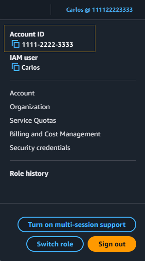 For more information about your AWS account ID and alias and how to find it, see [Your AWS account ID and its alias](../../../IAM/latest/UserGuide/console_account-alias.md "../../../IAM/latest/UserGuide/console_account-alias.md"). ## I need my account verification code If you provided your account email address and password, AWS sometimes requires you to provide a one-time verification code. To retrieve the verification code, check the email that's associated with your AWS account for a message from Amazon Web Services. The email address ends in @signin.aws or @verify.signin.aws. Follow the directions in the message. If you don't see the message in your account, check your spam and junk folders. If you no longer have access to the email, see [I don't have access to the email for my AWS account](#troubleshoot-lost-email "#troubleshoot-lost-email"). ## I forgot my root user password for my AWS account If you are a root user and you have lost or forgotten the password for your AWS account, you can reset your password by selecting the "Forgot Password" link in the AWS Management Console. You must know your AWS account's email address and must have access to the email account. You will be emailed a link during the password recovery process to reset your password. The link will be sent to the email address you used to create your AWS account. To reset the password for an account that you created using AWS Organizations, see [Accessing a member account as the root user](../../../organizations/latest/userguide/orgs_manage_accounts_access.md#orgs_manage_accounts_access-as-root "../../../organizations/latest/userguide/orgs_manage_accounts_access.md#orgs_manage_accounts_access-as-root"). ###### To reset your root user password 1. Use your AWS email address to begin signing in to the [AWS Management Console](http://signin.aws.amazon.com/console/ "http://signin.aws.amazon.com/console/") as the **root user**. Then, choose **Next**. 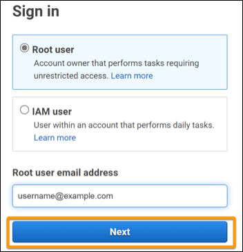 ###### Note If you are signed in to the [AWS Management Console](http://signin.aws.amazon.com/console/ "http://signin.aws.amazon.com/console/") with IAM user credentials, then you must sign out before you can reset the root user password. If you see the account-specific IAM user sign-in page, choose **Sign-in using root account credentials** near the bottom of the page. If necessary, provide your account email address and choose **Next** to access the **Root user sign in** page. 2. Choose **Forgot password?** 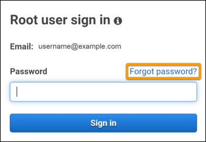 3. Complete the password recovery steps. If you can't complete the security check, try listening to the audio or refreshing the security check for a new set of characters. An example of a password recovery page is shown in the following image. 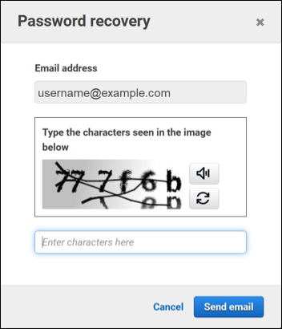 4. After you complete the password recovery steps, you receive a message that further instructions have been sent to the email address associated with your AWS account. An email with a link to reset your password is sent to the email used to create the AWS account. ###### Note The email will come from an address ending in @signin.aws or @verify.signin.aws. 5. Select the link provided in the AWS email to reset your AWS root user password. 6. The link directs you to a new webpage to create a new root user password. 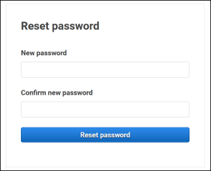 You receive a confirmation that your password reset was successful. A successful password reset is shown in the following image. 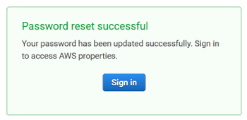 For more information on resetting your root user password, see [How do I recover a lost or forgotten AWS password?](https://aws.amazon.com/premiumsupport/knowledge-center/recover-aws-password/ "https://aws.amazon.com/premiumsupport/knowledge-center/recover-aws-password/") ## I forgot my IAM user password for my AWS account To change your IAM user password, you must have the proper permissions. For more information about resetting your IAM user password, see [How an IAM user changes their own password](../../../IAM/latest/UserGuide/id_credentials_passwords_user-change-own.md "../../../IAM/latest/UserGuide/id_credentials_passwords_user-change-own.md"). If you do not have the permission to reset your password, then only your IAM administrator can reset the IAM user password. IAM users should contact their IAM administrator to reset their password. Your administrator is typically an Information Technology (IT) personnel who has a higher level of permissions to the AWS account than other members of your organization. This individual created your account and provides users with their access credentials to sign in. 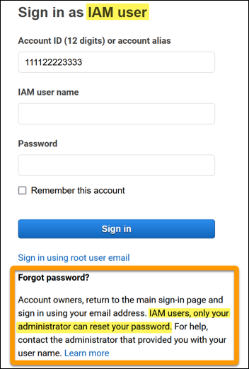 For security purposes, Support doesn't have access to view, provide, or change your credentials. For more information on resetting your IAM user password, see [How do I recover a lost or forgotten AWS password?](https://aws.amazon.com/premiumsupport/knowledge-center/recover-aws-password/ "https://aws.amazon.com/premiumsupport/knowledge-center/recover-aws-password/") To learn how an administrator can manage your password, see [Managing passwords for IAM users](../../../IAM/latest/UserGuide/id_credentials_passwords_admin-change-user.md "../../../IAM/latest/UserGuide/id_credentials_passwords_admin-change-user.md"). ## I forgot my federated identity password for my AWS account Federated identities sign in to access AWS accounts with external identities. The type of external identity in use determines how federated identities sign in. Your administrator creates federated identities. Check with your administrator for more details on how to reset your password. Your administrator is typically an Information Technology (IT) personnel who has a higher level of permissions to the AWS account than other members of your organization. This individual created your account and provides users with their access credentials to sign in. ## I can’t sign in to my existing AWS account and I can't create a new AWS account with the same email address You can associate an email address with only one AWS account root user. If you close your root user account and it remains closed for more than 90 days, then you are not able to reopen your account or create a new AWS account using the e-mail address associated with this account. To fix this issue, you can use subaddressing where you add a plus sign (+) after your usual email address when you sign up for a new account. The plus sign (+) can be followed by uppercase or lowercase letters, numbers, or other Simple Mail Transfer Protocol (SMTP) supported characters. For example, you can use `email+1@yourcompany.com` or `email+tag@yourcompany.com` where your usual email is `email@yourcompany.com`. This is considered a new address even though it’s connected to the same inbox as your usual email address. Before you sign up for a new account, we recommend that you send a test email to your appended email address to confirm that your email provider supports subaddressing. ## I need to reactivate my suspended AWS account If your AWS account is suspended and you want to reinstate it, see [How can I reactivate my suspended AWS account?](https://aws.amazon.com/premiumsupport/knowledge-center/reactivate-suspended-account/ "https://aws.amazon.com/premiumsupport/knowledge-center/reactivate-suspended-account/") ## I need to contact Support for sign-in issues If you tried everything, you can get help from Support by completing the [Billing and Account Support request](https://support.aws.amazon.com/#/contacts/aws-account-support/ "https://support.aws.amazon.com/#/contacts/aws-account-support/"). ## I need to contact AWS Billing for billing issues If you can't sign in to your AWS account and would like to contact AWS Billing for billing issues, you can do so through a [Billing and Account Support request](https://support.aws.amazon.com/#/contacts/aws-account-support/ "https://support.aws.amazon.com/#/contacts/aws-account-support/"). For more information about AWS Billing and Cost Management, including your charges and payment methods, see [Getting help with AWS Billing](../../../awsaccountbilling/latest/aboutv2/billing-get-answers.md "../../../awsaccountbilling/latest/aboutv2/billing-get-answers.md"). ## I have a question about a retail order If you have an issue with your www.amazon.com account or a question about a retail order, see [Support Options & Contact Us](https://www.amazon.com/gp/help/customer/display.html?nodeId=GSD587LKW72HKU2V "https://www.amazon.com/gp/help/customer/display.html?nodeId=GSD587LKW72HKU2V"). ## I need help managing my AWS account If you need help changing a credit card for your AWS account, reporting fraudulent activity, or closing your AWS account, see [Troubleshooting other issues with AWS accounts](../../../accounts/latest/reference/troubleshooting_other.md "../../../accounts/latest/reference/troubleshooting_other.md"). ## My AWS access portal credentials aren't working When you can't sign in to your AWS access portal, try to remember how you previously accessed AWS. **If you don't remember using a password at all** You might have previously accessed AWS without using AWS credentials. This is common for enterprise single sign-on through IAM Identity Center. Accessing AWS this way means that you use your corporate credentials to access AWS accounts or applications without entering your credentials.  • **AWS access portal** – If an administrator allows you to use credentials from outside AWS to access AWS, you need the URL for your portal. Check your email, browser favorites, or browser history for a URL that includes `awsapps.com/start` or `signin.aws/platform/login`. For example, your custom URL might include an ID or a domain such as `https://`d-1234567890`.awsapps.com/start`. If you can't find your portal link, contact your administrator. Support can't help you recover this information. If you remember your username and password, but your credentials don't work, you might be on the wrong page. Look at the URL in your web browser, if it's https://signin.aws.amazon.com/ then a federated user or IAM Identity Center user can't sign-in using their credentials.  • **AWS access portal** – If an administrator set up an AWS IAM Identity Center (successor to AWS Single Sign-On) identity source for AWS, you must sign in using your username and password at your AWS access portal for your organization. To locate the URL for your portal check your email, secure password storage, browser favorites, or browser history for a URL that includes `awsapps.com/start` or `signin.aws/platform/login`. For example, your custom URL might include an ID or a domain such as `https://`d-1234567890`.awsapps.com/start.` If you can’t find your portal link, contact your administrator. Support can’t help you recover this information. ## I forgot my IAM Identity Center password for my AWS account If you are a user in IAM Identity Center and you have lost or forgotten the password for your AWS account, you can reset your password. You must know the email address used for the IAM Identity Center account and have access to it. A link to reset your password is sent to your AWS account email. ###### To reset your user in IAM Identity Center password 1. Use your AWS access portal URL link and enter your username. Then, choose **Next**. 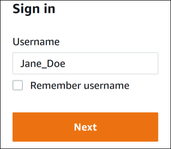 2. Select **Forgot password** as shown in the following image. 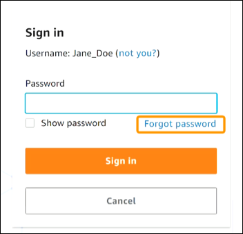 3. Complete the password recovery steps. 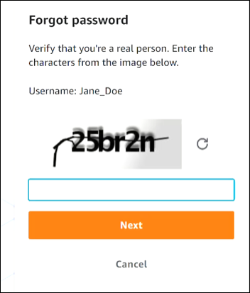 4. After you complete the password recovery steps, you receive the following message confirming that you've been sent an email message that you can use to reset your password. 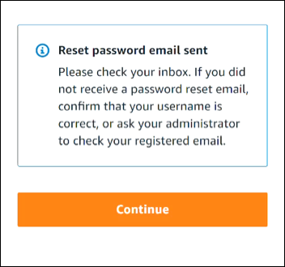 An email with a link to reset your password is sent to the email associated with the IAM Identity Center user account. Select the link provided in the AWS email to reset your password. The link directs you to a new web page to create a new password. After creating a new password, you receive confirmation that the password reset was successful. If you didn't receive an email to reset your password, ask your administrator to confirm which email is registered with your user in IAM Identity Center. ## I receive an error that states ‘It’s not you, it’s us’ when I try to sign in to the IAM Identity Center console This error indicates there is a setup problem with your instance of IAM Identity Center or the external identity provider (IdP) it’s using as its identity source. We recommend that you verify the following:  • Verify the date and time settings on the device you’re using to sign in. We recommend that you allow the date and time to be set automatically. If that’s not available, we recommend syncing your date and time to a known [Network Time Protocol (NTP)](https://en.wikipedia.org/wiki/Network_Time_Protocol "https://en.wikipedia.org/wiki/Network_Time_Protocol") server.  • Verify that the IdP certificate uploaded to IAM Identity Center is the same one provided by your identity provider. You can check the certificate from the [IAM Identity Center console](https://console.aws.amazon.com/singlesignon/ "https://console.aws.amazon.com/singlesignon/") by navigating to **Settings**. In the **Identity Source** tab, under **Action**, choose **Manage Authentication**. You may need to import a new certificate.  • In your IdP’s SAML metadata file, ensure that the NameID Format is `urn:oasis:names:tc:SAML:1.1:nameid-format:emailAddress`.  • If you're using AD Connector, verify that the credentials for the service account are correct and have not expired. For more information, see [Update your AD Connector service account credentials in AWS Directory Service](../../../directoryservice/latest/admin-guide/ad_connector_update_creds.md "../../../directoryservice/latest/admin-guide/ad_connector_update_creds.md"). |
