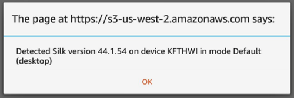

# Detecting the Silk User Agent

To determine browser support for a given feature, the [Learn about feature detection](feature-detection.md "feature-detection.md") method is almost
always recommended over user agent detection. However, in a few scenarios (for example,
performing site analytics) you may need to detect a particular user agent.

If you want to detect version and configuration info in the Amazon Silk user agent,
you can use a script like the one embedded in the following HTML document:

```
<html>
  <body>
    <script>
    var match = /(?:; ([^;)]+) Build\/.*)?\bSilk\/([0-9._-]+)\b(.*\bMobile Safari\b)?/.exec(navigator.userAgent);
    if (match) {
        alert("Detected Silk version "+match[2]+" on device "+(match[1] || "Kindle Fire")+" in mode "+(match[3] ? "Mobile" : "Default (desktop)"));
    }
    </script>
  </body>
</html>

```

Here's the page displayed in Silk on a Kindle Fire HDX 7".


The script detects the browser version, product model, and requested mode. We could
search for other fields, too. To learn more about fields in the Silk user agent, see
[Learn about user agent strings](user-agent.md "user-agent.md").

###### How the Regex Works

You can make use of the above script without delving into the details of the
regular expression. But if you're interested in the details, read on.

Our regular expression, which is an object in JavaScript, is assigned to a variable,
`match`:

```
var match = /(?:; ([^;)]+) Build\/.*)?\bSilk\/([0-9._-]+)\b(.*\bMobile Safari\b)?/.exec(navigator.userAgent);
```

The first and last `/` of the pattern indicate the beginning and ending of
the regular expression literal.

```
/(?:; ([^;)]+) Build\/.*)?\bSilk\/([0-9._-]+)\b(.*\bMobile Safari\b)?/
```

We can think of our regex as comprising three subpatterns. In the first, we use
noncapturing parentheses and a trailing `?` to specify an optional
match:

```
(?:; ([^;)]+) Build\/.*)?
```

This pattern will match the build ID (for example, `KFTHWI Build`), if it's
available. The inner parentheses capture one or more characters that are not
`;` and `)`. Thus, these parentheses will capture
`KFTHWI` or another build ID. The entire pattern group needs to be
optional because 1st Generation Kindle Fire devices don't have a build ID.

Following this first subexpression is a pattern that matches the Silk browser
version:

```
\bSilk\/([0-9._-]+)
```

The character set to be captured includes digits, dot, underscore, and dash, with
which we can capture either the browser version (for example, `44.1.54`).

The final pattern is comparatively straightforward:

```
\b(.*\bMobile Safari\b)?
```

We match the string `Mobile Safari`, preceded by any character 0 or more
times. If Silk requests a mobile view, the user agent will include the string
`Mobile Safari`. So this final pattern does exactly what you'd expect: It
identifies the browser as a mobile client.

To access the captured substrings, we can use the array object returned by the
`exec()` method. In our example, we call
`.exec(navigator.userAgent)` on the entire regular expression literal.
The `exec()` method tries to match the regex object against a string passed
in as a parameter. In this case, the string to be matched is the user agent object
(`navigator.userAgent`). The `exec()` method returns the
captured matches as elements of an array. In our example script, we use the returned
array elements to build a string for an alert message.

```

if (match) {
    alert("Detected Silk version "+match[2]+" on device "+(match[1] || "Kindle Fire")+" in mode "+(match[3] ? "Mobile" : "Default (desktop)"));
}

```

We use logical OR `||` and the conditional operator `?` to
provide appropriate default values in case of nonmatches. Of course, if you're doing
user agent detection in a production website, you probably want to do something other
than call the `alert()` method.

To learn more about the Silk user agent, see [Learn about user agent strings](user-agent.md "user-agent.md"). To learn more about regular expressions in JavaScript,
see [Regular Expressions](https://developer.mozilla.org/en-US/docs/Web/JavaScript/Guide/Regular_Expressions "https://developer.mozilla.org/en-US/docs/Web/JavaScript/Guide/Regular_Expressions") and [RegExp](https://developer.mozilla.org/en-US/docs/Web/JavaScript/Reference/Global_Objects/RegExp "https://developer.mozilla.org/en-US/docs/Web/JavaScript/Reference/Global_Objects/RegExp") at the [Mozilla
Developer Network](https://developer.mozilla.org/en-US/ "https://developer.mozilla.org/en-US/").
