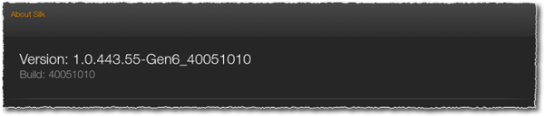

# Getting started with Amazon Silk

This guide provides an overview of the Amazon Silk web browser, with a focus on features
and behaviors that are relevant to site owners and web developers. If you're wondering how to
optimize your content for Silk, this is the place to start. If you're wondering about
supported features and standards, you can find that information here too.

For tips on developing and optimizing web content for Silk, see the sections below:

- At [Developing web content for Amazon Silk](developing.md "developing.md"), you'll find information on media handling, screen
  resolution, the Silk user agent string, and other topics relevant to web development and
  content optimization.
- You'll find an introduction to many of the HTML5 and CSS3
  features supported by Silk. You'll also find markup and examples to give you an idea of
  how Silk implements W3C standards.

## How do I find the number for an older version?

In the Silk browser, type `about:version` in the address bar. Amazon Silk
will display the build version string.

In this example, the first set of numbers, `1.0.443.55`, is the browser version.

The second set of numbers, `40051010`, is the build version.

