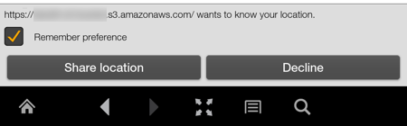

# HTML5 API support in Amazon Silk

Amazon Silk supports many of the HTML5 APIs. Though not intended to be comprehensive, the list
below describes supported HTML5 APIs and notes any Amazon Silk-specific implementation details.

###### Topics

- [Animation Timing API](#animation-timing-api "#animation-timing-api")
- [Application Cache API](#appcache-api "#appcache-api")
- [Cross-Origin Resource Sharing](#cors "#cors")
- [File API](#file-api "#file-api")
- [File System API](#file-system-api "#file-system-api")
- [Geolocation API](#geolocation "#geolocation")
- [Indexed Database API](#indexed-database-api "#indexed-database-api")
- [Server-Sent Events](#server-sent-events "#server-sent-events")
- [Touch Events](#touch-events "#touch-events")
- [XMLHttpRequest Level 2](#xmlhttprequest "#xmlhttprequest")
- [Web SQL Database](#web-sql-database "#web-sql-database")
- [Web Storage](#web-storage-api "#web-storage-api")
- [Web Workers API](#webworkers-api "#webworkers-api")
- [WebGL](#webgl "#webgl")
- [WebSocket API](#websocket-api "#websocket-api")

## Animation Timing API

The Animation Timing API can be used to create script-based animations where the user
agent is called upon to determine the appropriate frame update rate at runtime. This allows
animations to run more smoothly and efficiently than they would with the
`setInterval` or `setTimeout` methods, which schedule callbacks at
specified intervals.

To learn more about the Animation Timing API, see the W3C specification [Timing Control for Script-based
Animations](http://www.w3.org/TR/animation-timing/ "http://www.w3.org/TR/animation-timing/")

## Application Cache API

The Application Cache API, or AppCache, enables web applications to run offline. AppCache
can also improve application performance, as cached resources load faster and reduce server
load.

To learn more about the HTML5 Application Cache, see the following resources:

- [HTML5 Application
  Cache](https://www.quanzhanketang.com/html/html5_app_cache.html "https://www.quanzhanketang.com/html/html5_app_cache.html")
- [A Beginner's
  Guide to Using the Application Cache](http://www.html5rocks.com/en/tutorials/appcache/beginner/ "http://www.html5rocks.com/en/tutorials/appcache/beginner/")
- [HTML5 Offline
  Web Applications](http://www.w3.org/TR/2011/WD-html5-20110525/offline.html "http://www.w3.org/TR/2011/WD-html5-20110525/offline.html")

## Cross-Origin Resource Sharing

The Cross-Origin Resource Sharing (CORS) specification defines a method for making HTTP
requests that are not limited by the same-origin policy. The same-origin policy restricts
scripts from one domain from interacting with resources from a different domain. But when CORS
is implemented, a web client can fetch resources from an origin other than its own. In
practice, CORS requests are usually made through the XMLHttpRequest API.

Browsers handle the client-side implementation of CORS. This means that you can use
XMLHttpRequest to make cross-origin requests, and Amazon Silk will take care of the HTTP
request header and any necessary preflight requests (requests for authorization from
cross-origin servers).

To learn more about CORS, see the following resources:

- [W3C Recommendation: Cross-Origin Resource
  Sharing](http://www.w3.org/TR/cors/ "http://www.w3.org/TR/cors/")
- [HTML5 Rocks: Using
  CORS](http://www.html5rocks.com/en/tutorials/cors/ "http://www.html5rocks.com/en/tutorials/cors/")
- [MDN:
  HTTP access control (CORS)](https://developer.mozilla.org/en-US/docs/HTTP/Access_control_CORS "https://developer.mozilla.org/en-US/docs/HTTP/Access_control_CORS")
- [Cross-domain Ajax with Cross-Origin Resource Sharing](http://www.nczonline.net/blog/2010/05/25/cross-domain-ajax-with-cross-origin-resource-sharing/ "http://www.nczonline.net/blog/2010/05/25/cross-domain-ajax-with-cross-origin-resource-sharing/")

## File API

The File API provides a secure, standardized way for web applications to interact with
local files. Using the File API, a web application can represent file objects,
programmatically select them, and parse file data.

For more information, see the W3C [File
API](http://www.w3.org/TR/FileAPI/ "http://www.w3.org/TR/FileAPI/") specification.

## File System API

Using the File System API, a web application can create and interact with files in a
sandboxed virtual file system on the client. The File System API gives web applications a way
to store files, including large binary blobs, locally without using a database.

For more information, see the following resources:

- [File API: Directories and
  System](http://www.w3.org/TR/file-system-api/ "http://www.w3.org/TR/file-system-api/")
- [Exploring the
  File System APIs](http://www.html5rocks.com/en/tutorials/file/filesystem/ "http://www.html5rocks.com/en/tutorials/file/filesystem/")

## Geolocation API

The Geolocation API provides an interface to a device's location information, returned as
coordinates of latitude and longitude. The first time an app or website tries to access device
location with the Geolocation API, the browser has to obtain user permission. All browsers
that support the Geolocation API must respect this requirement, although the implementation
varies. Amazon Silk prompts the user with a dialog requesting permission.

In the Settings menu, Silk users can disable location access for an individual website or
for all websites.

As a developer, you can use the Geolocation API to get an initial position for a device
and to watch for changes of position.

To learn more about the Geolocation API, see the following resources:

- [W3C Geolocation API
  Specification](http://www.w3.org/TR/geolocation-API/ "http://www.w3.org/TR/geolocation-API/")
- [MDN:
  Using geolocation](https://developer.mozilla.org/en-US/docs/WebAPI/Using_geolocation "https://developer.mozilla.org/en-US/docs/WebAPI/Using_geolocation")
- [Dive Into HTML5: The
  Geolocation API](http://diveintohtml5.info/geolocation.html "http://diveintohtml5.info/geolocation.html")
- [A Simple
  Trip Meter using the Geolocation API](http://www.html5rocks.com/en/tutorials/geolocation/trip_meter/ "http://www.html5rocks.com/en/tutorials/geolocation/trip_meter/")

## Indexed Database API

The Indexed Database API, or IndexedDB API, is an interface to a high-performance,
object-oriented database that can store large amounts of structured data on the browser. Data
objects are stored as key-value pairs and can be accessed on- or offline.

For more information, see the [W3C Indexed DB
specification](http://www.w3.org/TR/IndexedDB/ "http://www.w3.org/TR/IndexedDB/").

## Server-Sent Events

The Server-Sent Events interface enables a client to receive updates from the server
automatically without having to request them. You can use Server-Sent Events to display news
and other updates on a website.

For more information, see the [W3C
Server-Sent Events specification](http://www.w3.org/TR/eventsource/ "http://www.w3.org/TR/eventsource/").

## Touch Events

Touch Events interpret finger motions on a touch-sensitive screen, so that web
applications can handle touch input directly. Touch events include `touchstart`,
`touchend`, `touchcancel`, and `touchmove`.

To learn more about Touch Events, see the following resources:

- [Touch Events W3C
  Specification](http://www.w3.org/TR/touch-events/ "http://www.w3.org/TR/touch-events/")
- [Multi-touch Web
  Development](http://www.html5rocks.com/en/mobile/touch/ "http://www.html5rocks.com/en/mobile/touch/")

## XMLHttpRequest Level 2

The XMLHttpRequest API enables a web application to make asynchronous HTTP requests to the
server. XMLHttpRequest Level 2, which is sometimes associated with HTML5, introduces new
functionality. For example, with XMLHttpRequest Level 2, you can use the Cross-Origin Resource
Sharing (CORS) API to make secure cross-origin requests, and you can transfer binary data in a
straightforward way.

For more information, see the W3C specification [XMLHttpRequest Level 2](http://www.w3.org/TR/XMLHttpRequest2/ "http://www.w3.org/TR/XMLHttpRequest2/").

## Web SQL Database

The Web SQL Database API is an interface for storing data on the client in a database that
can be queried with SQLite. The W3C no longer actively maintains the Web SQL Database
specification.

For more information, see the W3C [Web SQL
Database specification](http://www.w3.org/TR/webdatabase/ "http://www.w3.org/TR/webdatabase/").

## Web Storage

Web Storage is an interface for storing data in key-value pairs on the client. It's
designed to be a faster, more secure alternative to cookies. The Web Storage API provides two
storage types: local storage and session storage. Local storage has no expiration date, while
session storage persists for one session only.

To learn more about the Web Storage API, see the following resources:

- [W3C Web Storage
  Recommendation](http://www.w3.org/TR/webstorage/ "http://www.w3.org/TR/webstorage/")
- [HTML5 Web
  Storage](http://www.w3schools.com/html/html5_webstorage.asp "http://www.w3schools.com/html/html5_webstorage.asp")
- [An
  Overview of the Web Storage API](http://www.sitepoint.com/an-overview-of-the-web-storage-api/ "http://www.sitepoint.com/an-overview-of-the-web-storage-api/")

## Web Workers API

The Web Workers API can improve application performance by enabling JavaScript to run as a
background process. When a script runs as a Worker object, it's executed on a background
thread, in parallel to the main page. This prevents the script from affecting UI
performance.

For more information about the Web Workers API, see the [W3C Web Workers specification](http://www.w3.org/TR/workers/ "http://www.w3.org/TR/workers/").

## WebGL

WebGL is a web standard that facilitates the rendering of interactive 3-D graphics in the
browser without a plugin. Based on OpenGL ES 2.0, WebGL specifies both a JavaScript API and
interaction with the graphics processing unit (GPU). The HTML5 `canvas` element
functions as the rendering context. Amazon Silk has enabled WebGL and supports most WebGL
functionality.

For WebGL initialization tests, see [Khronos WEBGL FAQ](http://www.khronos.org/webgl/wiki/FAQ "http://www.khronos.org/webgl/wiki/FAQ").

To learn more about WebGL, see the following resources:

- [Khronos WebGL Overview](http://www.khronos.org/webgl/ "http://www.khronos.org/webgl/")
- [Khronos WebGL
  Specification](https://www.khronos.org/registry/webgl/specs/1.0/ "https://www.khronos.org/registry/webgl/specs/1.0/")

## WebSocket API

The WebSocket API facilitates event-driven client-server communication over an open
connection. Using the WebSocket API, the server can send updates to the client without the
client having to request resources.

To learn more about the WebSocket API, see the following resources:

- [The WebSocket API](http://www.w3.org/TR/websockets/ "http://www.w3.org/TR/websockets/")
- [Introducing
  WebSockets: Bringing Sockets to the Web](http://www.html5rocks.com/en/tutorials/websockets/basics/ "http://www.html5rocks.com/en/tutorials/websockets/basics/")
- [WebSocket.org](http://www.websocket.org/index.html "http://www.websocket.org/index.html")
