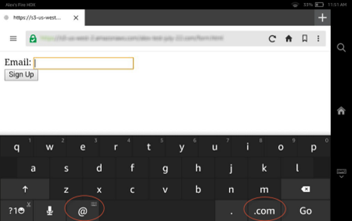
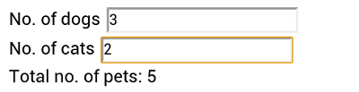
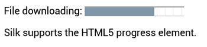

# HTML5 elements and attributes support in Amazon Silk

Amazon Silk supports many of the HTML5 elements and attributes. Though not intended to be
comprehensive, the list below describes supported elements and attributes and notes
Amazon Silk-specific implementation details, if applicable.

###### Topics

- [Audio Element](#audio-element "#audio-element")
- [Canvas Element](#canvas-element "#canvas-element")
- [contenteditable Attribute](#contenteditable-attribute "#contenteditable-attribute")
- [Input Types](#input-types "#input-types")
- [Keygen Element](#keygen-element "#keygen-element")
- [Meter Element](#meter-element "#meter-element")
- [Output Element](#output-element "#output-element")
- [Progress Element](#progress-element "#progress-element")
- [SVG Element](#svg "#svg")
- [Video Element](#video-element "#video-element")

## Audio Element

The `<audio>` element makes it possible to embed audio files directly
in a web page without using plug-ins. By nesting `<source>` elements within
an `<audio>` element, you can reference multiple file types.

```

<h1>HTML5 Audio Element</h1>
<audio controls>
  <source src="Media/audio_sample.ogg" type="audio/ogg">
  <source src="Media/audio_sample.mp3" type="audio/mpeg">
  Sorry. Your browser doesn't support the HTML5 audio element.
</audio>
```

The sample code above produces the player control shown below:


For more information, see the [W3C
audio element wiki](http://www.w3.org/wiki/HTML/Elements/audio "http://www.w3.org/wiki/HTML/Elements/audio").

## Canvas Element

You can use the `<canvas>` element to draw two-dimensional graphics on
a web page. Use the `<canvas>` element to create a container for a graphic,
and then render the graphic itself on the fly using JavaScript.

For more information, see the [HTML Canvas 2D
Context specification](http://www.w3.org/TR/2dcontext/ "http://www.w3.org/TR/2dcontext/").

## contenteditable Attribute

Setting the `contendeditable` attribute to "true" makes a text element on your
web page available for the user to edit. You can also use the `localStorage` object
to save the user's changes, effectively turning your web page into a text editor.

For more information, see [Mozilla
Developer Network: Content Editable](https://developer.mozilla.org/en-US/docs/Web/Guide/HTML/Content_Editable "https://developer.mozilla.org/en-US/docs/Web/Guide/HTML/Content_Editable").

## Input Types

In HTML5, you can use input types to make forms more responsive to mobile clients. By
specifying in your markup the type of input required, you can trigger the mobile device to
display an appropriate virtual keyboard. Amazon Silk supports this functionality. For example, if
you set the `type` attribute to `"email"`, Amazon Silk displays a virtual
keyboard featuring the **@** and **.com** keys, which make
the keyboard more user-friendly for typing an email address.

```

<form>
  Email: <input type="email" name="email"><br>
  <input type="submit" value="Sign Up">
</form>
```

The Silk virtual keyboard is shown below:



For more information, see [Making Forms Fabulous with
HTML5](http://www.html5rocks.com/en/tutorials/forms/html5forms/ "http://www.html5rocks.com/en/tutorials/forms/html5forms/").

## Keygen Element

The `<keygen>` element specifies a form field for securely
authenticating users. When the form containing the `<keygen>` element is
submitted, a public/private key pair is generated. The key pair can be used as part of a
certificate authentication system.

For more information about the `<keygen>` element, see [HTML/Elements/keygen](http://www.w3.org/wiki/HTML/Elements/keygen "http://www.w3.org/wiki/HTML/Elements/keygen") and [Mozilla Developer
Network: <keygen>](https://developer.mozilla.org/en-US/docs/Web/HTML/Element/keygen "https://developer.mozilla.org/en-US/docs/Web/HTML/Element/keygen").

## Meter Element

You can use the `<meter>` element to measure data within a given range.
It specifies a fractional value or gauge. For example, you could use the
`<meter>` element to gauge hard disk usage.

```

<p>Hard Disk Usage: <meter min="0" value="239" max="296">239 GB used out of 296 GB total</meter></p>
```

The sample code above produces the gauge below:


For more information, see [HTML/Elements/meter](http://www.w3.org/wiki/HTML/Elements/meter "http://www.w3.org/wiki/HTML/Elements/meter").

## Output Element

The `<output>` element represents the result of a calculation. Although
the `<output>` element is associated with a form, it doesn't have to be a
child of the form. You can collect input for a calculation in a form, and then use the
`<output>` element to display the results of the calculation elsewhere in
the document. In the following example, the `<output>` element displays the
sum of the values entered into the two input fields:

```

<form oninput="pets.value=parseInt(dogs.value)+parseInt(cats.value)">
  No. of dogs
  <input type="number" id="dogs" value="0"><br>
  No. of cats
  <input type="number" id="cats" value="0"><br>
  Total no. of pets:
  <output name="pets" for="dogs cats"></output>
</form>
```

Here's how the markup looks in Silk, after a user enters values in the input
fields:



Note that the `oninput` event is not supported by Silk Gen 1. For more on the
`<output>` element, see [HTML/Elements/output](http://www.w3.org/wiki/HTML/Elements/output "http://www.w3.org/wiki/HTML/Elements/output").

## Progress Element

The `<progress>` element represents progress toward completion of some
task, like a file download.

You can use the `<progress>` tag together with
JavaScript to create a progress display.

```

<div>File downloading: <progress value="70" max="100">70%</progress></p></div>
<div>Silk supports the HTML5 progress element.</div>
```

The sample code above produces the progress display shown below:



For more information, see [HTML/Elements/progress](http://www.w3.org/wiki/HTML/Elements/progress "http://www.w3.org/wiki/HTML/Elements/progress").

## SVG Element

Scalable Vector Graphics (SVG) is an XML-based format for describing two-dimensional web
graphics. Amazon Silk supports SVG both inline via the `<svg>` tag and
externally using the ``, `<object>`, and
`<embed>` tags. The example below creates an SVG rendering of a rectangle
with a horizontal linear gradient. The image shows the result rendered by Silk.

```
<html>
  <body>
    <svg width="180" height="120">
      <defs>
      <linearGradient id="gradient" x1="0%" y1="0%" x2="100%" y2="0%">
      <stop offset="0%" style="stop-color:rgb(255,255,255);stop-opacity:1.0" />
      <stop offset="100%" style="stop-color:rgb(0,0,255);stop-opacity:0.75" />
      </linearGradient>
      </defs>
      <rect x="10" y="10" width="160" height="100" style="fill:url(#gradient)">
    </svg>
  </body>
</html>

```


To learn more about SVG, visit the [W3C SVG
Working Group](http://www.w3.org/Graphics/SVG/ "http://www.w3.org/Graphics/SVG/").

## Video Element

The `<video>` element makes it possible to embed video files directly in
a web page without using plug-ins. By nesting `<source>` tags within a
`<video>` element, you can reference multiple file types.

```

<h1>HTML5 Video Element</h1>
<video width="320" height="240" controls>
  <source src="Media/video_sample.mp4" type="video/mp4">
  <source src="Media/video_sample.ogv" type="video/ogg">
  <source src="Media/video_sample.webm" type="video/webm">
  Sorry. Your browser doesn't support the HTML5 video element.
</video>
```

The sample code above produces the player control shown below:


For more information, see the [W3C
video element wiki](http://www.w3.org/wiki/HTML/Elements/video "http://www.w3.org/wiki/HTML/Elements/video").
