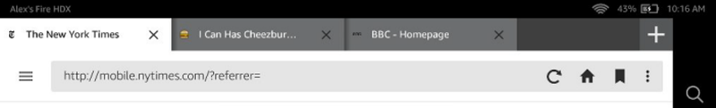

# Learn about remote debugging

Amazon Silk provides remote debugging through Chrome DevTools. With remote debugging, you can
use your development machine to inspect and interact with pages displayed in Silk on a separate
device. Remote debugging must be enabled on the device, and
Google Chrome must be installed on your
development machine.

From the Silk browser, tap the menu icon. If you see this menu, you have the latest version
of Silk. Use the following procedure for remote debugging. If your menu looks different, you may
have an older version of Silk. Follow the procedure in [Remote Debugging for Older Versions of Silk](#remote-debugging-2 "#remote-debugging-2").


###### To remote debug your device

1. Install the Chrome browser on your development machine. You can download it
   from the [Google Chrome
   download page](https://www.google.com/intl/en_us/chrome/browser/ "https://www.google.com/intl/en_us/chrome/browser/").
2. Swipe down and tap **Setting**, and then tap **Device
   Options**.
3. Locate the **Serial Number**. Tap it several times until you see a message
   that says you're a developer.
4. Tap **Developer Options** and then under
   **Debugging**, tap to **Enable ADB**.
5. Connect your device to your machine via USB.
6. When the USB Compatibility message appears, tap **OK**.
7. On your desktop Chrome browser, navigate to **chrome://inspect**.
8. Your device should appear, displaying your open tabs.
9. Using Silk on the device, navigate to the page you want to inspect. You can inspect
   multiple pages by opening each page in its own tab.

 10. Pages that are open in Silk tabs are listed at the remote debugging address.


Open inspectable pages and interact with them using the developer tools. To learn more
about inspecting pages with the developer tools, see [Chrome DevTools](https://developer.chrome.com/devtools/index "https://developer.chrome.com/devtools/index").

To learn more about remote debugging, see [Remote Debugging on
Android with Chrome](https://developer.chrome.com/devtools/docs/remote-debugging "https://developer.chrome.com/devtools/docs/remote-debugging").

## Remote Debugging for Older Versions of Silk

If you have an older version of Silk, follow the procedure below.

###### Install Chrome and ADB

1. Install the Chrome browser on your development machine. You can download it
   from the [Google Chrome
   download page](https://www.google.com/intl/en_us/chrome/browser/ "https://www.google.com/intl/en_us/chrome/browser/").
2. ADB is automatically installed with the Android SDK. To install the SDK, go to the
   [Get the Android SDK](http://developer.android.com/sdk/index.html "http://developer.android.com/sdk/index.html") site,
   download the bundle, and follow the setup instructions.
3. Swipe down from the top of the screen to open the main menu and locate the ADB setting
   on the device. The location of this setting varies depending on which version of Fire OS
   the device is running.
   - **Fire OS (based on Android 4.0.3)** – Select
     **More** > **Security**, and set **Enable
     ADB** to **ON**.

   This version of Fire OS is available on Fire tablets manufactured in 2012.
   - **Fire OS 3** – Select
     **Settings** > **Device**, and set
     **Enable ADB** to **ON**.

   This version of Fire OS is available on Kindle Fire tablets manufactured in 2013.
   - **Fire OS 4** – Select
     **Settings** > **Device Options** or
     **About** >
     **Developer Options**, and then set **Enable ADB**
     to **ON**.

   This version of Fire OS is available on Fire tablets manufactured in 2014. If you
   do not see the _Developer Options_ option in the _Device
   Options_ menu, tap the **Serial Number** field several
   times to turn on developer mode. Read the message regarding security and confirm your selection by tapping
   **OK** or **Enable**.

4. Open the Silk browser and enter `about:developer` in the URL bar. A
   dialog opens, giving you the option to enable developer settings. (If entering
   `about:developer` doesn't open the dialog, Silk may need to be
   updated before you can use remote debugging.) If you want to proceed, tap
   **Enable**. Developer options appear at the bottom of the Settings menu.


Tap **Remote Debugging**. In the dialog, select the
connection type that fits your development environment. Then connect as follows:

    * **Unix Domain Socket** (only available on a
     Unix-based development machine) – Connect the device to the development machine
     via USB.
    * **TCP** (available on Windows) – Ensure that
     both the device and the development machine are connected to the same network. While the URL for the Unix Domain Socket is always http://127.0.0.1:9222/,

the URL for TCP varies by device. Thus, if you're enabling a TCP connection, note the URL
listed in the **Settings** menu.

###### Debug your site

With Chrome and ADB installed, and remote debugging enabled on the device, you're ready
to debug.

1. Using Silk on the device, navigate to the page you want to inspect. You can inspect
   multiple pages by opening each page in its own tab.

 2. Follow the directions for your remote debugging configuration:

    * **Unix Domain Socket**: To inspect open tabs, run the
     following:


    ```
    adb forward tcp:9222 localabstract:com.amazon.cloud9.devtools
    ```

     Then navigate to http://127.0.0.1:9222/ in Chrome on your development machine.
    * **TCP**: To inspect open tabs, ensure that both your
     device and development machine are connected to the same network. Then navigate to the
     remote debugging URL in Chrome on your development machine. This URL is listed in the
     **Settings** menu.

3. Pages that are open in Silk tabs are listed at the remote debugging address.


Open inspectable pages and interact with them using the developer tools. To learn more
about inspecting pages with the developer tools, see [Chrome DevTools](https://developer.chrome.com/devtools/index "https://developer.chrome.com/devtools/index").
