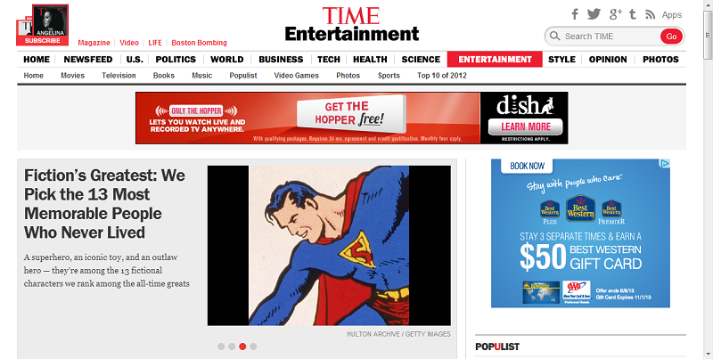
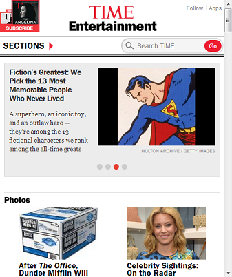
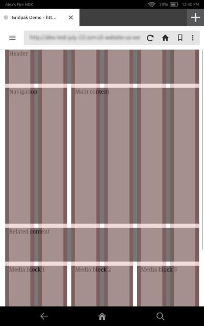
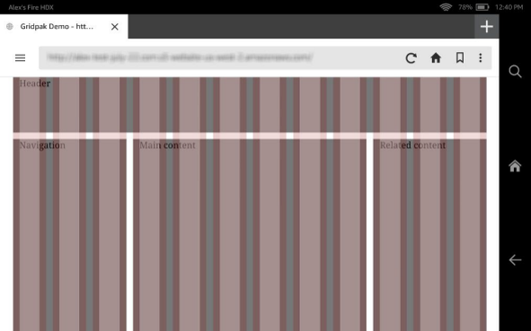

# Learn about responsive web design

Responsive web design is, among other things, a solution to the rapidly increasing demand
for websites that look good across a range of display sizes. A few years ago, web designers only
had to think about desktop monitors and—perhaps as an afterthought—smart phones.
Now designers can count on site visits from mobile, tablet, netbook, laptop, and desktop clients
in many different resolutions and aspect ratios. There's device orientation to think about, too,
and the size of the browser window (not all users maximize it). With all of these variables,
creating targeted content for every popular device is an unwieldy proposition, and one that's
unlikely to scale well as device types continue to proliferate.

Fortunately, Ethan Marcotte has pointed to an alternative in his seminal article [Responsive Web Design](http://alistapart.com/article/responsive-web-design "http://alistapart.com/article/responsive-web-design").
Instead of creating content for specific devices, we can design sites with flexible layouts that
adjust to the size of the viewport (the area that the browser uses to draw the page). For
example, the layout of [TIME.com](http://www.time.com/time/ "http://www.time.com/time/") alters with the
size of the browser window. At certain breakpoints, as the width of the window decreases, the
top navigation disappears and the layout is simplified.

Here's the TIME.com site at desktop scale.


And here's the site with the browser window reduced in size, as it would be on a mobile
device.


The site adapts to the changing width of the browser window, moving content and transforming
the navigation bar to a pop-out Sections menu.

Responsive web design makes life easier for web designers, who don't have to create a custom
layout for every new device on the market. But it's ultimately about creating a better
experience for the user, who no longer has to constantly resize, pan across, or otherwise adjust
the viewport. In a good responsive design, the layout adapts to the size of the viewport while
maintaining the intended proportionality among the various design elements.

Content, too, can be optimized for users. By thinking in terms of a content hierarchy, you
can ensure that users easily find what they're looking for on any device. For example, at a
certain pixel width, you might decide to collapse some content in order to make other content
more discoverable.

Of course, in some cases, it may be better to have a separate mobile site, instead of a
responsive site. For example, if you want to divide each of your desktop pages into multiple
mobile pages, a single set of responsively designed pages is probably not going to be the best
solution. But if you design with the "mobile first" axiom in mind, you may not need to restrict
the content available to mobile users.

## How Does Responsive Web Design Work?

Implementing a responsive design involves a combination of web development techniques and
technologies. The following can all be part of a responsive design:

**Media Queries**

[Media Queries](css3.md#media-queries "css3.md#media-queries") provide a way to
conditionally apply CSS rules. The attributes `min-width` and
`max-width` are especially useful, because they let you apply styles
according to the minimum or maximum width of the viewport. For example, the following
query sets styles for a viewport of 600 to 1000 pixels wide:

```
@media screen and (min-width: 600px) and (max-width: 1000px) { … }
```

You can also set `device-width` and
`orientation` in media queries. Using the logical operators
`and`, `not`, and `only`, you can combine media
queries for more finely tuned styling.

The conditional logic of a media query can be applied in several ways. You can embed
a media query in a link to a style sheet, so that the style sheet is applied to the
markup only if the indicated conditions are met. You can use a media query within an
`@import` rule, which imports styles from other style sheets. And you can
put media queries directly into a style sheet, as we've done in the Silk examples
below.

**Fluid Layout**

A fluid layout (also referred to as a fluid grid or liquid layout) keeps individual
elements of the web page proportional across various display sizes. Conceptually, the
opposite of a fluid layout would be a fixed-width layout in which the sizes of various
elements are specified in pixels. The key to creating a fluid layout is to use relative
rather than absolute values. A value of 80% can scale proportionally; a value of 600
pixels can't. To create a fluid layout, think percentages and ems (one em is equal to
the current font size), not pixels.

To calculate the proportional size of layout elements (text or containers, measured
in ems or percentages), use the following formula: _target /
context = result_. For example, given a main content area of 800 pixels (the
_context_), divided into a left column of 500 pixels
(the _target_) and a right column of 300 pixels, you
set the left column to 62.5% of the main content area (500 / 800 = 0.625).

As you consider the technical aspects of creating a fluid layout, you'll probably
also want to give some thought to your content hierarchy. Using a fluid layout and
breakpoints, you can reorder content containers as the viewport changes size. There's no
one right way to design a fluid layout, but it's a good idea to make important content
easy to find.

**Context-Aware Images**

Context-aware images, or flexible images, are an important part of a fluid layout.
The idea is pretty simple. An image with absolute width and height can't scale with a
fluid grid. But an image with its `max-width` property set to 100% can scale
down for smaller viewports. To save bandwidth, you can also serve different images
according to screen resolution. That way you don't force the client to load a larger
image than necessary. The `overflow:hidden` property can also help size
images appropriately, by cropping them. Keep in mind that enlarging an image beyond its
original dimensions can result in perceptible loss of quality.

**Viewport Meta Element**

The viewport is the area within which the browser draws a page, excluding the
browser Chrome. You can use the [viewport Meta Element](css3.md#viewport "css3.md#viewport") to
ensure that the viewport width is the same as the screen width. This is important for
mobile devices, because mobile browsers often try to render an entire desktop-scale page
within a mobile viewport. While this zoomed-out view lets the user see the full page
without swiping, it also effectively miniaturizes content. Moreover, media queries may
not work as expected if the viewport tag isn't implemented properly.

To avoid problems, include the `viewport` meta element in the
`head` section of your HTML document, and set `width` to
`device-width`:

```
<meta name="viewport" content="width=device-width">
```

This setting prevents browsers from zooming out
to fit more pixels in the viewport. The pixel width available to the viewport will be
the same as the pixel width of the device screen.

**Breakpoints**

A breakpoint represents a particular viewport width at which the layout changes. A
breakpoint occurs when the styling specified by one media query gives way to the styling
of another media query. In this sense, a breakpoint is not so much a single line of code
as it is a design abstraction. One strategy for creating breakpoints is to target common
device widths so that your layout is optimized for specific devices.

Another strategy (arguably a better one) is to create breakpoints based on your
content, and not on device constraints. Designing breakpoints around content aims to
make the layout user friendly and aesthetically pleasing across a range of possible
viewport widths. With this approach, you can minimize awkward layouts that fall between
device widths, and you don't have to plan for as many one-off scenarios (tablet "X" in
portrait, tablet "Y" in landscape, and so on). After all, the best outcome is to have
content that looks great at any display size.

## Responsive Design and Amazon Silk

Let's see how Silk renders a responsive design template.

We'll use the [Gridpak app](http://gridpak.com/ "http://gridpak.com/") to generate a layout
that adapts to orientation changes. The Gridpak app lets us configure columns and set
breakpoints in a web UI and then download a package of styles and scripts. We'll use a
slightly modified version of the Gridpak demo site to try out Silk.

Here's our demo site in portrait view on a Fire HD 8.9" tablet:



The following media query and the associated styles and scripts (which aren't shown)
produce a 6-column grid when the viewport is between 320 and 800 pixels wide.:

```
@media screen and (min-width: 320px) and (max-width: 800px) {
/* styles for 6-column grid */
}
```

Now here's our demo site in landscape view:



In this case, the following media query, plus the omitted styles and scripts, produce a
12-column grid when the viewport is more than 800 pixels wide.

```

@media screen and (min-width: 801px) {
/* styles for 12-column grid */
}
```

We haven't had to reference device orientation in our media
queries. We just specify width ranges. To make this layout work correctly on Silk, we also
need to add a viewport meta tag to our HTML:

```
<meta name="viewport" content="width=device-width">
```

Here we've made `width` equal to
`device-width`. This enables Silk to respond as expected to changes of device
orientation. We could also configure the viewport scale using `maximum-scale`,
`initial-scale`, and `user-scalable`. For example, the following
configuration loads the site at the scale of the viewport and lets the user zoom in to triple
the scale of the viewport:

```
<meta name="viewport" content="width=device-width, initial-scale=1.0, maximum-scale=3.0">
```

A `minimum-scale` setting is also available, but
with `width` set to `device-width`, the user won't be able to zoom out
past the width of the device.

## The Takeaway

So what's the takeaway for you, the site owner or web designer? Well, it's pretty simple.
You don't need to develop separate content for Silk. Of course, we recommend that you test
your site on a variety of devices.
But with responsive web design, you don't have to implement a new design tactic for every
device on the market. Instead, you can focus on developing content that looks great on any
device. Silk users will benefit from your efforts, and so will all the rest of your
customers.

## Additional Resources

- [Targeting
  Screens from Web Apps](http://developer.android.com/guide/webapps/targeting.html "http://developer.android.com/guide/webapps/targeting.html") in the _Android Developers
  Guide_
- Ethan Marcotte, [Responsive Web Design](http://alistapart.com/article/responsive-web-design "http://alistapart.com/article/responsive-web-design") in _A List Apart_
- Grace Smith, [85 Top
  Responsive Web Design Tools](http://mashable.com/2013/03/18/web-design-tools/ "http://mashable.com/2013/03/18/web-design-tools/") in _Mashable_
- Rahul Lalmalani's series on responsive web design in _MSDN
  Magazine_:
  - [Why the
    Web Is Ready for Responsive Web Design](http://msdn.microsoft.com/en-us/magazine/dn151701.aspx "http://msdn.microsoft.com/en-us/magazine/dn151701.aspx")
  - [Designing
    Experiences for Responsive Web Sites](http://msdn.microsoft.com/en-us/magazine/dn197837.aspx "http://msdn.microsoft.com/en-us/magazine/dn197837.aspx")
  - [Common
    Techniques in Responsive Web Design](http://msdn.microsoft.com/en-us/magazine/dn217862.aspx "http://msdn.microsoft.com/en-us/magazine/dn217862.aspx")

- Katrien De Graeve, [Responsive Web
  Design](http://msdn.microsoft.com/en-us/magazine/hh653584.aspx "http://msdn.microsoft.com/en-us/magazine/hh653584.aspx") in _MSDN Magazine_
- [Responsive Web design](https://developer.mozilla.org/en-US/docs/Web_Development/Responsive_Web_design "https://developer.mozilla.org/en-US/docs/Web_Development/Responsive_Web_design") in the _Mozilla Developer
  Network_
- Rudy Rigot and Sophie Taboni, [Responsive web design: a project-management perspective](http://dev.opera.com/articles/view/responsive-web-design-a-project-management-perspective/ "http://dev.opera.com/articles/view/responsive-web-design-a-project-management-perspective/") at
  _Dev.Opera_
- Chris Mills, [Love your devices: adaptive web design with media queries, viewport and more](http://dev.opera.com/articles/view/love-your-devices-adaptive-web-design-with-media-queries-viewport-and-more/ "http://dev.opera.com/articles/view/love-your-devices-adaptive-web-design-with-media-queries-viewport-and-more/")
  at _Dev.Opera_
- Andreas Bovens, [An introduction to meta viewport and @viewport](http://dev.opera.com/articles/view/an-introduction-to-meta-viewport-and-viewport/ "http://dev.opera.com/articles/view/an-introduction-to-meta-viewport-and-viewport/") at
  _Dev.Opera_
- Examples of responsively designed sites in [Media
  Queries](http://mediaqueri.es/ "http://mediaqueri.es/")
