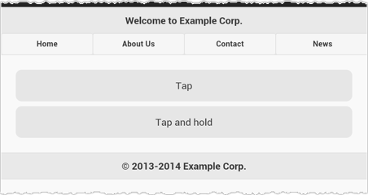
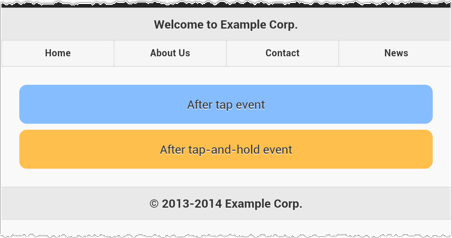

# Learn about touch interactions

As you might expect, Amazon Silk is designed for touch
interactions and fully supports [Touch Events](html5-apis.md#touch-events "html5-apis.md#touch-events"). In
general, Amazon Silk and other touch browsers know how to apply touch interactions to
click-based DOM events, even with no mouse involved. For example, Silk will fire the following
`onclick` event in response to a tap.

```
<html>
  <body>
    <button onclick="testFunction()">Tap me</button>
    <div id="test"></div>
    <script>
    function testFunction() {
        document.getElementById("test").innerHTML="The tap fired an onclick event.";
    }
    </script>
  </body>
</html>


```

In many web development scenarios, you can rely on this sort of compatability between mouse
events and a touch interface. But touch gestures are more than just a substitute for mouse
interactions. Touch is an integral part of the web browsing experience on a tablet, and if you
want to go beyond parity with desktop functionality—that is, if you want to provide an
experience tailored to a tablet or mobile form factor—providing added support for touch
gestures is a good place to start.

###### Note

Designing for touch events can also provide a better experience for trackpad users.

The W3C makes several [recommendations for touch-based interactions](http://www.w3.org/TR/mwabp/#bp-presentation-interaction "http://www.w3.org/TR/mwabp/#bp-presentation-interaction"):

- The spacing of selectable elements should be wide enough to accomodate direct
  selection.
- The screen size of selectable elements should be sufficient to accomodate direct
  selection.
- Because elements have to be selected to be in focus, you should be careful not to hide
  information behind a focus state.
  The first two recommendations address the "fat finger" problem. If selectable
  page elements are small and densely placed, it's easy to select the wrong one. The solution is
  to design navigation elements that are large enough to be easily selected by touch.

The third item pertains to information that's intended to be hidden until an element comes
into focus. The issue is that, with touch interactions, it can be problematic to distinguish
between focusing on an element and selecting an element. This issue is particularly important
when it comes to drop-down menus. On desktop, a user can trigger the `:focus` or
`:hover` pseudoclasses by mousing over an element. Thus, for desktop you can create
a drop-down navigation that displays child elements on mouseover. With a touch device, such
hover menus are more complicated.

## Touch Example Using jQuery Mobile

Consider a few examples of DOM events specifically designed for touch. These examples use
[jQuery Mobile](http://jquerymobile.com/ "http://jquerymobile.com/"), as it provides good touch
support. jQuery Mobile is a web development framework designed to make HTML5-compatible,
responsive, touch-optimized websites. The example below specifies targets and create handlers
for two touch events: [tap](http://api.jquerymobile.com/tap/ "http://api.jquerymobile.com/tap/") and [taphold](http://api.jquerymobile.com/taphold/ "http://api.jquerymobile.com/taphold/").

###### Note

This example includes the jQuery libraries from a content delivery network, so you
should be able to paste the code below directly into a page and run it without downloading
any additional resources.

```
<html>
  <head>
    <meta name="viewport" content="width=device-width, initial-scale=1.0, user-scalable=no">
    <style>
    div.test {
        text-align: center;
        border-radius: .625em;
        background-color: #E6E6E6;
        padding: 1em;
        margin: .5em;
    }
    </style>
    <link rel="stylesheet" href="http://code.jquery.com/mobile/1.4.2/jquery.mobile-1.4.2.min.css" />
  </head>
  <body>
    <div data-role="page" id="home">
      <div data-role="header">
        <h1>Welcome to Example Corp.</h1>
        <div data-role="navbar">
          <ul>
            <li><a href="#home" class="ui-btn ui-btn-inline ui-corner-all">Home</a></li>
            <li><a href="#about" class="ui-btn ui-btn-inline ui-corner-all">About Us</a></li>
            <li><a href="#contact" class="ui-btn ui-btn-inline ui-corner-all">Contact</a></li>
            <li><a href="#news" class="ui-btn ui-btn-inline ui-corner-all">News</a></li>
          </ul>
        </div>
      </div>
      <div data-role="main" class="ui-content">
          <div class="test tap">Tap</div>
          <div class="test taphold">Tap and hold</div>
      </div>
      <div data-role="footer">
        <h1>&copy; 2013-2014 Example Corp.</h1>
      </div>
    </div>
    <script>
    $(function(){
        $("div.test.tap").on("tap", function() {
            $(this).text("After tap event").css("background-color", "#86BDFF");
        });
        $("div.test.taphold").on("taphold", function() {
            $(this).text("After tap-and-hold event").css("background-color", "#FFBF4C");
        });
    });
    </script>
  </body>
</html>

```

Both the `tap` and `taphold` events are jQuery Mobile extensions of
jQuery built-in methods. The `tap` event is fired by a quick touch event on an
element. The `taphold` event is fired by a touch-and-hold event (that is, a long
press) on an element. (By default, the jQuery Mobile `taphold` event is triggered
by a sustained tap of 750 milliseconds, but you can change this.)

We could also have implemented other jQuery Mobile touch events, like [swipe](https://api.jquerymobile.com/swipe/ "https://api.jquerymobile.com/swipe/"), [swipeleft](http://api.jquerymobile.com/swipeleft/ "http://api.jquerymobile.com/swipeleft/"), and [swiperight](http://api.jquerymobile.com/swiperight/ "http://api.jquerymobile.com/swiperight/"). The code above sets two
anonymous callback functions, one on the `div.test.tap` selector, and one on the
`div.test.taphold` selector. In each case, we're binding a target
(`div.test.tap` or `div.test.taphold`) to an event (`tap`
or `taphold`), and in each case the event handler modifies the CSS applied to the
target element.

Here's what the page looks like immediately after page load:



And here's the page after the tap and tap-and-hold events.



The example above illustrates the beginning of a touch-friendly web design. Even in
portrait mode, the top navigation links are wide enough to accommodate touch interactions
comfortably. jQuery Mobile makes it especially easy to create such a touch-friendly design,
and there are other options, too. [Bootstrap](http://getbootstrap.com/ "http://getbootstrap.com/") is a
design framework that provides good touch support, and there are various plugins available for
improving touch support.

So here are the takeaways:

- Design and develop with touch interactions in mind. Even if your site or application
  is not specifically targeted for touch devices, you should provide a good experience for
  all users.
- Frameworks like jQuery Mobile and Bootstrap can help you provide a great experience
  to touch-device users. These frameworks won't be useful for every project, but creating
  touch-friendly interactions is important for every site.

## Additional Resources

- [W3C Touch Events
  Recommendation](http://www.w3.org/TR/touch-events/ "http://www.w3.org/TR/touch-events/")
- [Multi-touch Web
  Development](http://www.html5rocks.com/en/mobile/touch/ "http://www.html5rocks.com/en/mobile/touch/")
- [Touch events](https://developer.mozilla.org/en-US/docs/Web/Guide/Events/Touch_events "https://developer.mozilla.org/en-US/docs/Web/Guide/Events/Touch_events")
- [Touch And Mouse:
  Together Again For The First Time](http://www.html5rocks.com/en/mobile/touchandmouse/ "http://www.html5rocks.com/en/mobile/touchandmouse/")
