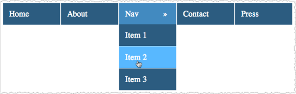
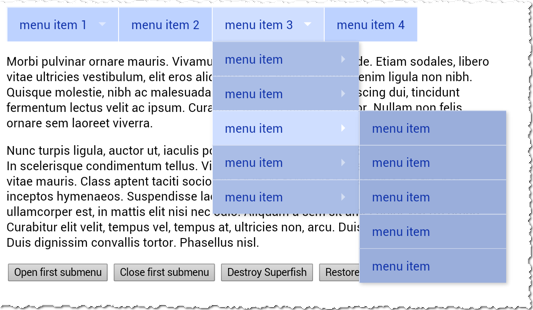

# Creating drop-down menus for a touch screen

Because Amazon Silk runs on a touch-screen device, it doesn't handle the CSS pseudoclass
`:hover` the same way that a desktop browser does. On a desktop browser,
`:hover` becomes a match when you move the pointer over an element on
which `:hover` is set. This behavior is useful for drop-down menus, as you
can create a menu that's hidden until the user hovers over the parent element. But on a
touch screen, this sort of hover-based menu design can lead to problems.

Let's look at an example. The following HTML document contains two unordered lists,
one nested within the other. Each <li> element contains a link.

```
<html>
  <head>
    <link rel="stylesheet" type="text/css" href="dropdown.css">
  </head>
  <body>
    <div class="nav">
      <ul>
        <li><a href="http://example.com/">Home</a></li>
        <li><a href="http://example.com/">About</a></li>
        <li class="more"><a href="http://example.com/">Nav</a>
          <ul>
            <li><a href="http://example.com/">Item 1</a></li>
            <li><a href="http://example.com/">Item 2</a></li>
            <li><a href="http://example.com/">Item 3</a></li>
          </ul>
        </li>
        <li><a href="http://example.com/">Contact</a></li>
        <li><a href="http://example.com/">Press</a></li>
      </ul>
    </div>
  </body>
</html>

```

By applying CSS to this markup, we can create a simple drop-down navigation. Here's
our style sheet:

```
div.nav ul {
    padding: 0;
    margin: 0;
    list-style-type: none;
}

div.nav ul li {
    color: #FFF;
    padding: 15px;
    font-size: 20px;
    border-right: 2px #FFF solid;
    border-bottom: 1px #FFF solid;
    float:left;
    background-color:#335A7F;
    width: 110px;
}

div.nav ul li a {
    color: #FFF;
    text-decoration: none;
}

div.nav li:hover {
    background-color: #4C88BF;
}

div.nav ul li ul {
    display:none;
}

div.nav ul li:hover ul {
    display: list-item;
    position: absolute;
    margin-top: 14px;
    margin-left: -15px;
}

div.nav ul li:hover ul li {
    float:none;
}

div.nav ul li ul li:hover {
    float:none;
    background-color: #66B5FF;
}

li.more:after {
    content: "\00BB";
    float: right;
    margin-right: 7px;
}

```

Notice how the `display` property is used. First, we use
`display:none` to hide the nested <ul>, and then we use the
`:hover` state to trigger `display:list-item`, which overrides
the first `display` and shows us the nested <ul>. The result, rendered
on a desktop browser, is shown below.


A single <li> contains both a hidden list and a link. To display
the drop-down menu, you hover over the appropriate <li>. To follow a link, you
click the <a> element within the appropriate <li>. In other words, you need
to register two different events under the same parent element. This works fine as long
as you're using a mouse, which supports both hovering and clicking. But Silk relies on a
single gesture—a tap—to represent both hovering and clicking. As a result,
a user might tap an element with the intention of showing menu items, and the effect
would be to follow the link. That's a potentially frustrating user experience.

There are several ways to avoid this problem. One possibility, given the prevalence of
touch-screen devices, is simply not to use menus that are dependent on a hover state.
Another option is to detect touch-screen devices and then deliver a different,
touch-optimized menu. Similarly, you can use scripting to alter the way that the menu
responds to touch events. [Superfish](https://plugins.jquery.com/superfish/ "https://plugins.jquery.com/superfish/"), a [jQuery](http://jquery.com/ "http://jquery.com/") plugin, provides such a solution.

In the following example page, which is distributed by Superfish and is shown here
rendered by Silk on a Kindle Fire HDX, the drop-down menus open on tap.


To follow a top-level menu item (for example, menu item 3), you'd tap
it a second time. On a desktop browser, the drop-down menus unfold on hover, and you
follow links by clicking. Thus, the menus are navigable on both touch-screen and desktop
browsers.

Superfish is just one option among many, and it may not be the best solution for your
site. The point is that it's important to create drop-down navigations that provide a
good experience for both desktop and touch-screen visitors. To do so, you'll need to
ensure that the `:hover` pseudoclass is not hiding content from touch-screen
users.

For more on drop-down menus and touch screens, see the following resources.

Additional Resources

- [Touch
  and Mouse: Together Again for the First Time](http://www.html5rocks.com/en/mobile/touchandmouse/ "http://www.html5rocks.com/en/mobile/touchandmouse/")
- [Mozilla Developer Network :hover](https://developer.mozilla.org/en-US/docs/Web/CSS/:hover "https://developer.mozilla.org/en-US/docs/Web/CSS/:hover")
