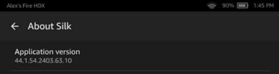

# Determining the Amazon Silk build version

Each version of Amazon Silk includes a build version and a browser version. In some
troubleshooting scenarios, you may need to know both the browser and build versions for a
given Amazon Silk client. You can find these values from the Amazon Silk user agent string.

From the Silk browser, tap the menu icon. If you see this menu, you have the latest
version of Silk. Use the following procedure to locate the build version and browser version.
If your menu looks different, you may have an older version of Silk.

1. From the Silk menu, tap **Settings**, and then tap **About Silk**.
2. Locate the application number, which should look something like this:
   `44.1.54.2403.63.10`.

In this example, the first set of numbers, `44.1.54`, is the browser
version.

The second set of numbers, `2403.63.10`, is the build version.

