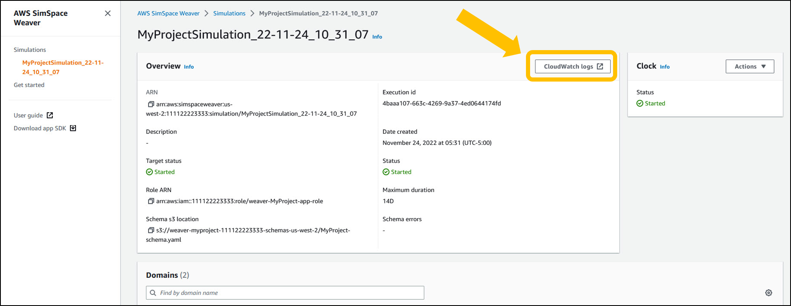
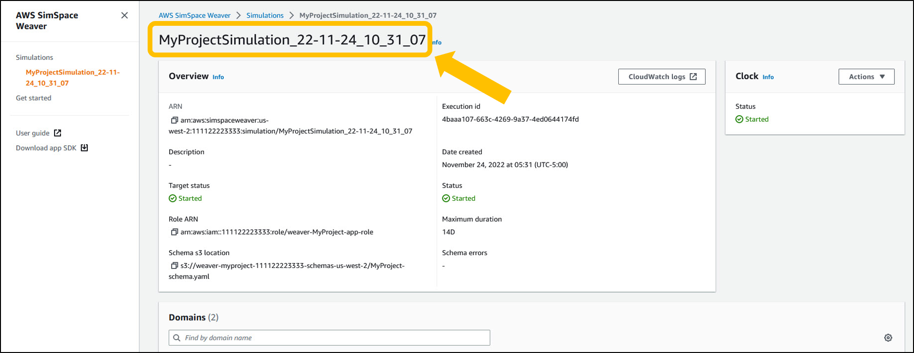

End of support notice: On May 20, 2026, AWS
will end support for AWS SimSpace Weaver. After May 20, 2026, you will
no longer be able to access the SimSpace Weaver console or SimSpace Weaver resources.
For more information, see [AWS SimSpace Weaver end of support](simspaceweaver-end-of-support.md "simspaceweaver-end-of-support.md").

# SimSpace Weaver logs in Amazon CloudWatch Logs

## Accessing your SimSpace Weaver

logs

All the logs generated from your SimSpace Weaver simulations are stored in Amazon CloudWatch Logs.
To access your logs, you can use the **CloudWatch logs** button
in the **Overview** pane of your simulation in the
SimSpace Weaver console, which will take you directly to the logs for that specific
simulation.



You can also access the logs through the CloudWatch console. You will need the name of
your simulation in order to search for its logs.



## SimSpace Weaver logs

SimSpace Weaver writes simulation management messages and the console output
from your apps to Amazon CloudWatch Logs. For more information on working with logs, see
[Working with log groups and log streams](../../../AmazonCloudWatch/latest/logs/Working-with-log-groups-and-streams.md "../../../AmazonCloudWatch/latest/logs/Working-with-log-groups-and-streams.md") in the _Amazon CloudWatch Logs
User Guide_.

Each simulation that you create has its own log group
in CloudWatch Logs. The name of the log group is specified in the simulation schema.
In the following schema snippet, the value of `log_destination_service`
is `logs`. This means that the value of `log_destination_resource_name`
is the name of a log group. In this case, the log group is `MySimulationLogs`.

```


simulation_properties:
  log_destination_service: "logs"
  log_destination_resource_name: "MySimulationLogs"
  default_entity_index_key_type: "Vector3<f32>"


```

You can also use the DescribeSimulation API to find the
name of the log group for simulation after you start it.

```
aws simspaceweaver describe-simulation --simulation `simulation-name`
```

The following example shows the part of the output from DescribeSimulation
that describes the logging configuration. The name of the log group is shown at the end of the
`LogGroupArn`.

```


    "LoggingConfiguration": {
        "Destinations": [
            {
                "CloudWatchLogsLogGroup": {
                    "LogGroupArn": "arn:aws:logs:us-west-2:111122223333:log-group:MySimulationLogs"
                }
            }
        ]
    },


```

Each simulation log group contains several log streams:

- Management log stream – simulation
  management messages produced by the SimSpace Weaver service.

```
/sim/management
```

- Errors log stream – error
  messages produced by the SimSpace Weaver service. This log stream only
  exists if there are errors. SimSpace Weaver stores errors written by your apps
  in their own app log streams (see the following log streams).

```
/sim/errors
```

- Spatial app log streams (1 for each spatial app
  on each worker) – console output produced by spatial apps. Each spatial app
  writes to its own log stream. The `spatial-app-id` is
  all characters after the trailing slash at the end of the `worker-id`.

```
/domain/`spatial-domain-name`/app/worker-`worker-id`/`spatial-app-id`
```

- Custom app log streams (1 for each custom app instance)
  – console output produced by custom apps. Each custom app instance writes
  to its own log stream.

```
/domain/`custom-domain-name`/app/`custom-app-name`/`random-id`
```

- Service app log streams (1 for each service app
  instance) – console output produced by service apps. Each service app
  writes to its own log stream. The `service-app-id` is
  all characters after the trailing slash at the end of the `service-app-name`.

```
/domain/`service-domain-name`/app/`service-app-name`/`service-app-id`
```
