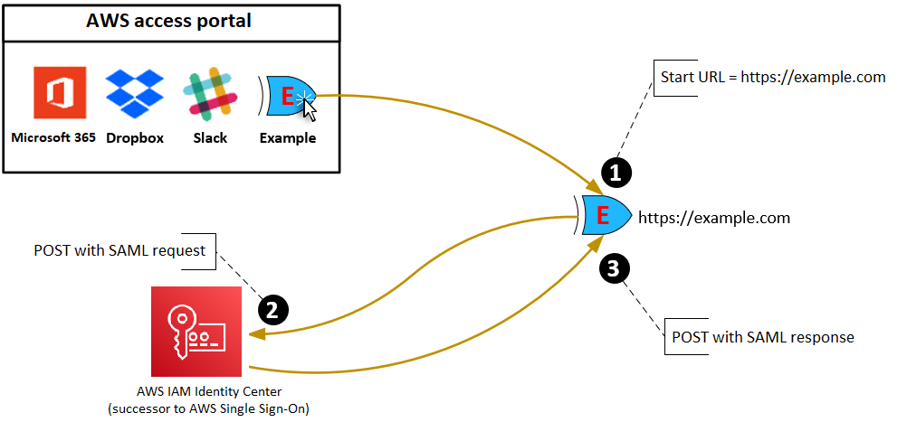
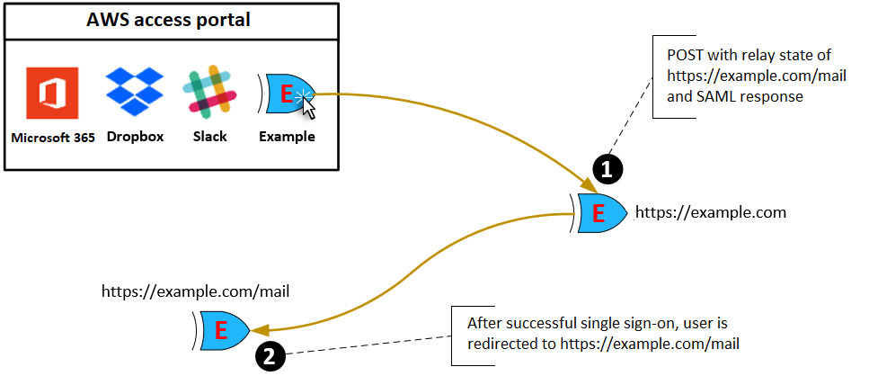

# Understand application properties in the IAM Identity Center
 console

In IAM Identity Center you can customize the user experience by configuring the application start
 URL, relay state, and session duration. 

## Application start URL

You use an application start URL to start the federation process with your
 application. The typical use is for an application that supports only service
 provider (SP)-initiated binding.

The following steps and diagram illustrate the application start URL
 authentication workflow when a user chooses an application in the
 AWS access portal:

1. The user’s browser redirects the authentication request using the value
 for the application start URL (in this case https://example.com).
2. The application sends an `HTML`
`POST` with a `SAMLRequest` to IAM Identity Center.
3. IAM Identity Center then sends an `HTML`
`POST` with a `SAMLResponse` back to the
 application.

## Relay state

During the federation authentication process, the relay state redirects users
 within the application. For SAML 2.0, this value is passed, unmodified, to the
 application. After the application properties are configured, IAM Identity Center sends the relay
 state value along with a SAML response to the application. 

## Session duration

Session duration is the length of time for which an application user session is
 valid. For SAML 2.0, this is used to set the `SessionNotOnOrAfter` date
 of the SAML assertion's element `saml2:AuthNStatement`. 

Session duration can be interpreted by applications in either of the following
 ways:

* Applications can use it to determine the maximum time that is allowed for
 the user's session. Applications might generate a user session with a
 shorter duration. This can happen when the application only supports user
 sessions with a duration that is shorter than the configured session
 length.
* Applications can use it as the exact duration and might not allow
 administrators to configure the value. This can happen when the application
 only supports a specific session length.

For more information about how session duration is used, see your specific
 application’s documentation.
