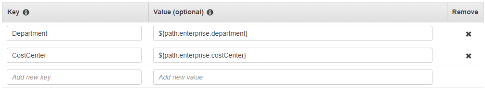

# Select your attributes for
 access control

Use the following procedure to set up attributes for your ABAC
 configuration. 

###### To select your attributes using the IAM Identity Center console

1. Open the [IAM Identity Center console](https://console.aws.amazon.com/singlesignon "https://console.aws.amazon.com/singlesignon").
2. Choose **Settings**
3. On the **Settings** page, choose the
 **Attributes for access control** tab, and then
 choose **Manage attributes**.
4. On the **Attributes for access control** page,
 choose **Add attribute** and enter the
 **Key** and **Value** details.
 This is where you will be mapping the attribute coming from your
 identity source to an attribute that IAM Identity Center passes as a session
 tag.

**Key** represents the name you are giving to the
 attribute for use in policies. This can be any arbitrary name, but
 you need to specify that exact name in the policies you author for
 access control. For example, lets say that you are using
 Okta (an external IdP) as your identity source
 and need to pass your organization's cost center data along as
 session tags. In **Key**, you would enter a
 similarly matched name like **CostCenter** as your
 key name. It's important to note that whichever name you choose
 here, it must also be named exactly the same in your `aws:PrincipalTag
 condition key` (that is,
 `"ec2:ResourceTag/CostCenter":
 "${aws:PrincipalTag/CostCenter}"`).

###### Note

Use a single-value attribute for your key, for example,
 `Manager`. IAM Identity Center doesn't support
 multi-value attributes for ABAC, for example,
 `Manager, IT Systems`.

**Value** represents the content of the attribute
 coming from your configured identity source. Here you can enter any
 value from the appropriate identity source table listed in [Attribute mappings between IAM Identity Center and External
 Identity Providers directory](attributemappingsconcept.md "attributemappingsconcept.md"). For example, using
 the context provided in the above mentioned example, you would
 review the list of supported IdP attributes and determine that the
 closest match of a supported attribute would be
 **`${path:enterprise.costCenter}`**
 and you would then enter it in the **Value** field.
 See the screenshot provided above for reference. Note, that you
 can’t use external IdP attribute values outside of this list for
 ABAC unless you use the option of passing attributes through the
 SAML assertion.
5. Choose **Save changes**.
Now that you have configured mapping your access control attributes, you
 need to complete the ABAC configuration process. To do this, create your
 ABAC rules and add them to your permission sets and/or resource-based
 policies. This is required so that you can grant user identities access to
 AWS resources. For more information, see [Create permission policies for ABAC in
 IAM Identity Center](configure-abac-policies.md "configure-abac-policies.md").
