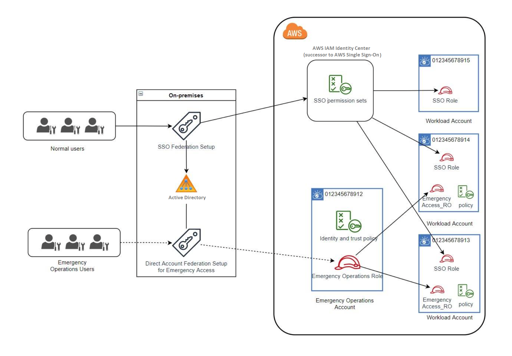

# How to

design
your critical operations roles

With this design, you configure a single AWS account in which you federate through IAM, so that users can assume critical operations roles.
The critical operations roles have a trust policy that enables users to assume a corresponding role in your workload accounts.
The roles in the workload accounts provide the permissions that users require to perform essential work.

The following diagram provides a design overview.

