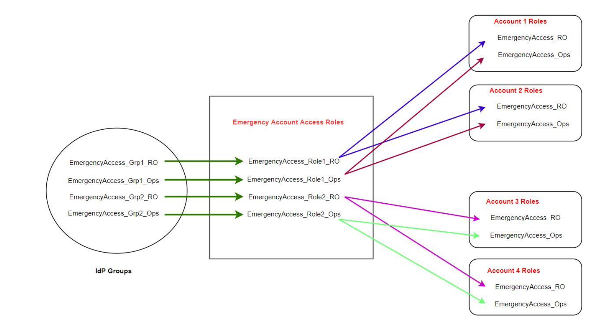

# How to design

emergency
role, account, and group mapping

The following diagram shows how to map your emergency access groups to roles in your
emergency access account. The diagram also shows the cross-account role trust
relationships that enable emergency access account roles to access corresponding roles in
your workload accounts. We recommend that your emergency plan design use these mappings as
a starting point.

