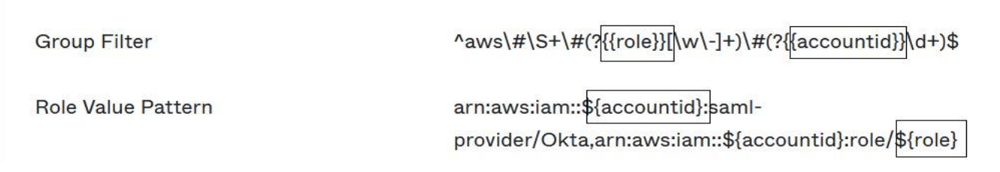

# One-time setup of a direct IAM federation application in Okta

1. Sign in to your Okta account as a user with administrative permissions.
2. In the Okta Admin Console, under **Applications**, choose
   **Applications.**
3. Choose **Browse App Catalog**. Search for and choose **AWS Account
   Federation**. Then choose **Add integration**.
4. Set up direct IAM federation with AWS by following the steps in [How to Configure SAML 2.0 for AWS Account Federation](https://saml-doc.okta.com/SAML_Docs/How-to-Configure-SAML-2.0-for-Amazon-Web-Service.html "https://saml-doc.okta.com/SAML_Docs/How-to-Configure-SAML-2.0-for-Amazon-Web-Service.html").
5. On the **Sign-On Options** tab, select SAML 2.0 and enter **Group Filter**
   and **Role Value Pattern** settings. The name of the group for the user directory depends on the filter that you configure.



In the figure above, the `role` variable is for the emergency operations
role in your emergency access account. For example, if you create the
`EmergencyAccess_Role1_RO` role (as described in the mapping table) in
AWS account `123456789012`, and if your group filter setting is configured
as shown in the figure above, your group name should be
`aws#EmergencyAccess_Role1_RO#123456789012`. 6. In your directory (for example, your directory in Active Directory), create the emergency
access group and specify a name for the directory (for example,
`aws#EmergencyAccess_Role1_RO#123456789012`). Assign your users to this
group by using your existing provisioning mechanism. 7. In the emergency access account, [configure a custom trust policy](../../../IAM/latest/UserGuide/id_roles_create_for-custom.md "../../../IAM/latest/UserGuide/id_roles_create_for-custom.md") that provides the permissions required for
the emergency access role to be assumed during a disruption. Following is an example
statement for a custom **trust policy** that is attached
to the `EmergencyAccess_Role1_RO` role. For an illustration, see the
emergency account in the diagram under [How to design
e
mergency
role, account, and group mapping](emergency-access-mapping-design.md "emergency-access-mapping-design.md") .

JSON

```
`{
 "Version":"2012-10-17",
 "Statement": [
 {
 "Effect":"Allow",
 "Principal":{
 "Federated":"arn:aws:iam::123456789012:saml-provider/Okta"
 },
 "Action":[
 "sts:AssumeRoleWithSAML",
 "sts:TagSession"
 ],
 "Condition":{
 "StringEquals":{
 "SAML:aud": "https://signin.aws.amazon.com/saml"
 }
 }
 },
 {
 "Effect":"Allow",
 "Principal":{
 "Federated":"arn:aws:iam::123456789012:saml-provider/Okta"
 },
 "Action":"sts:SetSourceIdentity"
 }
 ]
}`

```

8. The following is an example statement for a **permissions
   policy** that is attached to the `EmergencyAccess_Role1_RO`
   role. For an illustration, see the emergency account in the diagram under [How to design
   e
   mergency
   role, account, and group mapping](emergency-access-mapping-design.md "emergency-access-mapping-design.md") .

JSON

```
`{
 "Version":"2012-10-17",
 "Statement": [
 {
 "Effect": "Allow",
 "Action": "sts:AssumeRole",
 "Resource": [
 "arn:aws:iam::111122223333:role/EmergencyAccess_RO",
 "arn:aws:iam::444455556666:role/EmergencyAccess_RO"
 ]
 }
 ]
}`

```

9. On the workload accounts, configure a custom trust policy. Following is an example statement for a **trust policy** that is attached to the `EmergencyAccess_RO` role. In this example, account `123456789012` is the emergency access account.
   For an illustration, see workload account in the diagram under [How to design
   e
   mergency
   role, account, and group mapping](emergency-access-mapping-design.md "emergency-access-mapping-design.md") .

JSON

```
`{
 "Version":"2012-10-17",
 "Statement":[
 {
 "Effect":"Allow",
 "Principal":{
 "AWS":"arn:aws:iam::123456789012:root"
 },
 "Action":"sts:AssumeRole"
 }
 ]
}`

```

###### Note

Most IdPs enable you to keep an application integration deactivated until required. We recommend that you keep the direct IAM federation application deactivated in your IdP until required for emergency access.
