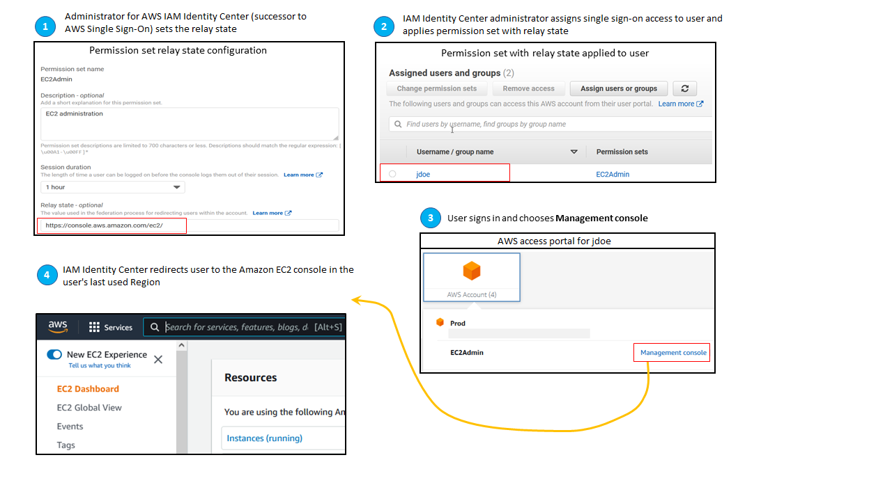

# Set relay state for quick access to the
 AWS Management Console

By default, when a user signs into the AWS access portal, chooses an account, and
 then chooses the role that AWS creates from the assigned permission set, IAM Identity Center
 redirects the user’s browser to the AWS Management Console. You can change this behavior by
 setting the relay state to a different console URL. 

Setting the relay state enables you to provide the user with quick access to
 the console that is most appropriate for their role. For example, you can set the
 relay state to the Amazon EC2 console URL
 (`https://console.aws.amazon.com/ec2/`) to redirect the
 user to that console when they choose the Amazon EC2 administrator role. During the
 redirection to the default URL or relay state URL, IAM Identity Center routes the user’s
 browser to the console endpoint in the last AWS Region used by the user. For
 example, if a user ended their last console session in the Europe (Stockholm) Region
 (eu-north-1), the user is redirected to the Amazon EC2 console in that Region.

To configure IAM Identity Center to redirect the user to a console in a specific
 AWS Region, include the Region specification as part of the URL. For example,
 to redirect the user to the Amazon EC2 console in the US East (Ohio) Region
 (us-east-2), specify the URL for the Amazon EC2 console in that Region
 (`https://us-east-2.console.aws.amazon.com/ec2/`).
 If you enabled IAM Identity Center in the US West (Oregon) Region (us-west-2) Region and you want to
 direct the user to that Region, specify
 `https://us-west-2.console.aws.amazon.com`. 

## Configure the relay state

Use the following procedure to configure the relay state URL for a
 permission set.

1. Open the [IAM Identity Center console](https://console.aws.amazon.com/singlesignon "https://console.aws.amazon.com/singlesignon").
2. Under **Multi-account permissions**, choose
 **Permission sets**.
3. Choose the name of the permission set for which you want to set
 the new relay state URL.
4. On the details page for the permission set, to the right of the
 **General settings** section heading, choose
 **Edit**.
5. On the **Edit general permission set settings**
 page, under **Relay state**, type a console URL for
 any of the AWS services. For example:

`https://console.aws.amazon.com/ec2/`

###### Note

The relay state URL must be within the AWS Management Console.
6. If the permission set is provisioned in any AWS accounts, the
 names of the accounts appear under **AWS accounts to
 reprovision automatically**. After the relay state URL
 for the permission set is updated, all AWS accounts that use the
 permission set are reprovisioned. This means that the new value for
 this setting is applied to all AWS accounts that use the
 permission set.
7. Choose **Save changes**.
8. At the top of the **AWS Organization** page, a
 notification appears.

	* If the permission set is provisioned in one or more
	 AWS accounts, the notification confirms that the
	 AWS accounts were reprovisioned successfully, and the
	 updated permission set was applied to the accounts.
	* If the permission set isn't provisioned in an
	 AWS account, the notification confirms that the settings
	 for the permission set were updated.

###### Note

You can automate this process by using the AWS API, an AWS SDK, or
 the AWS Command Line Interface(AWS CLI). For more information, see: 

* The `CreatePermissionSet` or
 `UpdatePermissionSet` actions in the [IAM Identity Center API Reference](../APIReference/welcome.md "../APIReference/welcome.md")
* The `create-permission-set` or
 `update-permission-set` commands in the [sso-admin](https://docs.aws.amazon.com/cli/latest/reference/sso-admin/index.html#cli-aws-sso-admin "https://docs.aws.amazon.com/cli/latest/reference/sso-admin/index.html#cli-aws-sso-admin") section of the
 *AWS CLI Command Reference*.
