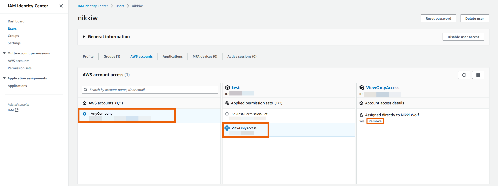
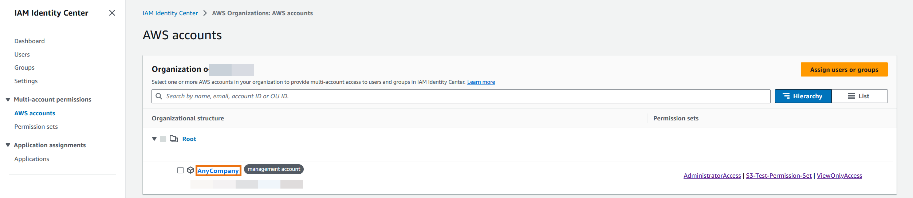

# Remove permission sets in

IAM Identity Center

You can remove a permission set from IAM Identity Center users and groups in the IAM Identity Center
console. You can also remove a permission set from an AWS account. For more
information about permission sets and how they are used in IAM Identity Center, see [Manage AWS accounts with permission
sets](permissionsetsconcept.md "permissionsetsconcept.md").

###### Note

To use permission sets, you'll need to use an Organization instance of
IAM Identity Center. For more information, see [Organization and account instances of IAM Identity Center](identity-center-instances.md "identity-center-instances.md").

Remove permission set from a user

###### Remove permission set from a user

Use this procedure to remove a permission set from a user with
the IAM Identity Center console.

1. Sign in to the AWS Management Console and open the AWS IAM Identity Center console at [https://console.aws.amazon.com/singlesignon/](https://console.aws.amazon.com/singlesignon/ "https://console.aws.amazon.com/singlesignon/").
2. Under **IAM Identity Center**, select
   **Users**.
3. Select the username of the user you want to remove a
   permission set from.
4. On the user details page, select the
   **AWS accounts** tab. Under
   **AWS account access**, select your
   AWS account.
5. In the right pane, the applied permissions for the
   selected user appears. Select the permission set you want to
   remove. Under **Account Access details**,
   select **Remove**.
6. A dialog box appears asking if you want to remove this
   permission set. Select **Remove**.

Remove permission set from a group

###### Remove permission set from a group

Use this procedure to remove a permission set from a group
with the IAM Identity Center console.

1. Sign in to the AWS Management Console and open the AWS IAM Identity Center console at [https://console.aws.amazon.com/singlesignon/](https://console.aws.amazon.com/singlesignon/ "https://console.aws.amazon.com/singlesignon/").
2. Under **Multi-account permissions**,
   select **AWS accounts**. Select the link
   to your management account.

 3. Under the **Assigned users and groups**
tab, select the group you want to remove the permission set
from and then select **Change permission
set**. 4. On the **Change permission sets** page,
clear the permission set you want to remove and then select
**Save changes**.

Remove permission set from an AWS account
Use this procedure to remove a permission set from the
AWS account with the IAM Identity Center console.

1. Sign in to the AWS Management Console and open the AWS IAM Identity Center console at [https://console.aws.amazon.com/singlesignon/](https://console.aws.amazon.com/singlesignon/ "https://console.aws.amazon.com/singlesignon/").
2. Under **Multi-account permissions**,
   select **AWS accounts**. Select the name
   of the AWS account from which you want to remove the
   permission set.
3. On the **Overview** page of the
   AWS account, choose the **Permission
   sets** tab. Select the permission set you want
   to remove. Then select **Remove**.
4. In the **Remove permission set** dialog
   box, confirm that the correct permission set is selected,
   type `Delete` to confirm removal, and
   then choose **Remove access**.
