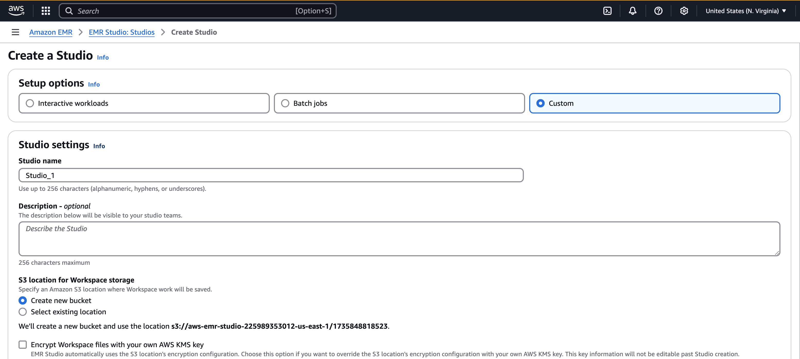
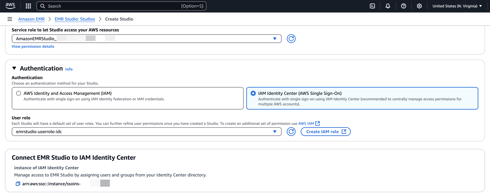
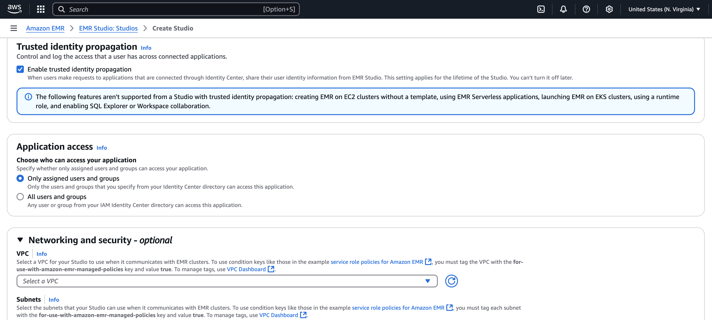

# Setting up trusted identity propagation

with Amazon EMR Studio

The following procedure walks you through setting up Amazon EMR
Studio for trusted identity propagation in queries
against an Amazon Athena workgroups or Amazon EMR clusters running Apache
Spark.

## Prerequisites

Before you can get started with this tutorial, you'll need to set up
the following:

1. [Enable IAM Identity Center](enable-identity-center.md "enable-identity-center.md").
   [Organization instance](organization-instances-identity-center.md "organization-instances-identity-center.md") is recommended. For more
   information, see [Prerequisites and
   considerations](trustedidentitypropagation-overall-prerequisites.md "trustedidentitypropagation-overall-prerequisites.md").
2. [Provision the users and groups from
   your source of identities into IAM Identity Center](tutorials.md "tutorials.md").

To complete setting up trusted identity propagation from Amazon EMR Studio,
the EMR Studio administrator must perform the following steps.

## Step 1. Create the required

IAM roles for EMR Studio

In this step, the Amazon EMR Studio administrator creates
and IAM service role and an IAM user role for EMR
Studio.

1.  **[Create an EMR Studio service role](../../../emr/latest/ManagementGuide/emr-studio-service-role.md "../../../emr/latest/ManagementGuide/emr-studio-service-role.md")** -
    EMR Studio assume this IAM role to securely manage workspaces
    and notebooks, connect to clusters, and handle data
    interactions.

        1. Navigate to the IAM console ([https://console.aws.amazon.com/iam/](https://console.aws.amazon.com/iam/ "https://console.aws.amazon.com/iam/")) and
         create an IAM role.
        2. Select **AWS service** as the
         trusted entity and then choose
         **Amazon EMR**. Attach the following
         policies to define the role's permissions and trust
         relationship.


        To use these policy, replace the
         `italicized placeholder
         text` in the example policy with your
         own information. For additional directions, see [Create a policy](../../../IAM/latest/UserGuide/access_policies_create.md "../../../IAM/latest/UserGuide/access_policies_create.md") or [Edit a policy](../../../IAM/latest/UserGuide/access_policies_manage-edit.md "../../../IAM/latest/UserGuide/access_policies_manage-edit.md").


        JSON


        ```
        `{
         "Version":"2012-10-17",
         "Statement": [
         {
         "Sid": "ObjectActions",
         "Effect": "Allow",
         "Action": [
         "s3:PutObject",
         "s3:GetObject",
         "s3:DeleteObject"
         ],
         "Resource": [
         "arn:aws:s3:::`Your-S3-Bucket-For-EMR-Studio`/*"
         ],
         "Condition": {
         "StringEquals": {
         "aws:ResourceAccount": "`Your-AWS-Account-ID`"
         }
         }
         },
         {
         "Sid": "BucketActions",
         "Effect": "Allow",
         "Action": [
         "s3:ListBucket",
         "s3:GetEncryptionConfiguration"
         ],
         "Resource": [
         "arn:aws:s3:::`Your-S3-Bucket-For-EMR-Studio`"
         ],
         "Condition": {
         "StringEquals": {
         "aws:ResourceAccount": "`Your-AWS-Account-ID`"
         }
         }
         }
         ]
        }`

        ```

        [Show moreShow less](# "#")


        For a reference of all the service role permissions,
         see [EMR Studio service role permissions](../../../emr/latest/ManagementGuide/emr-studio-service-role.md#emr-studio-service-role-permissions-table "../../../emr/latest/ManagementGuide/emr-studio-service-role.md#emr-studio-service-role-permissions-table").

    [Show moreShow less](# "#")

2.  **[Create an EMR Studio user role for IAM Identity Center
    authentication](../../../emr/latest/ManagementGuide/emr-studio-user-permissions.md#emr-studio-create-user-role "../../../emr/latest/ManagementGuide/emr-studio-user-permissions.md#emr-studio-create-user-role")** - EMR Studio assumes
    this role when a user signs in through IAM Identity Center to manage
    workspaces, EMR clusters, jobs, git repositories. **This role is used to initiate the trusted
    identity propagation workflow**.

###### Note

The EMR Studio user role does not need to include
permissions to access the Amazon S3 locations of the tables in
AWS Glue Catalog. AWS Lake Formation permissions and registered lake
locations will be used to receive temporary permissions.

The following example policy can be used in a role allowing a
user of EMR Studio to use Athena workgroups to run
queries.

JSON

```
`{
 "Version":"2012-10-17",
 "Statement": [
 {
 "Sid": "AllowDefaultEC2SecurityGroupsCreationInVPCWithEMRTags",
 "Effect": "Allow",
 "Action": [
 "ec2:CreateSecurityGroup"
 ],
 "Resource": [
 "arn:aws:ec2:*:*:vpc/*"
 ],
 "Condition": {
 "StringEquals": {
 "aws:ResourceTag/for-use-with-amazon-emr-managed-policies": "true"
 }
 }
 },
 {
 "Sid": "AllowAddingEMRTagsDuringDefaultSecurityGroupCreation",
 "Effect": "Allow",
 "Action": [
 "ec2:CreateTags"
 ],
 "Resource": "arn:aws:ec2:*:*:security-group/*",
 "Condition": {
 "StringEquals": {
 "aws:RequestTag/for-use-with-amazon-emr-managed-policies": "true",
 "ec2:CreateAction": "CreateSecurityGroup"
 }
 }
 },
 {
 "Sid": "AllowSecretManagerListSecrets",
 "Action": [
 "secretsmanager:ListSecrets"
 ],
 "Resource": "*",
 "Effect": "Allow"
 },
 {
 "Sid": "AllowSecretCreationWithEMRTagsAndEMRStudioPrefix",
 "Effect": "Allow",
 "Action": "secretsmanager:CreateSecret",
 "Resource": "arn:aws:secretsmanager:*:*:secret:emr-studio-*",
 "Condition": {
 "StringEquals": {
 "aws:RequestTag/for-use-with-amazon-emr-managed-policies": "true"
 }
 }
 },
 {
 "Sid": "AllowAddingTagsOnSecretsWithEMRStudioPrefix",
 "Effect": "Allow",
 "Action": "secretsmanager:TagResource",
 "Resource": "arn:aws:secretsmanager:*:*:secret:emr-studio-*"
 },
 {
 "Sid": "AllowPassingServiceRoleForWorkspaceCreation",
 "Action": "iam:PassRole",
 "Resource": [
 "arn:aws:iam::`111122223333`:role/service-role/`AmazonEMRStudio_ServiceRole_Name`"
 ],
 "Effect": "Allow"
 },
 {
 "Sid": "AllowS3ListAndLocationPermissions",
 "Action": [
 "s3:ListAllMyBuckets",
 "s3:ListBucket",
 "s3:GetBucketLocation"
 ],
 "Resource": "arn:aws:s3:::*",
 "Effect": "Allow"
 },
 {
 "Sid": "AllowS3ReadOnlyAccessToLogs",
 "Action": [
 "s3:GetObject"
 ],
 "Resource": [
 "arn:aws:s3:::aws-logs-`Your-AWS-Account-ID`-`Region`/elasticmapreduce/*"
 ],
 "Effect": "Allow"
 },
 {
 "Sid": "AllowAthenaQueryExecutions",
 "Effect": "Allow",
 "Action": [
 "athena:StartQueryExecution",
 "athena:GetQueryExecution",
 "athena:GetQueryResults",
 "athena:StopQueryExecution",
 "athena:ListQueryExecutions",
 "athena:GetQueryResultsStream",
 "athena:ListWorkGroups",
 "athena:GetWorkGroup",
 "athena:CreatePreparedStatement",
 "athena:GetPreparedStatement",
 "athena:DeletePreparedStatement"
 ],
 "Resource": "*"
 },
 {
 "Sid": "AllowGlueSchemaManipulations",
 "Effect": "Allow",
 "Action": [
 "glue:GetDatabase",
 "glue:GetDatabases",
 "glue:GetTable",
 "glue:GetTables",
 "glue:GetPartition",
 "glue:GetPartitions"
 ],
 "Resource": "*"
 },
 {
 "Sid": "AllowQueryEditorToAccessWorkGroup",
 "Effect": "Allow",
 "Action": "athena:GetWorkGroup",
 "Resource": "arn:aws:athena:*:`111122223333`:workgroup*"
 },
 {
 "Sid": "AllowConfigurationForWorkspaceCollaboration",
 "Action": [
 "elasticmapreduce:UpdateEditor",
 "elasticmapreduce:PutWorkspaceAccess",
 "elasticmapreduce:DeleteWorkspaceAccess",
 "elasticmapreduce:ListWorkspaceAccessIdentities"
 ],
 "Resource": "*",
 "Effect": "Allow",
 "Condition": {
 "StringEquals": {
 "elasticmapreduce:ResourceTag/creatorUserId": "${aws:userId}"
 }
 }
 },
 {
 "Sid": "DescribeNetwork",
 "Effect": "Allow",
 "Action": [
 "ec2:DescribeVpcs",
 "ec2:DescribeSubnets",
 "ec2:DescribeSecurityGroups"
 ],
 "Resource": "*"
 },
 {
 "Sid": "ListIAMRoles",
 "Effect": "Allow",
 "Action": [
 "iam:ListRoles"
 ],
 "Resource": "*"
 },
 {
 "Sid": "AssumeRole",
 "Effect": "Allow",
 "Action": [
 "sts:AssumeRole"
 ],
 "Resource": "*"
 }
 ]
}`

```

[Show moreShow less](# "#")

The following trust policy allows EMR Studio to assume the
role:

###### Note

Additional permissions are needed to leverage EMR Studio
Workspaces and EMR Notebooks. See [Create permissions policies for EMR Studio
users](../../../emr/latest/ManagementGuide/emr-studio-user-permissions.md#emr-studio-permissions-policies "../../../emr/latest/ManagementGuide/emr-studio-user-permissions.md#emr-studio-permissions-policies") for more information.

###### You can find more information with the following

links:

    * [Define custom IAM permissions with customer managed
     policies](../../../IAM/latest/UserGuide/access_policies_create.md "../../../IAM/latest/UserGuide/access_policies_create.md")
    * [EMR Studio service role permissions](../../../emr/latest/ManagementGuide/emr-studio-service-role.md#emr-studio-service-role-permissions-table "../../../emr/latest/ManagementGuide/emr-studio-service-role.md#emr-studio-service-role-permissions-table")

[Show moreShow less](# "#")

## Step 2. Create and configure

your EMR Studio

In this step, you'll create an Amazon EMR Studio in the EMR Studio console
and use the IAM roles you created in [Step 1. Create the required
IAM roles for EMR Studio](#setting-up-tip-emr-step1 "#setting-up-tip-emr-step1").

1. Navigate to the EMR Studio console, select **Create
   Studio** and the **Custom Setup**
   option. You can either create a new S3 bucket or use an existing
   bucket. You may check the box to **Encrypt workspace
   files with your own KMS keys**. For more
   information, see [AWS Key Management Service](../../../kms/latest/developerguide/overview.md "../../../kms/latest/developerguide/overview.md").

 2. Under **Service role to let Studio access your
resources**, select the service role created in
[Step 1. Create the required
IAM roles for EMR Studio](#setting-up-tip-emr-step1 "#setting-up-tip-emr-step1") from the
menu. 3. Choose **IAM Identity Center** under
**Authentication**. Select the user role
created in [Step 1. Create the required
IAM roles for EMR Studio](#setting-up-tip-emr-step1 "#setting-up-tip-emr-step1").

 4. Check the **Trusted identity
propagation** box. Choose **Only assigned users and groups** under the
Application access section, which will allow you to grant only
authorized user and groups to access this studio. 5. _(Optional)_ - You can configure VPC and
subnet if you are using this Studio with EMR clusters.

 6. Review all the details and select **Create
Studio**. 7. After configuring an Athena WorkGroup or EMR clusters, sign in
to the Studio's URL to:

    1. Run Athena queries with the Query Editor.
    2. Run Spark jobs in the workspace using
     Jupyter notebook.
