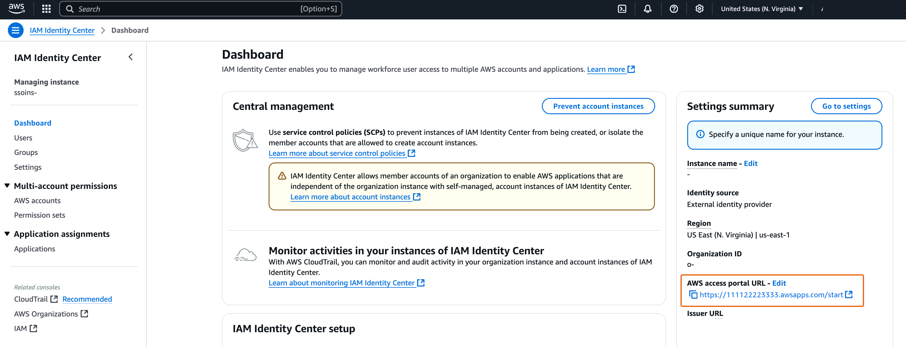
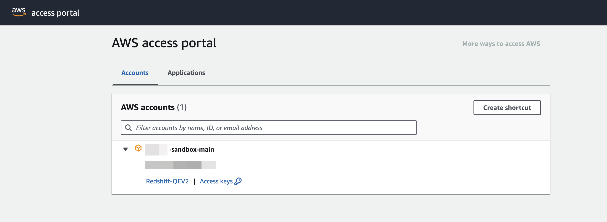

# Setting up trusted identity

propagation with Amazon Redshift Query Editor V2

The following procedure walks you through how to achieve trusted identity
propagation from Amazon Redshift Query Editor V2 to Amazon Redshift.

## Prerequisites

Before you can get started with this tutorial, you'll need to set up
the following:

1. [Enable IAM Identity Center](enable-identity-center.md "enable-identity-center.md").
   [Organization instance](organization-instances-identity-center.md "organization-instances-identity-center.md") is recommended. For more
   information, see [Prerequisites and
   considerations](trustedidentitypropagation-overall-prerequisites.md "trustedidentitypropagation-overall-prerequisites.md").
2. [Provision the users and groups from
   your source of identities into IAM Identity Center](tutorials.md "tutorials.md").

Enabling trusted identity propagation includes tasks performed by an
IAM Identity Center administrator in the IAM Identity Center console and tasks performed by an Amazon Redshift
administrator in the Amazon Redshift console.

## Tasks performed by

the IAM Identity Center administrator

The following tasks needed to be complete by the IAM Identity Center
administrator:

1.  **Create an [IAM
    role](../../../IAM/latest/UserGuide/id_roles.md "../../../IAM/latest/UserGuide/id_roles.md")** in the account where the Amazon Redshift
    cluster or Serverless instance exists with the following
    permission policy. For more information, see [IAM Role
    creation](../../../IAM/latest/UserGuide/id_roles_create.md "../../../IAM/latest/UserGuide/id_roles_create.md").

        1. The following policy examples includes the necessary
         permissions to complete this tutorial. To use this
         policy, replace the `italicized placeholder
         text` in the example policy with your
         own information. For additional directions, see [Create a policy](../../../IAM/latest/UserGuide/access_policies_create.md "../../../IAM/latest/UserGuide/access_policies_create.md") or [Edit a policy](../../../IAM/latest/UserGuide/access_policies_manage-edit.md "../../../IAM/latest/UserGuide/access_policies_manage-edit.md").


        **Permission policy:**


        JSON


        ```
        `{
         "Version":"2012-10-17",
         "Statement": [
         {
         "Sid": "AllowRedshiftApplication",
         "Effect": "Allow",
         "Action": [
         "redshift:DescribeQev2IdcApplications",
         "redshift-serverless:ListNamespaces",
         "redshift-serverless:ListWorkgroups",
         "redshift-serverless:GetWorkgroup"
         ],
         "Resource": "*"
         },
         {
         "Sid": "AllowIDCPermissions",
         "Effect": "Allow",
         "Action": [
         "sso:DescribeApplication",
         "sso:DescribeInstance"
         ],
         "Resource": [
         "arn:aws:sso:::instance/`Your-IAM-Identity-Center-Instance ID`",
         "arn:aws:sso::`111122223333`:application/`Your-IAM-Identity-Center-Instance-ID`/*"
         ]
         }
         ]
        }`

        ```

        [Show moreShow less](# "#")


        **Trust policy:**


        JSON


        ```
        `{
         "Version":"2012-10-17",
         "Statement": [
         {
         "Effect": "Allow",
         "Principal": {
         "Service": [
         "redshift-serverless.amazonaws.com",
         "redshift.amazonaws.com"
         ]
         },
         "Action": [
         "sts:AssumeRole",
         "sts:SetContext"
         ]
         }
         ]
        }`

        ```

        [Show moreShow less](# "#")

    [Show moreShow less](# "#")

2.  **Create a permission set** in the AWS Organizations
    management account where IAM Identity Center is enabled. You’ll use it in the
    next step to allow federated users to access Redshift Query
    Editor V2.

        1. Go to the **IAM Identity Center** console, under
         **Multi-Account permissions**,
         choose **Permission sets**.
        2. Choose **Create permission
         set**.
        3. Choose **Custom permission set** and
         then choose **Next**.
        4. Under **AWS managed policies**,
         choose
         **`AmazonRedshiftQueryEditorV2ReadSharing`**.
        5. Under **Inline policy**, add the
         following policy:


        JSON


        ```
        `{
         "Version":"2012-10-17",
         "Statement": [
         {
         "Sid": "Statement1",
         "Effect": "Allow",
         "Action": [
         "redshift:DescribeQev2IdcApplications",
         "redshift-serverless:ListNamespaces",
         "redshift-serverless:ListWorkgroups",
         "redshift-serverless:GetWorkgroup"
         ],
         "Resource": "*"
         }
         ]
        }`

        ```

        [Show moreShow less](# "#")
        6. Select **Next** and then provide a
         name for the permission set name. For example,
         `Redshift-Query-Editor-V2`.
        7. Under **Relay state – optional**, set
         default relay state to the Query Editor V2 URL, using
         the format:
         `https://`your-region`.console.aws.amazon.com/sqlworkbench/home`.
        8. Review the settings and choose
         **Create**.
        9. Navigate to the IAM Identity Center Dashboard and copy the
         AWS access portal URL from the **Setting
         Summary** section.


        
        10. Open a new Incognito Browser Window and paste the
         URL.


        This will take you to your AWS access portal, ensuring you
         are signing in with an IAM Identity Center user.


        

        For more information about permission set, see [Manage AWS accounts with permission
         sets](permissionsetsconcept.md "permissionsetsconcept.md").

    [Show moreShow less](# "#")

3.  **Enable federated users access to Redshift Query
    Editor V2**.

        1. In the AWS Organizations management account, open the
         **IAM Identity Center** console.
        2. In the navigation pane, under **Multi-account
         permissions**, choose
         **AWS accounts**.
        3. On the AWS accounts page, select the AWS account
         that you want to assign access to.
        4. Choose **Assign users or
         groups**.
        5. On the **Assign users and groups**
         page, choose the users and or groups that you want to
         create the permission set for. Then, choose
         **Next**.
        6. On the **Assign permission sets** page, choose the permission set you created
         in the previous step. Then, choose
         **Next**.
        7. On the **Review and submit
         assignments** page, review your selections
         and choose **Submit**.

    [Show moreShow less](# "#")

## Tasks performed by

an Amazon Redshift administrator

Enabling trusted identity propagation to Amazon Redshift requires an Amazon Redshift cluster
administrator or Amazon Redshift Serverless administrator to perform a number of
tasks in the Amazon Redshift console. For more information, see [Integrate Identity Provider (IdP) with Amazon Redshift Query Editor V2 and SQL
Client using IAM Identity Center for seamless Single Sign-On](https://aws.amazon.com/blogs/big-data/integrate-identity-provider-idp-with-amazon-redshift-query-editor-v2-and-sql-client-using-aws-iam-identity-center-for-seamless-single-sign-on/ "https://aws.amazon.com/blogs/big-data/integrate-identity-provider-idp-with-amazon-redshift-query-editor-v2-and-sql-client-using-aws-iam-identity-center-for-seamless-single-sign-on/") in the
_AWS Big Data Blog_.
