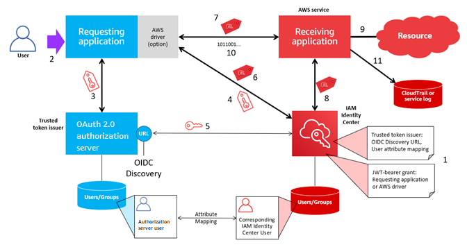

# Setting up a trusted token

issuer

To enable trusted identity propagation for an application that
authenticates externally to IAM Identity Center, one or more administrators must set up a
trusted token issuer. A trusted token issuer is an OAuth 2.0 authorization
server that issues tokens to applications that initiate requests (requesting
applications). The tokens authorize these applications to initiate requests
on behalf of their users to a receiving application (an AWS service).

###### Topics

- [Coordinating administrative roles and responsibilities](#coordinating-administrative-roles-responsibilities "#coordinating-administrative-roles-responsibilities")
- [Tasks for setting up a
  trusted token issuer](#setuptrustedtokenissuer-tasks "#setuptrustedtokenissuer-tasks")
- [How to add a trusted
  token issuer to the IAM Identity Center console](#how-to-add-trustedtokenissuer "#how-to-add-trustedtokenissuer")
- [How to view or edit
  trusted token issuer settings in the IAM Identity Center console](#view-edit-trusted-token-issuers "#view-edit-trusted-token-issuers")
- [Setup process and request flow for applications that use a trusted
  token issuer](#setuptrustedtokenissuer-setup-process-request-flow "#setuptrustedtokenissuer-setup-process-request-flow")

## Coordinating administrative roles and responsibilities

In some cases, a single administrator might perform all of the
necessary tasks for setting up a trusted token issuer. If multiple
administrators perform these tasks, close coordination is required. The
following table describes how multiple administrators might coordinate
to set up a trusted token issuer and configure AWS service to use it.

###### Note

The application can be any AWS service that is integrated with
IAM Identity Center and supports trusted identity propagation.

For more information, see [Tasks for setting up a
trusted token issuer](#setuptrustedtokenissuer-tasks "#setuptrustedtokenissuer-tasks").

| Role                                                 | Performs these tasks                                                                                                                                                                                                                                                                                                 | Coordinates with                                                                          |
| ---------------------------------------------------- | -------------------------------------------------------------------------------------------------------------------------------------------------------------------------------------------------------------------------------------------------------------------------------------------------------------------- | ----------------------------------------------------------------------------------------- |
| IAM Identity Center administrator                    | Adds the external IdP as a trusted token issuer to the IAM Identity Center console. Helps set up the correct attribute mapping between IAM Identity Center and the external IdP. Notifies the AWS service administrator when the trusted token issuer is added to the IAM Identity Center console. | External IdP (trusted token issuer) administrator AWS service administrator         |
| External IdP (trusted token issuer) administrator | Configures the external IdP to issue tokens. Helps set up the correct attribute mapping between IAM Identity Center and the external IdP. Provides the audience name (Aud claim) to the AWS service administrator.                                                                                    | IAM Identity Center administrator AWS service administrator                            |
| AWS service administrator                            | Checks the AWS service console for the trusted token issuer. The trusted token issuer will be visible in the AWS service console after the IAM Identity Center administrator adds it to the IAM Identity Center console. Configures the AWS service to use the trusted token issuer.                  | IAM Identity Center administrator External IdP (trusted token issuer) administrator |

## Tasks for setting up a

trusted token issuer

To set up a trusted token issuer, an IAM Identity Center administrator, external IdP
(trusted token issuer) administrator, and application administrator must
complete the following tasks.

###### Note

The application can be any AWS service that is integrated with
IAM Identity Center and supports trusted identity propagation.

1. **Add the trusted token issuer to
   IAM Identity Center** – The IAM Identity Center administrator [adds the trusted
   token issuer by using the IAM Identity Center console](#how-to-add-trustedtokenissuer "#how-to-add-trustedtokenissuer") or [APIs](../APIReference/API_Operations.md "../APIReference/API_Operations.md"). This
   configuration requires specifying the following:
   - A name for the trusted token issuer.
   - The OIDC discovery endpoint URL (in the IAM Identity Center console,
     this URL is called the _issuer URL_).
     The discovery endpoint must be reachable via ports 80
     and 443 only.
   - Attribute mapping for user lookup. This attribute
     mapping is used in a claim in the token that is
     generated by the trusted token issuer. The value in the
     claim is used to search IAM Identity Center. The search uses the
     specified attribute to retrieve a single user in
     IAM Identity Center.

2. **Connect the AWS service to
   IAM Identity Center** – The AWS service administrator
   must connect the application to IAM Identity Center by using the console for
   the application or the application APIs.

After the trusted token issuer is added to the IAM Identity Center console,
it is also visible in the AWS service console and available
for the AWS service administrator to select. 3. **Configure the use of token
exchange** – In the AWS service console,
the AWS service administrator configures AWS service to
accept tokens issued by the trusted token issuer. These tokens
are exchanged for tokens generated by IAM Identity Center. This requires
specifying the name of the trusted token issuer from Step 1, and
the Aud claim value that corresponds to the AWS service.

The trusted token issuer places the Aud claim value in the
token it issues to indicate that the token is intended for use
by the AWS service. To obtain this value, contact the
administrator for the trusted token issuer.

## How to add a trusted

token issuer to the IAM Identity Center console

In an organization that has multiple administrators, this task is
performed by an IAM Identity Center administrator. If you are the IAM Identity Center administrator,
you must choose which external IdP to use as a trusted token issuer.

###### To add a trusted token issuer to the IAM Identity Center console

1. Open the [IAM Identity Center
   console](https://console.aws.amazon.com/singlesignon "https://console.aws.amazon.com/singlesignon").
2. Choose **Settings**.
3. On the **Settings** page, choose the
   **Authentication** tab.
4. Under **Trusted token issuers**, choose
   **Create trusted token issuer**.
5. On the **Set up an external IdP to issue trusted
   tokens** page, under **Trusted token issuer
   details**, do the following:
   - For **Issuer URL**, specify the [OIDC
     discovery URL](trusted-token-issuer-configuration-settings.md#oidc-discovery-endpoint-url "trusted-token-issuer-configuration-settings.md#oidc-discovery-endpoint-url") of the external IdP that will issue tokens
     for trusted identity propagation. You must specify the
     URL of the discovery endpoint up until and without
     `.well-known/openid-configuration`. The
     administrator of the external IdP can provide this
     URL.

   ###### Note

   Note This URL must match the URL in the Issuer
   (iss) claim in tokens that are issued for trusted
   identity propagation.
   - For **Trusted token issuer name**,
     enter a name to identify this trusted token issuer in
     IAM Identity Center and in the application console.

6. Under **Map attributes**, do the
   following:
   - For **Identity provider attribute**,
     select an attribute from the list to map to an attribute
     in the IAM Identity Center identity store.
   - For **IAM Identity Center attribute**, select the
     corresponding attribute for the attribute
     mapping.

7. Under **Tags (optional)**, choose
   **Add new tag**, specify a value for
   **Key**, and optionally for
   **Value**.

For information about tags, see [Tagging AWS IAM Identity Center resources](tagging.md "tagging.md"). 8. Choose **Create trusted token
issuer**. 9. After you finish creating the trusted token issuer, contact
the application administrator to let them know the name of the
trusted token issuer, so that they can confirm that the trusted
token issuer is visible in the applicable console. 10. The application administrator must select this trusted token
issuer in the applicable console to enable user access to the
application from applications that are configured for trusted
identity propagation.

## How to view or edit

trusted token issuer settings in the IAM Identity Center console

After you add a trusted token issuer to the IAM Identity Center console, you can
view and edit the relevant settings.

If you plan to edit the trusted token issuer settings, keep in mind
that doing so might cause users to lose access to any applications that
are configured to use the trusted token issuer. To avoid disrupting user
access, we recommend that you coordinate with the administrators for any
applications that are configured to use the trusted token issuer before
you edit settings.

###### To view or edit trusted token issuer settings in the IAM Identity Center

console

1. Open the [IAM Identity Center
   console](https://console.aws.amazon.com/singlesignon "https://console.aws.amazon.com/singlesignon").
2. Choose **Settings**.
3. On the **Settings** page, choose the
   **Authentication** tab.
4. Under **Trusted token issuers**, select the
   trusted token issuer that you want to view or edit.
5. Choose **Actions**, and then choose
   **Edit**.
6. On the **Edit trusted token issuer** page,
   view or edit settings as needed. You can edit the trusted token
   issuer name, attribute mappings, and tags.
7. Choose **Save changes**.
8. In the **Edit trusted token issuer** dialog
   box, you are prompted to confirm that you want to make changes.
   Choose **Confirm**.

## Setup process and request flow for applications that use a trusted

token issuer

This section describes the setup process and request flow for
applications that use a trusted token issuer for trusted identity
propagation. The following diagram provides an overview of this
process.

The following steps provide additional information about this
process.

1. Set up IAM Identity Center and the receiving AWS managed application to
   use a trusted token issuer. For information, see [Tasks for setting up a
   trusted token issuer](#setuptrustedtokenissuer-tasks "#setuptrustedtokenissuer-tasks").
2. The request flow begins when a user opens the requesting
   application.
3. The requesting application requests a token from the trusted
   token issuer to initiate requests to the receiving AWS managed
   application. If the user hasn't authenticated yet, this process
   triggers an authentication flow. The token contains the
   following information:
   - The subject (Sub) of the user.
   - The attribute that IAM Identity Center uses to look up the
     corresponding user in IAM Identity Center.
   - An audience (Aud) claim that contains a value that the
     trusted token issuer associates with the receiving AWS
     managed application. If other claims are present, they
     aren't used by IAM Identity Center.

4. The requesting application, or the AWS driver that it uses,
   passes the token to IAM Identity Center and requests that the token be
   exchanged for a token that is generated by IAM Identity Center. If you use an
   AWS driver, you might need to configure the driver for this
   use case. For more information, see the documentation for the
   relevant AWS managed application.
5. IAM Identity Center uses the OIDC Discovery endpoint to obtain the public
   key that it can use to verify the authenticity of the token.
   IAM Identity Center then does the following:
   - Verifies the token.
   - Searches the Identity Center directory. To do this,
     IAM Identity Center uses the mapped attribute specified in the
     token.
   - Verifies that the user is authorized to access the
     receiving application. If the AWS managed application
     is configured to require assignments to users and
     groups, the user must have a direct or group-based
     assignment to the application; otherwise the request is
     denied. If the AWS managed application is configured
     to not require user and group assignments, processing
     continues.

   ###### Note

   AWS services have a default setting
   configuration that determines whether assignments
   are required for users and groups. We recommend that
   you do not modify the **Require
   assignments** setting for these
   applications if you plan to use them with trusted
   identity propagation. Even if you have configured
   fine-grained permissions that allow user access to
   specific application resources, modifying the
   **Require assignments** setting
   might result in unexpected behavior, including
   disrupted user access to these resources.
   - Verifies that the requesting application is configured
     to use valid scopes for the receiving AWS managed
     application.

6. If the previous verification steps are successful, IAM Identity Center
   creates a new token. The new token is an opaque (encrypted)
   token that includes the identity of the corresponding user in
   IAM Identity Center, the audience (Aud) of the receiving AWS managed
   application, and the scopes that the requesting application can
   use when making requests to the receiving AWS managed
   application.
7. The requesting application, or the driver that it uses,
   initiates a resource request to the receiving application and
   passes the token that IAM Identity Center generated to the receiving
   application.
8. The receiving application makes calls to IAM Identity Center to obtain the
   identity of the user and the scopes that are encoded in the
   token. It might also make requests to obtain user attributes or
   the user’s group memberships from the Identity Center
   directory.
9. The receiving application uses its authorization configuration
   to determine if the user is authorized to access the requested
   application resource.
10. If the user is authorized to access the requested application
    resource, the receiving application responds to the
    request.
11. The user's identity, actions performed on their behalf, and
    other events are recorded in the receiving application logs and
    CloudTrail events. The specific way in which this information is
    logged varies based on the application.
