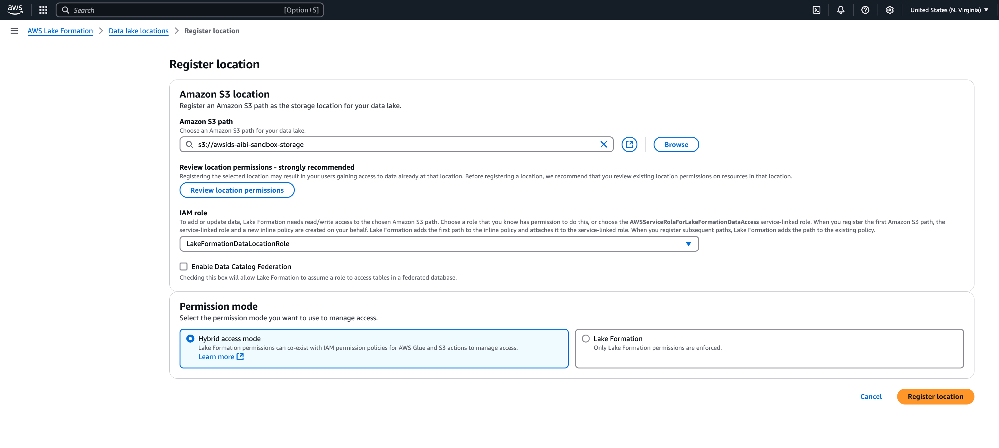

# Setting up AWS Lake Formation with IAM Identity Center

[AWS Lake Formation](https://docs.aws.amazon.com/lake-formation/latest/dg/what-is-lake-formation.html "https://docs.aws.amazon.com/lake-formation/latest/dg/what-is-lake-formation.html") is a managed service that simplifies the creation and
 management of data lakes on AWS. It automates data collection, cataloging,
 and security, providing a centralized repository for storing and analyzing
 diverse data types. Lake Formation offers fine-grained access controls and integrates
 with various AWS analytics services, enabling organizations to efficiently
 set up, secure, and derive insights from their data lakes.

Follow these steps to enable Lake Formation to grant data permissions based on user
 identity using IAM Identity Center and trusted identity propagation.


## Prerequisites


Before you can get started with this tutorial, you'll need to set up
 the following:


* [Enable IAM Identity Center](enable-identity-center.md "enable-identity-center.md").
 [Organization instance](organization-instances-identity-center.md "organization-instances-identity-center.md") is recommended. For more
 information, see [Prerequisites and
 considerations](trustedidentitypropagation-overall-prerequisites.md "trustedidentitypropagation-overall-prerequisites.md").

## Steps to set up trusted identity
 propagation


1. **Integrate IAM Identity Center with AWS Lake Formation** following
 the guidance in [Connecting Lake Formation with IAM Identity Center](https://docs.aws.amazon.com/lake-formation/latest/dg/connect-lf-identity-center.html "https://docs.aws.amazon.com/lake-formation/latest/dg/connect-lf-identity-center.html").


###### Important

**If you do not have AWS Glue Data Catalog
 tables**, you must create them in order to use
 AWS Lake Formation to grant access to IAM Identity Center users and groups. See
 [Creating objects in AWS Glue Data Catalog](https://docs.aws.amazon.com/lake-formation/latest/dg/populating-catalog.html "https://docs.aws.amazon.com/lake-formation/latest/dg/populating-catalog.html") for more
 information.
2. **Register data lake locations**.


[Register the S3 locations](https://docs.aws.amazon.com/lake-formation/latest/dg/register-location.html "https://docs.aws.amazon.com/lake-formation/latest/dg/register-location.html") where the data of the
 Glue tables are stored. By doing this, Lake Formation will provision
 temporary access to the required S3 locations when the tables
 are queried, removing the need to include S3 permissions in the
 service role (e.g. the Athena service role configured on the
 WorkGroup).


	1. Navigate to the **Data lake
	 locations** under the
	 **Administration** section in the
	 navigation pane in the AWS Lake Formation console. Select
	 **Register location**.
	
	
	This will allow Lake Formation to provision temporary IAM
	 credentials with the necessary permissions to access S3
	 data locations.
	
	
	
	
	2. Enter the S3 path of the data locations of the AWS Glue
	 tables in the **Amazon S3 path**
	 field.
	3. In the **IAM role** section, do not
	 select the service linked role if you want to use it
	 with trusted identity propagation. Create a separate
	 role with the following permissions.
	
	
	To use these policies, replace the
	 `italicized placeholder
	 text` in the example policy with your
	 own information. For additional directions, see [Create a policy](https://docs.aws.amazon.com/IAM/latest/UserGuide/access_policies_create.html "https://docs.aws.amazon.com/IAM/latest/UserGuide/access_policies_create.html") or [Edit a policy](https://docs.aws.amazon.com/IAM/latest/UserGuide/access_policies_manage-edit.html "https://docs.aws.amazon.com/IAM/latest/UserGuide/access_policies_manage-edit.html"). The permission policy should
	 grant access to the S3 location specified in the
	 path:
	
	
		1. **Permission policy**:
		
		
		
		JSON
		
		
		
		
		
		```
		`{
		 "Version":"2012-10-17", 
		 "Statement": [
		 {
		 "Sid": "LakeFormationDataAccessPermissionsForS3",
		 "Effect": "Allow",
		 "Action": [
		 "s3:PutObject",
		 "s3:GetObject",
		 "s3:DeleteObject"
		 ],
		 "Resource": [
		 "arn:aws:s3:::`Your-S3-Bucket`/*"
		 ]
		 },
		 {
		 "Sid": "LakeFormationDataAccessPermissionsForS3ListBucket",
		 "Effect": "Allow",
		 "Action": [
		 "s3:ListBucket"
		 ],
		 "Resource": [
		 "arn:aws:s3:::`Your-S3-Bucket`"
		 ]
		 },
		 {
		 "Sid": "LakeFormationDataAccessServiceRolePolicy",
		 "Effect": "Allow",
		 "Action": [
		 "s3:ListAllMyBuckets"
		 ],
		 "Resource": [
		 "arn:aws:s3:::*"
		 ]
		 }
		 ]
		}`
		
		```
		2. **Trust relationship**: This
		 should include `sts:SectContext`, which
		 is required for trusted identity
		 propagation.
		
		
		
		JSON
		
		
		
		
		
		```
		`{
		 "Version":"2012-10-17", 
		 "Statement": [
		 {
		 "Sid": "",
		 "Effect": "Allow",
		 "Principal": {
		 "Service": "lakeformation.amazonaws.com"
		 },
		 "Action": [
		 "sts:AssumeRole",
		 "sts:SetContext"
		 ]
		 }
		 ]
		}`
		
		```
		
		
		
		
		
		###### Note
		
		The IAM role created by the wizard is a
		 service-linked role and does not include
		 `sts:SetContext`.
	4. After creating the IAM role, select
	 **Register location**.

## Trusted identity propagation with
 Lake Formation across AWS accounts


AWS Lake Formation supports using [AWS Resource Access Manager (RAM)](https://docs.aws.amazon.com/ram/latest/userguide/what-is.html "https://docs.aws.amazon.com/ram/latest/userguide/what-is.html") to
 share tables across AWS accounts and it works with trusted identity
 propagation when the grantor account and grantee account are in the same
 AWS Region, in the same AWS Organizations, and share the same organization
 instance of IAM Identity Center. See [Cross-account data sharing in Lake Formation](https://docs.aws.amazon.com/lake-formation/latest/dg/cross-data-sharing-lf.html "https://docs.aws.amazon.com/lake-formation/latest/dg/cross-data-sharing-lf.html") for more
 information.
