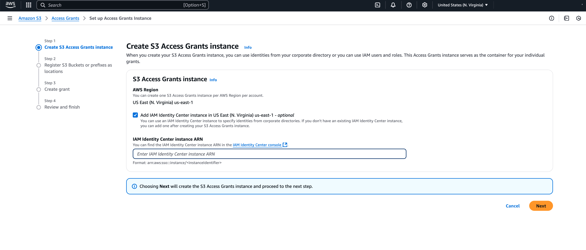
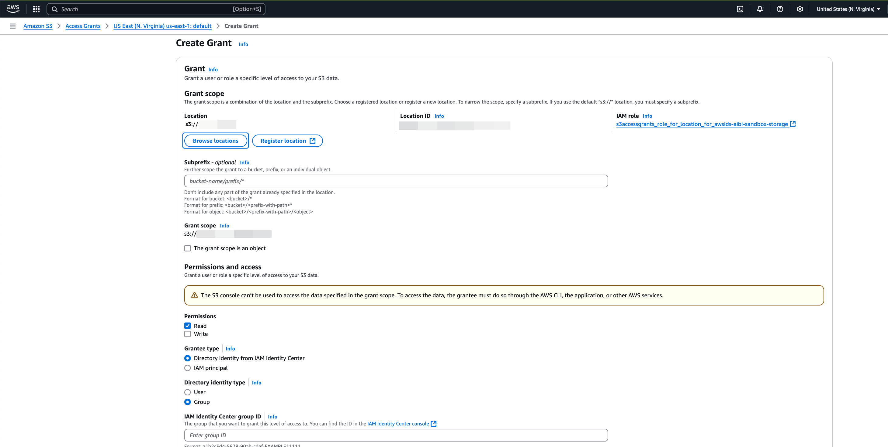

# Setting up Amazon S3 Access Grants with
 IAM Identity Center

[Amazon S3
 Access Grants](https://docs.aws.amazon.com/AmazonS3/latest/userguide/access-grants-get-started.html "https://docs.aws.amazon.com/AmazonS3/latest/userguide/access-grants-get-started.html") provides the flexibility to
 grant identity-based fine-grain access control to S3 locations. You can use
 Amazon S3 Access Grants to grant Amazon S3 bucket access directly to
 your corporate users and groups. Follow these steps to enable S3
 Access Grants with IAM Identity Center and achieve trusted identity
 propagation.


## Prerequisites


Before you can get started with this tutorial, you'll need to set up
 the following:


* [Enable IAM Identity Center](enable-identity-center.md "enable-identity-center.md").
 [Organization instance](organization-instances-identity-center.md "organization-instances-identity-center.md") is recommended. For more
 information, see [Prerequisites and
 considerations](trustedidentitypropagation-overall-prerequisites.md "trustedidentitypropagation-overall-prerequisites.md").

## Configuring S3 Access Grants for
 trusted identity propagation through IAM Identity Center


###### If you already have an Amazon S3 Access Grants instance
 with a registered location, follow these steps:

1. [Associate your IAM Identity Center instance](https://docs.aws.amazon.com/AmazonS3/latest/userguide/access-grants-instance-idc.html "https://docs.aws.amazon.com/AmazonS3/latest/userguide/access-grants-instance-idc.html").
2. [Create a
 grant](#tip-tutorial-s3-create-grant "#tip-tutorial-s3-create-grant").

###### If you have not created an Amazon S3 Access Grants yet,
 follow these steps:

1. [**Create an S3 Access Grants
 instance**](https://docs.aws.amazon.com/AmazonS3/latest/userguide/access-grants-instance-create.html "https://docs.aws.amazon.com/AmazonS3/latest/userguide/access-grants-instance-create.html") - You can create one S3
 Access Grants instance per AWS Region. When
 you create the S3 Access Grants instance, make
 sure to check the **Add IAM Identity Center instance** box
 and provide the ARN of your IAM Identity Center instance. Select
 **Next**.


The following image shows the Create S3 Access
 Grants instance page in the Amazon S3 Access
 Grants console:



2. **Register a location** - After you create an
 [create an Amazon S3 Access Grants
 instance](https://docs.aws.amazon.com/AmazonS3/latest/userguide/access-grants-instance-create.html "https://docs.aws.amazon.com/AmazonS3/latest/userguide/access-grants-instance-create.html") in an AWS Region in your account, you
 [register an S3 location](https://docs.aws.amazon.com/AmazonS3/latest/userguide/access-grants-location-register.html "https://docs.aws.amazon.com/AmazonS3/latest/userguide/access-grants-location-register.html") in that instance. An S3
 Access Grants location maps the default S3
 region (`S3://`), a bucket, or a prefix to an IAM
 role. S3 Access Grants assumes this Amazon S3 role to
 vend temporary credentials to the grantee that is accessing that
 particular location. You must first register at least one
 location in your S3 Access Grants instance before
 you can create an access grant. 


For the **Location scope**,
 specify `s3://`, which includes all of your buckets
 in that Region. This is the recommended location scope for most
 use cases. If you have an advanced access management use case,
 you can set the location scope to a specific bucket
 `s3://`bucket``or
 prefix within a bucket
 `s3://`bucket`/`prefix-with-path``.
 For more information, see [Register a location](https://docs.aws.amazon.com/AmazonS3/latest/userguide/access-grants-location-register.html "https://docs.aws.amazon.com/AmazonS3/latest/userguide/access-grants-location-register.html") in the *Amazon Simple Storage Service User Guide*.


###### Note

Ensure the S3 locations of the AWS Glue tables you want to
 grant access to are included in this path.


The procedure requires you to configure an IAM role for the
 location. This role should include permissions to access the
 location scope. You can use the S3 console wizard to create the
 role. You'll need to specify your S3 Access
 Grants instance ARN in the policies for this IAM
 role. The default value of your S3 Access Grants
 instance ARN is
 `arn:aws:s3:`Your-Region`:`Your-AWS-Account-ID`:access-grants/default`. 


The following example permission policy gives Amazon S3 permissions
 to the IAM role that you created. And the example trust policy
 following it allows the S3 Access Grants service
 principal to assume the IAM role.


	1. **Permission policy**
	
	
	To use these policies, replace the
	 `italicized placeholder
	 text` in the example policy with your
	 own information. For additional directions, see [Create a policy](https://docs.aws.amazon.com/IAM/latest/UserGuide/access_policies_create.html "https://docs.aws.amazon.com/IAM/latest/UserGuide/access_policies_create.html") or [Edit a policy](https://docs.aws.amazon.com/IAM/latest/UserGuide/access_policies_manage-edit.html "https://docs.aws.amazon.com/IAM/latest/UserGuide/access_policies_manage-edit.html").
	
	
	
	JSON
	
	
	
	
	
	```
	`{
	 "Version":"2012-10-17", 
	 "Statement": [
	 {
	 "Sid": "ObjectLevelReadPermissions",
	 "Effect": "Allow",
	 "Action": [
	 "s3:GetObject",
	 "s3:GetObjectVersion",
	 "s3:GetObjectAcl",
	 "s3:GetObjectVersionAcl",
	 "s3:ListMultipartUploadParts"
	 ],
	 "Resource": [
	 "arn:aws:s3:::*"
	 ],
	 "Condition": {
	 "StringEquals": {
	 "aws:ResourceAccount": "`111122223333`"
	 },
	 "ArnEquals": {
	 "s3:AccessGrantsInstanceArn": [
	 "arn:aws:s3:::access-grants/`instance-id`"
	 ]
	 }
	 }
	 },
	 {
	 "Sid": "ObjectLevelWritePermissions",
	 "Effect": "Allow",
	 "Action": [
	 "s3:PutObject",
	 "s3:PutObjectAcl",
	 "s3:PutObjectVersionAcl",
	 "s3:DeleteObject",
	 "s3:DeleteObjectVersion",
	 "s3:AbortMultipartUpload"
	 ],
	 "Resource": [
	 "arn:aws:s3:::*"
	 ],
	 "Condition": {
	 "StringEquals": {
	 "aws:ResourceAccount": "`111122223333`"
	 },
	 "ArnEquals": {
	 "s3:AccessGrantsInstanceArn": [
	 "arn:aws:s3:::access-grants/`instance-id`"
	 ]
	 }
	 }
	 },
	 {
	 "Sid": "BucketLevelReadPermissions",
	 "Effect": "Allow",
	 "Action": [
	 "s3:ListBucket"
	 ],
	 "Resource": [
	 "arn:aws:s3:::*"
	 ],
	 "Condition": {
	 "StringEquals": {
	 "aws:ResourceAccount": "`111122223333`"
	 },
	 "ArnEquals": {
	 "s3:AccessGrantsInstanceArn": [
	 "arn:aws:s3:::access-grants/`instance-id`"
	 ]
	 }
	 }
	 },
	 {
	 "Sid": "OptionalKMSPermissionsForSSEEncryption",
	 "Effect": "Allow",
	 "Action": [
	 "kms:Decrypt",
	 "kms:GenerateDataKey"
	 ],
	 "Resource": [
	 "*"
	 ]
	 }
	 ]
	}`
	
	```
	2. **Trust policy**
	
	
	 In the IAM role trust policy, give the S3 Access
	 Grants service
	 (`access-grants.s3.amazonaws.com`)
	 principal access to the IAM role that you created. To
	 do so, you can create a JSON file that contains the
	 following statements. To add the trust policy to your
	 account, see [Create a role using custom trust policies](https://docs.aws.amazon.com/IAM/latest/UserGuide/id_roles_create_for-custom.html "https://docs.aws.amazon.com/IAM/latest/UserGuide/id_roles_create_for-custom.html"). 
	
	
	
	JSON
	
	
	
	
	
	```
	`{
	 "Version":"2012-10-17", 
	 "Statement": [
	 {
	 "Sid": "Stmt1234567891011",
	 "Effect": "Allow",
	 "Action": [
	 "sts:AssumeRole",
	 "sts:SetSourceIdentity"
	 ],
	 "Resource": "*",
	 "Condition": {
	 "StringEquals": {
	 "aws:SourceAccount": "`111122223333`",
	 "aws:SourceArn": "`Your-Custom-Access-Grants-Location-ARN`"
	 }
	 }
	 },
	
	 {
	 "Sid": "Stmt1234567891012",
	 "Effect": "Allow",
	 "Action": "sts:SetContext",
	 "Resource": "*",
	 "Condition": {
	 "StringEquals": {
	 "aws:SourceAccount": "`111122223333`",
	 "aws:SourceArn": "`Your-Custom-Access-Grants-Location-ARN`"
	 },
	 "ForAllValues:ArnEquals": {
	 "sts:RequestContextProviders": "arn:aws:iam::aws:contextProvider/IdentityCenter"
	 }
	 }
	 }
	 ]
	}`
	
	```

## Create an Amazon S3 Access
 Grant


If you have an Amazon S3 Access Grants instance with a
 registered location and you have associated your IAM Identity Center instance with it,
 you can [create a grant](https://docs.aws.amazon.com/AmazonS3/latest/userguide/access-grants-grant-create.html "https://docs.aws.amazon.com/AmazonS3/latest/userguide/access-grants-grant-create.html"). In the S3 console **Create Grant** page, complete the following:


###### Create a grant

1. Select the location created in the previous step. You can
 reduce the scope of the grant by adding a sub-prefix. The
 sub-prefix can be a `bucket`,
 `bucket/prefix`, or an object in the bucket. For
 more information, see [Subprefix](https://docs.aws.amazon.com/AmazonS3/latest/userguide/access-grants-grant-create.html#subprefix "https://docs.aws.amazon.com/AmazonS3/latest/userguide/access-grants-grant-create.html#subprefix") in the *Amazon Simple Storage Service
 User Guide*.
2. Under **Permissions and access**, select
 **Read** and or **Write**
 depending on your needs.
3. In **Granter type**, choose
 **Directory Identity form IAM Identity Center**.
4. Provide the IAM Identity Center **User or Group ID**. You
 can find the user and group IDs in the IAM Identity Center console under [User and
 Group sections](howtoviewandchangepermissionset.md "howtoviewandchangepermissionset.md"). Select
 **Next**.
5. On the **Review and Finish** page, review the
 settings for the S3 Access Grant and then select
 **Create Grant**.


The following image shows the Create Grant page in the Amazon S3
 Access Grants console:



