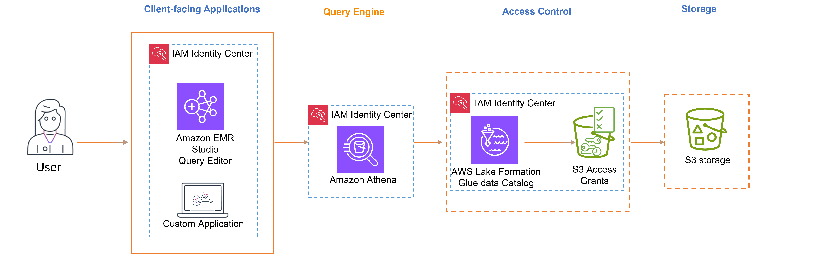

# Trusted identity propagation with
 Amazon Athena

The steps to enable trusted identity propagation depend on whether your users
 interact with AWS managed applications or customer managed applications. The
 following diagram shows a trusted identity propagation configuration for
 client-facing applications - either AWS managed or external to AWS - that
 uses Amazon Athena to query Amazon S3 data with access control provided by AWS Lake Formation and
 Amazon S3 Access Grants.

###### Note

* Trusted identity propagation with Amazon Athena requires the use of
 Trino.
* Apache Spark and SQL clients connected to Amazon Athena via ODBC and
 JDBC drivers are not supported.

**AWS managed applications**

The following AWS managed client-facing application supports trusted
 identity propagation with Athena:

* Amazon EMR Studio

###### To enable trusted identity propagation, follow these steps:

* [Set up Amazon EMR
 Studio](setting-up-tip-emr.md "setting-up-tip-emr.md") as the client-facing application for
 Athena. The Query Editor in EMR Studio is needed to run Athena Queries
 when trusted identity propagation is enabled.
* [Set up Athena
 Workgroup](setting-up-tip-ate.md "setting-up-tip-ate.md").
* [Set up AWS Lake Formation](tip-tutorial-lf.md "tip-tutorial-lf.md") to enable
 fine-grained access control for AWS Glue tables based on the user or group
 in IAM Identity Center.
* [Set up Amazon S3 Access
 Grants](tip-tutorial-s3.md "tip-tutorial-s3.md") to enable temporary access to the
 underlying data locations in S3.
###### Note

Both Lake Formation and Amazon S3 Access Grants are required for access
 control to AWS Glue Data Catalog and for Athena query results in Amazon S3.

###### Customer managed applications

To enable trusted identity propagation for users of
 *custom-developed applications*, see to [Access AWS services programmatically using trusted identity
 propagation](https://aws.amazon.com/blogs/security/access-aws-services-programmatically-using-trusted-identity-propagation/ "https://aws.amazon.com/blogs/security/access-aws-services-programmatically-using-trusted-identity-propagation/") in the *AWS Security
 Blog*.
