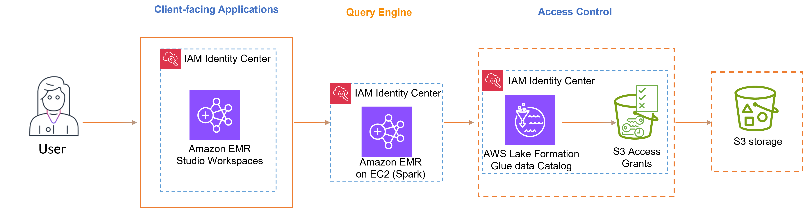

# Trusted identity propagation with
 Amazon EMR

The following diagram shows a trusted identity propagation configuration for
 Amazon EMR Studio using Amazon EMR on Amazon EC2 with access control provided by AWS Lake Formation and
 Amazon S3 Access Grants.

###### Supported client-facing applications

* Amazon EMR Studio

###### To enable trusted identity propagation, follow these steps:

* [Set up Amazon EMR
 Studio](setting-up-tip-emr.md "setting-up-tip-emr.md") as the client-facing application for
 Amazon EMR cluster.
* Set up [Amazon EMR Cluster
 on Amazon EC2 with Apache Spark](https://docs.aws.amazon.com/emr/latest/ManagementGuide/emr-idc-start.html "https://docs.aws.amazon.com/emr/latest/ManagementGuide/emr-idc-start.html").
* *Recommended*: [AWS Lake Formation](tip-tutorial-lf.md "tip-tutorial-lf.md") and [Amazon S3
 Access Grants](tip-tutorial-s3.md "tip-tutorial-s3.md") to provide fine-grained
 access control to AWS Glue Data Catalog and underlying data locations in
 S3.
