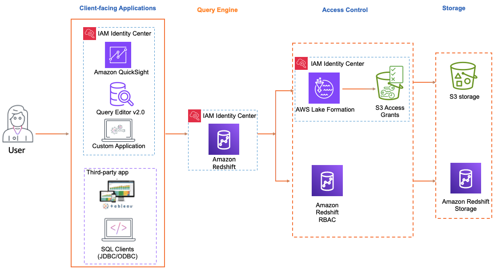

# Trusted identity propagation with

Amazon Redshift

The steps to enable trusted identity propagation depend on whether your users
interact with AWS managed applications or customer managed applications. The
following diagram shows a trusted identity propagation configuration for
client-facing applications - either AWS managed or external to AWS - that
query Amazon Redshift data with access control provided either by Amazon Redshift or by authorization
services, such as AWS Lake Formation or Amazon S3 Access Grants.

When trusted identity propagation to Amazon Redshift is enabled, Redshift administrators
can configure Redshift to [automatically create roles](../../../redshift/latest/mgmt/redshift-iam-access-control-sso-autocreate.md "../../../redshift/latest/mgmt/redshift-iam-access-control-sso-autocreate.md") for IAM Identity Center as the identity provider, map
Redshift roles to groups in IAM Identity Center, and use [Redshift role-based access
control to grant access](../../../redshift/latest/dg/r_tutorial-RBAC.md "../../../redshift/latest/dg/r_tutorial-RBAC.md").

## Supported

client-facing applications

###### AWS managed applications

The following AWS managed client-facing applications support trusted
identity propagation to Amazon Redshift:

- [Amazon Redshift Query Editor
  V2](setting-up-tip-redshift.md "setting-up-tip-redshift.md")
- [Quick Suite](../../../quicksight/latest/user/redshift-trusted-identity-propagation.md "../../../quicksight/latest/user/redshift-trusted-identity-propagation.md")

###### Note

If you are using Amazon Redshift Spectrum to access external databases or tables in
AWS Glue Data Catalog, consider setting up [Lake Formation](tip-tutorial-lf.md "tip-tutorial-lf.md") and [Amazon S3 Access
Grants](tip-tutorial-s3.md "tip-tutorial-s3.md") to provide fine-grain access
control.

###### Customer managed applications

The following customer managed applications support trusted identity
propagation to Amazon Redshift:

- **Tableau** including Tableau
  Desktop, Tableau Server, and
  Tableau Prep
  - To enable trusted identity propagation for users of
    Tableau, refer to [Integrate Tableau and Okta with Amazon Redshift using
    IAM Identity Center](https://aws.amazon.com/blogs//big-data/integrate-tableau-and-okta-with-amazon-redshift-using-aws-iam-identity-center/ "https://aws.amazon.com/blogs//big-data/integrate-tableau-and-okta-with-amazon-redshift-using-aws-iam-identity-center/") in the _AWS Big Data
    Blog_.

- **SQL Clients** (DBeaver and
  DBVisualizer)
  - To enable trusted identity propagation for users of SQL
    Clients (DBeaver and
    DBVisualizer), refer to [Integrate Identity Provider (IdP) with Amazon Redshift Query
    Editor V2 and SQL Client using IAM Identity Center for seamless Single
    Sign-On](https://aws.amazon.com/blogs//big-data/integrate-identity-provider-idp-with-amazon-redshift-query-editor-v2-and-sql-client-using-aws-iam-identity-center-for-seamless-single-sign-on/ "https://aws.amazon.com/blogs//big-data/integrate-identity-provider-idp-with-amazon-redshift-query-editor-v2-and-sql-client-using-aws-iam-identity-center-for-seamless-single-sign-on/") in the _AWS Big Data
    Blog_.
