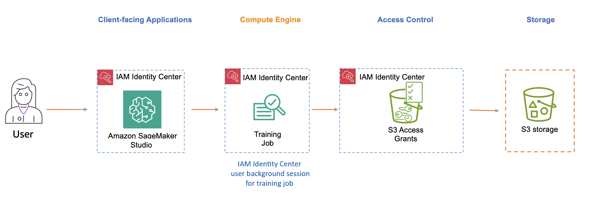

# Trusted identity propagation with Amazon SageMaker Studio

[Amazon SageMaker Studio](https://docs.aws.amazon.com/sagemaker/latest/dg/studio-updated.html "https://docs.aws.amazon.com/sagemaker/latest/dg/studio-updated.html") integrates with IAM Identity Center, and it supports [user background sessions](user-background-sessions.md "user-background-sessions.md") and
 trusted identity propagation. User background sessions allow a user to initiate
 a long-running job on SageMaker Studio, without that user having to remain signed in while
 the job runs. The job runs immediately and in the background, using the
 permissions of the user who initiated the job. The job can continue to run even
 if the user turns off their computer, their IAM Identity Center sign-in session expires, or
 the user signs out of the AWS access portal. The default session duration for user
 background sessions is 7 days, but you can specify a maximum duration of 90
 days. Trusted identity propagation allows fine-grained access to be provided to
 AWS resources such as Amazon S3 buckets based on the user's identity or group
 membership.

The following diagram shows a trusted identity propagation configuration for
 SageMaker Studio, with access to data stored in an Amazon S3 bucket. User background sessions
 are enabled for IAM Identity Center, which allows the SageMaker Studio training job to run in the
 background. Access control for the training data is provided by Amazon S3
 Access Grants.

**AWS managed application**

The following AWS managed client-facing application supports trusted identity propagation:

* [Amazon SageMaker Studio](setting-up-trusted-identity-propagation-sagemaker-studio.md "setting-up-trusted-identity-propagation-sagemaker-studio.md")

###### To enable trusted identity propagation and user background sessions, follow these steps:

* [Set up SageMaker Studio as the client-facing application.](setting-up-trusted-identity-propagation-sagemaker-studio.md "setting-up-trusted-identity-propagation-sagemaker-studio.md")
* [Set up Amazon S3 Access
 Grants](tip-tutorial-s3.md "tip-tutorial-s3.md") to enable temporary access to the
 underlying data locations in Amazon S3.
