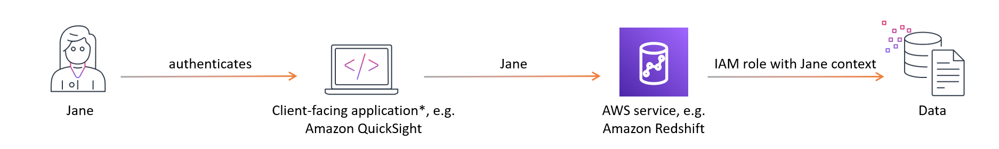
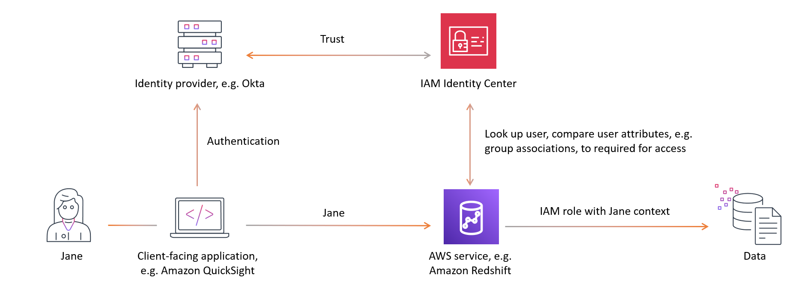

# Trusted identity propagation

overview

Trusted identity propagation is a feature of IAM Identity Center that enables administrators of
AWS services to grant permissions based on user attributes such as group associations.
With trusted identity propagation, identity context is added to an IAM role to
identify the user requesting access to AWS resources. This context is propagated to
other AWS services.

Identity context comprises information that AWS services use to make authorization
decisions when they receive access requests. This information includes metadata that
identifies the requester (for example, an IAM Identity Center user), the AWS service to which access
is requested (for example, Amazon Redshift), and the scope of access (for example, read only
access). The receiving AWS service uses this context, and any permissions assigned to
the user, to authorize access to its resources.

## Benefits of trusted identity

propagation

Trusted identity propagation allows the administrators of AWS services to grant
permissions to resources, such as data, using the corporate identities of your
workforce. In addition, they can audit who accessed what data by looking at service
logs or AWS CloudTrail. If you are an IAM Identity Center administrator, you may be asked by other
AWS service administrators to enable trusted identity propagation.

## Enabling trusted identity propagation

The process of enabling trusted identity propagation involves the following two
steps:

1. **Enable IAM Identity Center and connect your existing source of identities to
   IAM Identity Center** - You'll continue to manage your workforce identities
   in your existing source of identities; connecting it to IAM Identity Center creates a
   reference to your workforce that all AWS services in your use case can
   share. It's also available for data owners to use in future use
   cases.
2. **Connect the AWS services in your use case to IAM Identity Center**

- The administrator of each AWS service in the trusted identity
  propagation use case follows the guidance in the respective service
  documentation to connect the service to IAM Identity Center.

###### Note

If your use case involves a _third-party_ or
_customer developed application_, you enable trusted
identity propagation by configuring a trust relationship between the identity
provider that authenticates the application users and IAM Identity Center. This allows your
application to take advantage of the trusted identity propagation flow
previously described.

For more information, see [Using applications with a
trusted token issuer](using-apps-with-trusted-token-issuer.md "using-apps-with-trusted-token-issuer.md").

## How trusted identity propagation works

The following diagram shows the high-level workflow for trusted identity
propagation:

1. Users authenticate with a client-facing application, for example
   Quick Suite.
2. The client-facing application requests access to use an AWS service to
   query data and includes information on the user.

###### Note

Some trusted identity propagation use cases involve tools that
interact with AWS services using service drivers. You can find out if
this applies to your use case in the [use case
guidance](trustedidentitypropagation-integrations.md "trustedidentitypropagation-integrations.md"). 3. The AWS service verifies the user identity with IAM Identity Center and compares the
user attributes, like their group associations, with those required for
access. The AWS service authorizes the access so long as the user or their
group has the necessary permissions. 4. AWS services may log the user identifier in AWS CloudTrail and in their
service logs. Check the service documentation for details.

The following image provides an overview of the previously described steps in the
trusted identity propagation workflow:

###### Topics

- [Prerequisites and
  considerations](trustedidentitypropagation-overall-prerequisites.md "trustedidentitypropagation-overall-prerequisites.md")
- [Trusted identity
  propagation use cases](trustedidentitypropagation-integrations.md "trustedidentitypropagation-integrations.md")
- [Authorization services](authorization-services.md "authorization-services.md")
