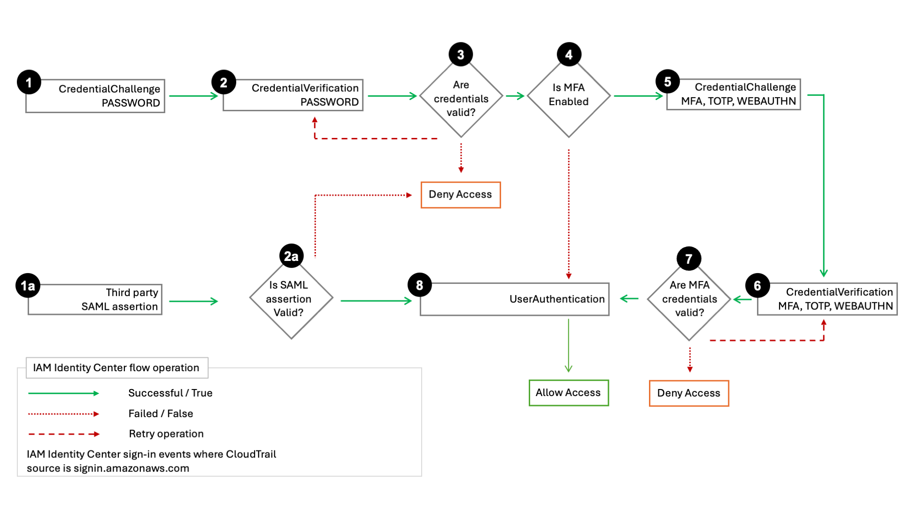

# Understanding IAM Identity Center sign-in events

AWS CloudTrail records successful and unsuccessful sign-in events for all IAM Identity Center identity
 sources. IAM Identity Center and Active Directory (AD Connector and AWS Managed Microsoft AD) sourced identities
 include additional sign-in events that are captured each time a user is prompted to solve
 a specific credential challenge or factor, in addition to the status of that particular
 credential verification request. Only after a user has completed all required credential
 challenges will the user be signed in, which will result in a
 `UserAuthentication` event being logged.

The following table captures each of the IAM Identity Center sign-in CloudTrail event names, their
 purpose, and applicability to different identity sources.

| Event name | Event purpose | Identity source applicability |
| --- | --- | --- |
| `CredentialChallenge` | Used to notify that IAM Identity Center has requested the user to solve a specific credential challenge and specifies the `CredentialType` that was required (For example, PASSWORD or TOTP). | Native IAM Identity Center users, AD Connector, and AWS Managed Microsoft AD |
| `CredentialVerification` | Used to notify that the user has attempted to solve a specific `CredentialChallenge` request and specifies whether that credential succeeded or failed. | Native IAM Identity Center users, AD Connector, and AWS Managed Microsoft AD |
| `UserAuthentication` | Used to notify that all authentication requirements the user was challenged with have been successfully completed and that the user was successfully signed in. *Users failing to successfully complete the required credential challenges will result in no `UserAuthentication` event being logged.* | All identity sources | The following table captures additional useful event data fields contained within specific sign-in CloudTrail events.
| Field | Event purpose | Sign-in event applicability | Example values |
| --- | --- | --- | --- |
| `AuthWorkflowID` | Used to correlate all events emitted across an entire sign-in sequence. For each user sign-in, multiple events may be emitted by IAM Identity Center.  | `CredentialChallenge`, `CredentialVerification`, `UserAuthentication` | "AuthWorkflowID": "9de74b32-8362-4a01-a524-de21df59fd83" |
| `CredentialType` | Used to specify the credential or factor that was challenged. `UserAuthentication` events will include all of the `CredentialType` values that were successfully verified across the user's sign-in sequence. | `CredentialChallenge`, `CredentialVerification`, `UserAuthentication` | CredentialType": "PASSWORD" or "CredentialType": "PASSWORD,TOTP" (possible values include: PASSWORD, TOTP, WEBAUTHN, EXTERNAL\_IDP, RESYNC\_TOTP, EMAIL\_OTP) |
| `DeviceEnrollmentRequired` | Used to specify that the user was required to register an MFA device during sign-in, and that the user successfully completed that request. | `UserAuthentication` | "DeviceEnrollmentRequired": "true" |
| `LoginTo` | Used to specify the redirect location following a successful sign-in sequence. | `UserAuthentication` | "LoginTo": "https://mydirectory.awsapps.com/start/....." | ###### CloudTrail events in the IAM Identity Center sign-in flows The following diagram describes the sign-in flow and the CloudTrail events that Sign-in emits.  The diagram shows a **password sign-in** flow and a **federated sign-in** flow. The **password sign-in** flow, which consists of steps 1–8, demonstrates the steps during the username and password sign-in process. IAM Identity Center sets `userIdentity.additionalEventData.CredentialType` to "`PASSWORD`", and IAM Identity Center goes through the credentials challenge-response cycle, retrying as needed. The number of steps depends on the type of [login and the presence of the multi-factor authentication (MFA)](enable-mfa.md "enable-mfa.md"). The initial process results in three or five CloudTrail events with `UserAuthentication` ending the sequence for a successful authentication. Unsuccessful password authentication attempts result in additional CloudTrail events as the IAM Identity Center re-issues `CredentialChallenge` for regular or, if enabled, MFA authentication. The password sign-in flow also covers the scenario where an IAM Identity Center user newly-created with a `CreateUser` API call signs in with a one-time password (OTP). The credential type in this scenario is “`EMAIL_OTP`”. The **federated sign-in** flow, consisting of steps 1a, 2a, and 8, demonstrates the main steps during the federated authentication process where a [SAML assertion is provided by an identity provider](scim-profile-saml.md "scim-profile-saml.md"), validated by IAM Identity Center, and if successful, results in `UserAuthentication`. IAM Identity Center doesn't invoke the internal MFA authentication sequence in steps 3 – 7 because an external, federated identity provider is responsible for all user credential authentication.
