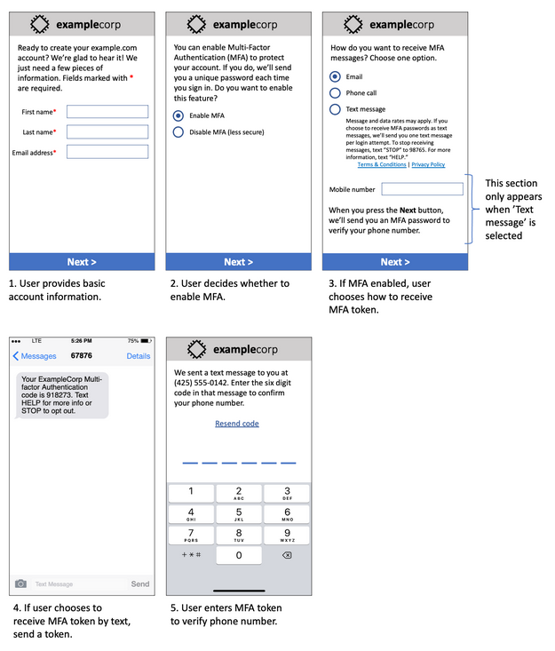

# AWS End User Messaging SMS Best Practices

For the best results for creating and sending messages, we recommend that you perform the
following best practices.

###### Topics

- [SMS and MMS best practices](#best-practices-sms "#best-practices-sms")
- [Voice best practices](#voice-best-practices "#voice-best-practices")

## SMS and MMS best practices

Additionally, mobile phone carriers continuously audit bulk SMS and MMS senders and
throttle or block messages from originators that they determine to be sending unsolicited
messages.

Sending unsolicited content is also a violation of the [AWS acceptable use
policy](https://aws.amazon.com/aup/#No_E-Mail_or_Other_Message_Abuse "https://aws.amazon.com/aup/#No_E-Mail_or_Other_Message_Abuse"). The AWS End User Messaging SMS team routinely audits SMS and MMS message, and might throttle
or block your ability to send messages if it appears that you're sending unsolicited
messages.

In many countries, regions, and jurisdictions, there are severe penalties for
sending unsolicited SMS or MMS messages. For example, in the United States, the Telephone
Consumer Protection Act (TCPA) states that consumers are entitled to $500–$1,500 in
damages (paid by the sender) for each unsolicited message that they receive.

###### Important

This section describes several best practices that might help you improve your customer
engagement and avoid costly penalties. However, note that this section doesn't contain legal
advice. Always consult an attorney to obtain legal advice.

Before creating message content you should review the [SMS protocol security considerations](security-protocol-considerations.md "security-protocol-considerations.md") and [SMS protocol security best practices](security-protocol-best-practices.md "security-protocol-best-practices.md") to ensure the SMS channel is appropriate for your use case.

###### Topics

- [Comply with laws, regulations, and
  carrier requirements](#best-practices-sms-understand-laws "#best-practices-sms-understand-laws")
- [Prohibited message content](#best-practices-sms-message-content "#best-practices-sms-message-content")
- [Obtain permission](#best-practices-sms-obtain-permission "#best-practices-sms-obtain-permission")
- [Don't send messages to old lists](#best-practices-sms-old-lists "#best-practices-sms-old-lists")
- [Audit your customer lists](#best-practices-sms-audit-lists "#best-practices-sms-audit-lists")
- [Keep records](#best-practices-sms-keep-records "#best-practices-sms-keep-records")
- [Make your messages clear,
  honest, and concise](#best-practices-sms-appropriate-content "#best-practices-sms-appropriate-content")
- [Respond appropriately](#best-practices-sms-respond-appropriately "#best-practices-sms-respond-appropriately")
- [Adjust your sending based on
  engagement](#best-practices-sms-adjust-engagement "#best-practices-sms-adjust-engagement")
- [Send at appropriate times](#best-practices-sms-appropriate-times "#best-practices-sms-appropriate-times")
- [Avoid cross-channel
  fatigue](#best-practices-sms-cross-channel-fatigue "#best-practices-sms-cross-channel-fatigue")
- [Use dedicated short
  codes](#best-practices-sms-dedicated-short-codes "#best-practices-sms-dedicated-short-codes")
- [Verify your destination
  phone numbers](#best-practices-sms-verify-destination-numbers "#best-practices-sms-verify-destination-numbers")
- [Design with redundancy in mind](#best-practices-sms-redundancy "#best-practices-sms-redundancy")
- [Handling deactivated phone
  numbers](#channels-sms-best-practices-deactivated "#channels-sms-best-practices-deactivated")

### Comply with laws, regulations, and

carrier requirements

You can face significant fines and penalties if you violate the laws and regulations
of the places where your customers reside. For this reason, it's vital to understand the
laws related to SMS and MMS messaging in each country or region where you do
business.

###### Important

In many countries, the local carriers ultimately have the authority to determine
what kind of traffic flows over their networks. This means that the carriers might
impose restrictions on SMS and MMS content that exceed the minimum requirements of
local laws.

The following list includes links to key laws that apply to SMS and MMS communications
in some of the major markets around the world. This guide doesn't cover the laws for all
locales, so it's important that you research them.

- United States: The Telephone Consumer
  Protection Act of 1991, also known as TCPA, applies to certain types of SMS
  messages. For more information, see the [rules and regulations](https://www.fcc.gov/document/telephone-consumer-protection-act-1991 "https://www.fcc.gov/document/telephone-consumer-protection-act-1991") at the Federal Communications Commission
  website.
- United Kingdom: The Privacy and Electronic
  Communications (EC Directive) Regulations 2003, also known as PECR, applies to
  certain types of SMS messages. For more information, see [What
  are PECR?](https://ico.org.uk/for-organisations/direct-marketing-and-privacy-and-electronic-communications/guide-to-pecr/what-are-pecr/ "https://ico.org.uk/for-organisations/direct-marketing-and-privacy-and-electronic-communications/guide-to-pecr/what-are-pecr/") at the website of the UK Information Commissioner's
  Office.
- European Union: The Privacy and Electronic
  Communications Directive 2002, sometimes known as the ePrivacy Directive,
  applies to some types of SMS messages. For more information, see the [full text of the law](https://eur-lex.europa.eu/legal-content/EN/TXT/?uri=CELEX:32002L0058 "https://eur-lex.europa.eu/legal-content/EN/TXT/?uri=CELEX:32002L0058") at the Europa.eu website.
- Canada: The Fighting Internet and Wireless Spam
  Act, more commonly known as Canada's Anti-Spam Law or CASL, applies to certain
  types of SMS messages. For more information, see the [full
  text of the law](https://www.parl.ca/DocumentViewer/en/40-3/bill/C-28/first-reading "https://www.parl.ca/DocumentViewer/en/40-3/bill/C-28/first-reading") at the website of the Parliament of Canada.
- Japan: The Act on Regulation of Transmission of
  Specific Electronic Mail can apply to certain types of SMS messages.

As a sender, these laws can apply to you even if your company or organization isn't
based in one of these countries. Some of the laws in this list were originally created
to address unsolicited email or telephone calls, but have been interpreted or expanded
to apply to SMS and MMS messages as well. Other countries and regions have their own
laws related to the transmission of SMS and MMS messages. Consult an attorney in each
country or region where your customers are located to obtain legal advice.

### Prohibited message content

The following are general prohibited content categories for all message types
globally. Some countries might allow content on the list in the following table, but no
country actively allows unsolicited content. Some countries or mobile carriers require
that you register your number or sender ID with them before live messaging will be
enabled. When using or registering a number as an originator, follow these
guidelines:

- Because regulators have a high bar for number registration, you must provide a
  valid opt-in workflow to register the number. For more information, see [SMS Best Practices: Obtain
  Permission](#best-practices-sms-obtain-permission "#best-practices-sms-obtain-permission").
- Don't use shortened URLs created from third-party URL shorteners, as these
  messages are more likely to be filtered as spam. If you want to use a shortened
  URL, use a 10LDC phone number or short code. Using either of these number types
  requires that you register your message template, which can then include a
  shortened URL in the message.
- For toll-free numbers, the keyword opt-out and opt-in responses are set at the
  carrier level, using STOP and UNSTOP. These are the only keywords that you can
  use, and you cannot modify them. Response messages when a user replies with STOP
  and UNSTOP are also managed by the carrier and you cannot modify them.
- Don't send the same or similar message contents using multiple numbers. This
  is considered _snowshoe spamming_, which is a
  practice used by spammers to avoid number rate and volume limitations.
- Any messages related to these industries could be considered restricted, and
  are subject to heavy filtering or being blocked outright. This can include
  one-time passwords and multi-factor authentication for services related to
  restricted categories.

If you had a registration denied for a noncompliant use case and you feel that
this designation is incorrect, you can submit a request through AWS
support.

The following table describes the types of restricted content.

| Category                     | Examples                                                                                                                                                             |
| ---------------------------- | -------------------------------------------------------------------------------------------------------------------------------------------------------------------- |
| Gambling                     | + Casinos + Sweepstakes + App/Websites the offer gambling + 50/50 Raffles + Betting/Sports picks                                                         |
| High-risk financial services | + Payday loans + Short-term high-interest loans + Auto loans + Mortgage loans + Student loans + Debt collection + Stock alerts + Cryptocurrency |
| Debt forgiveness             | + Debt consolidation + Debt reduction + Credit repair programs + Debt relief + Third-party debt collection                                               |
| Get-rich-quick schemes       | + Work-from-home programs + Risk-investment opportunities + Pyramid or multi-level marketing schemes + Mystery shopping                                     |
| Illegal substances           | + Cannabis/CBD + Kratom + Paraphernalia products + Fireworks + Vape/E-cig                                                                                |
| Prescription drugs           | + Drugs that require a prescription                                                                                                                                  |
| Phishing/smishing            | + Attempts to get users to reveal personal information or website login information.                                                                              |
| S.H.A.F.T.                   | + Sex + Hate + Alcohol + Firearms + Tobacco/Vape                                                                                                         |
| Third-Party Lead Generation  | + Companies that buy, sell, or share consumer information + Affiliate lending + Affiliate marketing + deceptive marketing                                |

### Obtain permission

Never send messages to recipients who haven't explicitly asked to receive the specific
types of messages that you plan to send. Don't share opt-in lists, even among
organizations within the same company.

If recipients can sign up to receive your messages by using an online form, add
systems that prevent automated scripts from subscribing people without their knowledge.
You should also limit the number of times a user can submit a phone number in a single
session.

When you receive an SMS or MMS opt-in request, send the recipient a message that asks
them to confirm that they want to receive messages from you. Don't send that recipient
any additional messages until they confirm their subscription. A subscription
confirmation message might resemble the following example:

`Text YES to join ExampleCorp alerts. 2 msgs/month. Msg &
 data rates may apply. Reply HELP for help, STOP to cancel.`

Maintain records that include the date, time, and source of each opt-in request and
confirmation. This might be useful if a carrier or regulatory agency requests it, and
can also help you perform routine audits of your customer list.

#### Opt-in workflow

In some cases, such as US toll-free or short code registration, mobile carriers
require you to provide mockups or screenshots of your entire opt-in workflow. The
mockups or screenshots must closely resemble the opt-in workflow that your
recipients will complete.

Your mockups or screenshots should include all of the following required
disclosures to maintain the highest level of compliance.

###### Required disclosures for your opt-in

- A description of the messaging use case that you will send through your
  program.
- The phrase “Message and data rates may apply.”
- An indication of how often recipients will get messages from you. For
  example, a recurring messaging program might say “one message per week.” A
  one-time password or multi-factor authentication use case might say “message
  frequency varies” or “one message per login attempt.”
- Publicly accessible links to your Terms and Conditions and Privacy Policy
  documents.

###### Note

If you don't have publicly accessible links to your Terms and Conditions and Privacy Policy
documents then you can alternatively attach them to the registration
form or another method like an [Amazon S3 presigned URL](../../../AmazonS3/latest/userguide/ShareObjectPreSignedURL.md "../../../AmazonS3/latest/userguide/ShareObjectPreSignedURL.md").

###### Common rejection reasons for noncompliant opt-ins

- If the provided company name does not match what is provided in the mockup
  or screenshot. Any relationships that are not obvious should be explained in
  the opt-in workflow description.
- If it appears that a message will be sent to the recipient, but no consent
  is explicitly gathered before doing so. Explicit consent from the intended
  recipient is a requirement of all messaging.
- If it appears that receiving a text message is required to sign up for a
  service. This is not compliant if the workflow doesn’t provide any
  alternative to receiving an opt-in message in another form, such as an email
  or a voice call.
- If the opt-in language is presented entirely in the Terms of Service. The
  disclosures should always be presented to the recipient at time of opt-in
  rather than housed inside of a linked policy document.
- If a customer provided consent to receive one type of text message from
  you and you send them other types of text messages. For example, they
  consent to receive one-time passwords, but are also sent polling and survey
  messages.
- If the previously listed required disclosures are not presented to the
  recipients.

The following example complies with the mobile carriers’ requirements for a
multi-factor authentication use case.

It contains finalized text and images, and it shows the entire opt-in flow,
complete with annotations. In the opt-in flow, the customer must take distinct,
intentional actions to provide their consent to receive text messages and contains
all of the required disclosures.

#### Other opt-in workflow

types

Mobile carriers will also accept opt-in workflows outside of applications and
websites, such as verbal or written opt-in if it complies with what has been
described in the previous section. A compliant opt-in workflow and verbal or written
script will gather explicit consent from the recipient to receive a specific message
type. For example, a verbal script that a support agent uses to gather consent
before recording into a service database, or a phone number listed on a promotional
flyer. To provide a mockup of these opt-in workflow types, you can provide a
screenshot of your opt-in script, marketing material, or database where numbers are
collected. Mobile carriers might have additional questions around these use cases if
an opt-in is not clear or the use case exceed certain volumes.

#### SMS and MMS specific

Terms and Conditions page

Mobile carriers also require that you make a specific set of SMS and MMS Terms and
Conditions available to your customers. The following terms and conditions comply
with the mobile carriers’ requirements. You can copy these terms and modify them to
fit your use case.

###### Important

If you copy these terms, be sure to replace all of the items shown in {curly
braces} with the appropriate values for your use case. Your legal department
should also want to review these terms before you publish them, so plan
accordingly.

- When you opt in to the service, we will send you {description of the
  messages that you plan to send}.
- You can cancel the SMS or MMS service at any time by texting “STOP” to
  {short code or phone number}. When you send the SMS message “STOP” to us, we
  reply with an SMS message that confirms that you have been unsubscribed.
  After this, you won’t receive SMS any additional messages from us. If you
  want to join again, sign up as you did the first time and we will start
  sending SMS and MMS messages to you again.
- You can get more information at any time by texting “HELP” to {short code
  or phone number}. When you send the SMS message “HELP” to us, we respond
  with instructions on how to use our service and how to unsubscribe.
- We are able to deliver messages to the following mobile phone carriers:
  Major carriers: AT&T, Verizon Wireless, Sprint, T-Mobile, MetroPCS, US
  Cellular, Alltel, Boost Mobile, Nextel, and Virgin Mobile. Minor carriers:
  Alaska Communications Systems (ACS), Appalachian Wireless (EKN), Bluegrass
  Cellular, Cellular One of East Central IL (ECIT), Cellular One of Northeast
  Pennsylvania, Cincinnati Bell Wireless, Cricket, Coral Wireless (Mobi PCS),
  COX, Cross, Element Mobile (Flat Wireless), Epic Touch (Elkhart Telephone),
  GCI, Golden State, Hawkeye (Chat Mobility), Hawkeye (NW Missouri), Illinois
  Valley Cellular, Inland Cellular, iWireless (Iowa Wireless), Keystone
  Wireless (Immix Wireless/PC Man), Mosaic (Consolidated or CTC Telecom),
  Nex-Tech Wireless, NTelos, Panhandle Communications, Pioneer, Plateau (Texas
  RSA 3 Ltd), Revol, RINA, Simmetry (TMP Corporation), Thumb Cellular, Union
  Wireless, United Wireless, Viaero Wireless, and West Central (WCC or 5 Star
  Wireless). Carriers are not liable for delayed or undelivered
  messages.
- Message and data rates may apply for any messages that we send to you or
  you send to us. You will receive {message frequency} messages per {time
  period}. Contact your wireless provider for more information about your text
  plan or data plan. If you have questions about the services provided by this
  short code, email us at {support email address}.
- If you have any questions regarding privacy, read our privacy policy at
  {link to privacy policy}

###### Important

If you don’t provide your customers with a copy of these terms, the carriers
won’t approve your short code application. When these terms have been reviewed,
plan to host them in a publicly accessible location. A URL that links to these
terms is a required part of every short code application. If this URL isn’t live
when you submit your short code request, determine what the URL will be, and
include a copy of the Terms and Conditions in a file that you include with your
request.

### Don't send messages to old lists

People change phone numbers often. A phone number that you gathered consent to contact
two years ago might belong to somebody else today. Don't use an old list of phone
numbers for a new messaging program. If you do, you're likely to have some messages fail
because the number is no longer in service, or because some people opted out because
they didn't remember giving you their consent in the first place.

### Audit your customer lists

If you send recurring SMS or MMS messsages, audit your customer lists on a regular
basis. Auditing your customer lists helps to make sure that the only customers who receive
your messages are those who are interested in receiving them.

When you audit your list, send each opted-in customer a message that reminds them that
they're subscribed, and provides them with information about unsubscribing. A reminder
message might resemble the following example:

`You're subscribed to ExampleCorp alerts. Msg & data rates
 may apply. Reply HELP for help, STOP to unsubscribe.`

### Keep records

Keep records that show when each customer requested to receive SMS and MMS messages
from you, and which messages you sent to each customer. Many countries and regions
around the world require SMS and MMS senders to maintain these records in a way that can
be easily retrieved. Mobile carriers might also request this information from you at any
time. The exact information that you must provide varies by country or region. For
more information about record-keeping requirements, review the regulations about
commercial SMS messaging in each country or region where your customers are
located.

Occasionally, a carrier or regulatory agency asks us to provide proof that a customer
opted to receive messages from you. In these situations, Support contacts you with a list
of the information that the carrier or agency requires. If you can't provide the
necessary information, we may pause your ability to send additional SMS and MMS
messages.

### Make your messages clear,

honest, and concise

SMS is a unique medium. The 160-character-per-message limit means that your messages
must be concise. Techniques that you might use in other communication channels, such as
email, might not apply to the SMS channel, and might even seem dishonest or deceptive
when used with SMS messages. If the content in your messages doesn't align with best
practices, recipients might ignore your messages. In the worst case scenario, the mobile
carriers might identify your messages as spam and block future messages from your phone
number.

MMS has a 1,600 character limit for the message body. Your message doesn’t have to be
concise, but it should still follow the best practices.

The following section provides some tips and ideas for creating an effective SMS
message body.

#### Identify yourself as the

sender

Your recipients should be able to immediately identify that a message is from you.
Senders who follow this best practice include an identifying name ("program name")
at the beginning of each message.

**Don't do this:**

`Your account has been accessed from a new device. Reply Y to
 confirm.`

**Try this instead:**

`ExampleCorp Financial Alerts: You have logged in to your account
 from a new device. Reply Y to confirm, or STOP to
 opt-out.`

#### Don't try to make your

message look like a person-to-person message

Some marketers are tempted to add a personal touch to their messages by making
their messages appear to come from an individual. However, this technique might make
your message seem like a phishing attempt.

**Don't do this:**

`Hi, this is Jane. Did you know that you can save up to 50% at
 Example.com? Click here for more info:
 https://www.example.com.`

**Try this instead:**

`ExampleCorp Offers: Save 25-50% on sale items at Example.com.
 Click here to browse the sale: https://www.example.com. Text STOP to
 opt-out.`

#### Be careful when talking

about money

Scammers often prey upon people's desire to save and receive money. Don't make
offers seem too good to be true. Don't use the lure of money to deceive people.
Don't use currency symbols to indicate money.

**Don't do this:**

`Save big $$$ on your next car repair by going to
 https://www.example.com.`

**Try this instead:**

`ExampleCorp Offers: Your ExampleCorp insurance policy gets you
 discounts at 2300+ repair shops nationwide. More info at
 https://www.example.com. Text STOP to opt-out.`

#### Use only the necessary

characters

Brands are often inclined to protect their trademarks by including trademark
symbols such as ™ or ® in their messages. However, these symbols are not
part of the standard set of characters that can be included in a 160-character SMS
message. These characters are known as the GSM alphabet. When you send a message
that contains one of these characters, your message is automatically sent using a
different character encoding system, which supports only 70 characters for each
message part. As a result, your message could be broken into several parts. Because
you're billed for each message part that you send, it could cost you more than you
expect to spend to send the entire message. Additionally, your recipients might
receive several sequential messages from you, rather than one single message. For
more information about SMS character encoding, see [SMS character limits](sms-limitations-character.md "sms-limitations-character.md").

**Don't do this:**

`ExampleCorp Alerts: Save 20% when you buy a new ExampleCorp
 Widget® at example.com and use the promo code
 WIDGET.`

**Try this instead:**

`ExampleCorp Alerts: Save 20% when you buy a new ExampleCorp
 Widget(R) at example.com and use the promo code
 WIDGET.`

###### Note

The two preceding examples are almost identical, but the first example
contains a Registered Trademark symbol (®), which is not part of the GSM
alphabet. As a result, the first example is sent as two message parts, while the
second example is sent as one message part.

#### Use valid, safe

links

If your message includes links, double-check the links to make sure that they
work. Test your links on a device outside of your internal network to confirm that
links resolve properly. Because of the 160-character limit of SMS messages, very
long URLs could be split across multiple messages. You should use redirect domains
to provide shortened URLs. However, you shouldn't use free link-shortening services
such as tinyurl.com or bitly.com, because carriers tend to
filter messages that include links on these domains. However, you can use paid
link-shortening services as long as your links point to a domain that is dedicated
to the exclusive use of your company or organization.

**Don't do this:**

`Go to https://tinyurl.com/4585y8mr today for a special
 offer!`

**Try this instead:**

`ExampleCorp Offers: Today only, get an exclusive deal on an
 ExampleCorp Widget. See https://a.co/cFKmaRG for more info. Text
 STOP to opt-out.`

#### Limit the number of

abbreviations that you use

The 160-character limitation of the SMS channel leads some senders to believe that
they need to use abbreviations extensively in their messages. However, the overuse
of abbreviations can seem unprofessional to many readers, and could cause some users
to report your message as spam. It's completely possible to write a coherent message
without using an excessive number of abbreviations.

**Don't do this:**

`Get a gr8 deal on ExampleCorp widgets when u buy a 4-pack
 2day.`

**Try this instead:**

`ExampleCorp Alerts: Today only—an exclusive deal on ExampleCorp
 Widgets at example.com. Text STOP to opt-out.`

### Respond appropriately

When a recipient replies to your messages, make sure that you respond with useful
information. For example, when a customer responds to one of your messages with the
keyword "HELP", send them information about the program that they're subscribed to, the
number of messages you will send each month, and the ways that they can contact you for
more information. A HELP response might resemble the following example:

`HELP: ExampleCorp alerts: email help@example.com or call
 425-555-0199. 2 msgs/month. Msg & data rates may apply. Reply STOP to
 cancel.`

When a customer replies with the keyword "STOP", let them know that they won't receive
any further messages. A STOP response might resemble the following example:

`You're unsubscribed from ExampleCorp alerts. No more messages
 will be sent. Reply HELP, email help@example.com, or call 425-555-0199 for more
 info.`

### Adjust your sending based on

engagement

Your customers' priorities can change over time. If customers no longer find your
messages to be useful, they might opt out of your messages entirely, or even report your
messages as unsolicited. For these reasons, it's important that you adjust your sending
practices based on customer engagement.

For customers who rarely engage with your messages, you should adjust the frequency of
your messages. For example, if you send weekly messages to engaged customers, you could
create a separate monthly digest for customers who are less engaged.

Finally, remove customers who are completely unengaged from your customer lists. This
step prevents customers from becoming frustrated with your messages. It also saves you
money and helps protect your reputation as a sender.

### Send at appropriate times

Send messages during normal daytime business hours. If you send messages at dinner
time or in the middle of the night, there's a good chance that your customers will
unsubscribe from your lists to avoid being disturbed. You might want to avoid sending
SMS or MMS messages when your customers can't respond to them immediately.

If you send campaigns or journeys to very large audiences, double-check the throughput
rates for your originator phone numbers. Divide the number of recipients by your
throughput rate to determine how long it will take to send messages to all of your
recipients.

### Avoid cross-channel

fatigue

In your campaigns, if you use multiple communication channels (such as email, SMS,
MMS, and push messages), don't send the same message in every channel. When you send the
same message at the same time in more than one channel, your customers will probably
perceive your sending behavior to be annoying rather than helpful.

### Use dedicated short

codes

If you use short codes, maintain a separate short code for each brand and each type of
message. For example, if your company has two brands, use a separate short code for each
one. Similarly, if you send both transactional and promotional messages, use a separate
short code for each type of message or register the short code once for transactional
and create another registration for promotional. For more information about requesting
short codes, see [Request a phone number in AWS End User Messaging SMS](phone-numbers-request.md "phone-numbers-request.md").

### Verify your destination

phone numbers

When you send SMS and MMS messages through AWS End User Messaging SMS, you're billed for each message part
that you send. The price you pay per message part varies on the recipient's country or
region. For more information about SMS and MMS pricing, see [AWS End User Messaging Pricing](https://aws.amazon.com/end-user-messaging/pricing/ "https://aws.amazon.com/end-user-messaging/pricing/").

When AWS End User Messaging SMS accepts a request to send an SMS or MMS message, you're charged for sending
that message. This statement is true even if the intended recipient doesn't actually
receive the message. For example, if the recipient's phone number is no longer in
service, or if you sent the message to mobile phone number that wasn't valid, you're
still billed for sending the message.

AWS End User Messaging SMS accepts valid requests to send SMS messages and attempts to deliver them. For
this reason, you should validate that the phone numbers that you send messages to are
valid mobile numbers. You can use the Amazon Pinpoint phone number validation service to determine
if a phone number is valid and what type of number it is (such as mobile, landline, or
VoIP). For more information, see [Validating phone numbers](../../../pinpoint/latest/developerguide/validate-phone-numbers.md "../../../pinpoint/latest/developerguide/validate-phone-numbers.md") in the
_Amazon Pinpoint Developer Guide_.

### Design with redundancy in mind

For mission-critical messaging programs, we recommend that you configure AWS End User Messaging SMS in more
than one AWS Region. AWS End User Messaging SMS is available in several AWS Regions. For a complete list
of Regions where AWS End User Messaging SMS is available, see the [AWS General Reference](../../../general/latest/gr/pinpoint.md "../../../general/latest/gr/pinpoint.md").

The phone numbers that you use for SMS or MMS messages—including short codes,
long codes, toll-free numbers, and 10DLC numbers—can't be replicated across
AWS Regions. So to use AWS End User Messaging SMS in multiple Regions, you must request separate phone
numbers in each Region where you want to use AWS End User Messaging SMS. For example, if you use a short code
to send text messages to recipients in the United States, you must request separate
short codes in each AWS Region that you plan to use.

In some countries, you can also use multiple types of phone numbers for added
redundancy. For example, in the United States, you can request short codes, 10DLC
numbers, and toll-free numbers. Each of these phone number types takes a different route
to the recipient. Having multiple phone number types available—either in the same
AWS Region or spread across multiple AWS Regions—provides an additional layer
of redundancy, which can help improve resiliency.

### Handling deactivated phone

numbers

A deactivated phone number means that the mobile subscriber has terminated their service or
transferred their phone number to a different mobile network provider. Eventually, deactivated
numbers are recycled and reassigned to new subscribers. Therefore, it’s possible to mistakenly
send an SMS or MMS message to a phone number that now belongs to a different subscriber who has
not opted in to your SMS or MMS message program.

Mobile network providers frequently publish deactivation reports that contain a current list
of deactivated phone numbers in their networks. These reports are published to help keep your
SMS and MMS sending list current and compliant.

###### Note

Many of the mobile phone numbers on deactivation reports are numbers that have been
transferred to a different mobile network provider by the subscriber. Changing mobile network
providers requires an opt-in from the new mobile network provider. There is a risk of removing
a deactivated number that your end user believes should still receive messages. You can engage
with your end users through different channels, such as email or voice calls, if you find
their phone number is deactivated.

#### Why is handling deactivated phone

numbers important?

In the US, the Federal Communications Commission (FCC) considers sending messages to a
phone number that belongs to a subscriber who has not opted in to your projects as spam. This
stance can result in end-user and mobile network provider complaints, which can then lead to
audits, and put your SMS and MMS message sending at risk of being entirely blocked by mobile
network providers. In the worst-case scenarios, the FCC can impose fines, or you could be
subject to a class-action lawsuit.

Additionally, when you send SMS or MMS messages through AWS End User Messaging SMS, you're billed for each
message that you send. By keeping your end-users lists up to date, you can prevent charges on
unnecessary messages.

AWS End User Messaging SMS provides a copy of the deactivation reports to allow you to keep all of your
end-users lists up to date periodically. These reports originate from mobile network providers
and are processed daily. Each report contains a list of phone numbers that have been
deactivated on the mobile network provider networks. You should download and compare them to
your existing end-users list. Delete all phone numbers from your end-users lists that have
been deactivated.

#### Requesting deactivation

reports

Before you can obtain a copy of a deactivation report, you must first request a
deactivation report through an Amazon S3 GET OBJECT API request using the REQUESTER PAYS buckets
option to download a file. For more information about Requester Pays buckets, see [Downloading objects in Requester Pays buckets](../../../AmazonS3/latest/userguide/ObjectsinRequesterPaysBuckets.md "../../../AmazonS3/latest/userguide/ObjectsinRequesterPaysBuckets.md") in the
_[Amazon S3 User Guide](../../../AmazonS3/latest/userguide.md "../../../AmazonS3/latest/userguide.md")_.

You pay for requests made against S3 buckets and objects requiring the Requester pays
option. S3 request costs are based on the request type, and are charged on the quantity of
requests. For more information about S3 request costs, see [Amazon S3 pricing](https://aws.amazon.com/s3/pricing/ "https://aws.amazon.com/s3/pricing/").

###### Note

The deactivation reports retrieve only United States phone numbers.

AWS End User Messaging SMS provides two types of deactivation reports. For ease of use, if you want the most
recent deactivation report, you can submit a request using the latest object format. If you
want a deactivation report for a specific date, you can submit a request using the date
specific object format.

###### Note

AWS End User Messaging SMS stores only the last 90 days of date-specific objects.

You can use the following template example to request a deactivation report through the
AWS CLI. For more information about configuring the AWS CLI, see [Configure the AWS
CLI](../../../cli/latest/userguide/cli-chap-configure.md "../../../cli/latest/userguide/cli-chap-configure.md") in the [AWS Command Line Interface User Guide](../../../cli/latest/userguide.md "../../../cli/latest/userguide.md").

`Bucket name format: `{region}`-pinpoint-sms-voice/`

`Latest object format:
 /sms-deact-reports/`{iso2}`/latest-deact-report.csv`

`Date specific object format:
 /sms-deact-reports/`{iso2}`/`{YYYY}`-`{MM}`-`{DD}`-deact-report.csv`

In the preceding examples, make the following changes:

- Replace `{region}` with the AWS Region that host the
  report, for example `us-east-1`. For a list of supported AWS Regions for
  bucket name, see [Endpoints and quotas](../../../general/latest/gr/pinpoint.md "../../../general/latest/gr/pinpoint.md") in the _AWS General Reference_.
- Replace `{iso2}` with the two-letter ISO-3166 alpha-2 code
  for the country .
- Replace `{YYYY}` with the four digit year.
- Replace `{MM}` with the two digit month.
- Replace `{DD}` with the two digit day.

The following example shows you how to request the latest deactivation report using AWS CLI
command.

`aws s3api get-object --bucket `us-east-1`-pinpoint-sms-voice --key
 sms-deact-reports/us/latest-deact-report.csv OUTFILE.csv --request-payer
 requester`

The following example shows you how to request a date-specific deactivation report using
AWS CLI command.

`aws s3api get-object --bucket `us-east-1`-pinpoint-sms-voice --key
 sms-deact-reports/`US`/`2023`-`09`-`28`-deact-report.csv OUTFILE.csv --request-payer
 requester`

After the Amazon S3 GET OBJECT API request is submitted, the deactivation report is downloaded
to the OUTFILE.csv specified in the command.

Using the Amazon S3 API, you can get a list of deactivation reports. You can list the
deactivation reports only within the embedded `sms-deact-reports/us/`
folder.

The following example shows you how to get the list of deactivation reports available.

`aws s3api list-objects-v2 --bucket
 `us-east-1`-pinpoint-sms-voice --prefix "sms-deact-reports/us/"
 --request-payer requester`

## Voice best practices

This section contains several best practices related to sending voice messages using AWS End User Messaging SMS.
These practices can help with the satisfaction of your recipients, and can protect you from
unexpected charges.

###### Topics in this section:

- [Comply with laws and
  regulations](#voice-best-practices-understand-laws "#voice-best-practices-understand-laws")
- [Send at appropriate
  times](#voice-best-practices-appropriate-times "#voice-best-practices-appropriate-times")
- [Avoid
  cross-channel fatigue](#voice-best-practices-cross-channel-fatigue "#voice-best-practices-cross-channel-fatigue")
- [Protect yourself
  against voice fraud](#voice-best-practices-fraud-protection "#voice-best-practices-fraud-protection")

### Comply with laws and

regulations

You can face significant fines and penalties if you violate the laws and regulations of the
places where your customers reside. For this reason, it's vital to understand the laws related
to automated voice calls in each country where you do business. As a sender, these laws might
apply to you even if you don't reside in one of these countries. You are responsible for
complying with all applicable laws. Note that some national subdivisions have stricter rules
than their parent countries. For example, several US states have rules that are more strict than
the US Federal laws concerning voice calls. This information is not intended to be legal advice.
Consult an attorney in each country or region where your customers are located to obtain legal
advice.

### Send at appropriate

times

Only send messages during normal daytime business hours in each recipient's time zone.
If you send messages at dinner time or in the middle of the night, there's a good chance
that your customers will unsubscribe from your lists in order to avoid being disturbed
again in the future. Additionally, many countries and regions restrict the days and
times at which people can receive automated messages. Although regulations vary by
country, it's a good idea to not send messages before 9 AM or after 8 PM. Many countries
also prohibit sending messages on Sundays and national holidays. This information is not
intended to be legal advice. Consult an attorney in each country or region where your
customers are located to obtain legal advice.

### Avoid

cross-channel fatigue

If you use multiple communication channels (such as voice, email, SMS, and push
messages), don't send the same message across multiple channels unless there's a good
reason for doing so. If you send the same message at the same time in more than one
channel, your customers are likely to perceive this behavior as annoying rather than
helpful.

### Protect yourself

against voice fraud

Because voice calls can be expensive, it's important to secure your AWS account
against unauthorized access, and to monitor the destinations of the messages that you
send.

**Carefully manage IAM roles, policies, and
users**

In general, the IAM policies of your users should grant _least
privilege_—that is, only the permissions that are
required to do a task, and nothing more. You can restrict these permissions
so that only a small number of users have them. For more information,
see [Security best practices
in IAM](../../../IAM/latest/UserGuide/best-practices.md "../../../IAM/latest/UserGuide/best-practices.md")in the _IAM User Guide_.

Additionally, you should change the passwords and access keys for your
users regularly. The process of changing passwords and access
keys is known as _credential rotation_. For more
information, see [Security best practices in IAM](../../../IAM/latest/UserGuide/best-practices.md#rotate-credentials "../../../IAM/latest/UserGuide/best-practices.md#rotate-credentials")

**Know which country you're sending to**

The per-minute price that you pay for sending voice messages depends on
the recipient's country. The country code of the recipient's phone number
isn't always the best way to tell which country they're in. For example,
many senders realize that the United States and Canada both use the same
country code (+1). However, they might not realize that 23 other countries
and territories (mainly in the Pacific and Caribbean) also use this country
code. Sending voice messages to some of these countries can be significantly
more expensive than for others. For example, sending messages to recipients
in the US and Canada costs $0.013 per minute, but sending to Jamaica costs
$0.564 per minute[1](#voice-best-practices-fraud-protection-note-1 "#voice-best-practices-fraud-protection-note-1"). Phone numbers in all three of these
countries begin with +1 followed by 10 digits, so to the untrained eye they
can be difficult to distinguish.

You can use the [Amazon Pinpoint
phone number validation service](../../../pinpoint/latest/developerguide/validate-phone-numbers.md "../../../pinpoint/latest/developerguide/validate-phone-numbers.md") to verify the country of each
phone number that you send messages to.

**Limit your sending to specific
countries**

If you plan to send messages only to recipients in specific countries, configure your
message-sending applications to send messages only to those countries.

**Limit the number of messages that you send to a single
number**

Configure your applications so that they can only send a certain number of
voice messages to the same recipient each day.

 

1 Prices quoted are accurate as of December 2021. Per-minute rates are
subject to change. For current pricing, see [AWS End User Messaging Pricing](https://aws.amazon.com/end-user-messaging/pricing/ "https://aws.amazon.com/end-user-messaging/pricing/").
