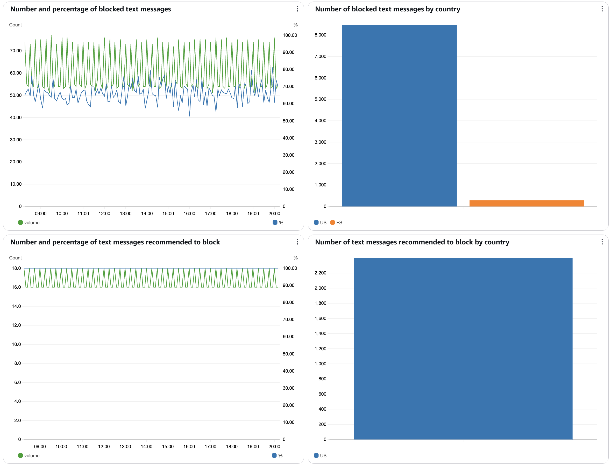

# View protect metrics in AWS End User Messaging SMS

The **Monitoring** tab on a protect configuration provides an overview of
message delivery metrics for the protect configuration. To view all metrics for your account
in the AWS End User Messaging SMS console choose **Dashboard** in the left hand navigation.

You can also use CloudWatch to view and create alarms. For more information on CloudWatch metrics, see
[Dashboard metrics](view-metrics-dashboard.md "view-metrics-dashboard.md"),
and [Create CloudWatch Alarms](monitoring-sms-cw.md "monitoring-sms-cw.md").

###### How to view protect metrics

1. Open the AWS End User Messaging SMS console at
   [https://console.aws.amazon.com/sms-voice/](https://console.aws.amazon.com/sms-voice/ "https://console.aws.amazon.com/sms-voice/").
2. In the navigation pane, under **Protect**, choose
   **Protect configuration**.
3. On the **Protect configuration** page, choose a protect
   configuration and then choose the **Monitoring** tab.
4. The graphs display actual message blocks and recommended blocks across your SMS
   traffic. Review data by count, percentage, and country. Recommended-to-block data
   appears only for countries with monitor or filter rules enabled. Use the date and
   time controls to change the date range and timezone.

## How protect metrics are

processed in AWS End User Messaging SMS

The protect metrics section provides information about messages that have been blocked
and to which countries. These charts and metrics help you better understand message
delivery.

Phone number override rules do affect blocked message metrics. If you block all
messages to a country and add a phone number override rule then messages sent to the
phone number with the override rule are not blocked and the graph is unchanged. For
example, if you send 100 messages to a country that is blocked but 1 message is for a
phone number with an override then the blocked messages graph will show 99 messages
blocked for that country.

###### What the specific metrics show

On the monitoring tab, End User Messaging provides multiple charts that help you
understand how your country rule configurations (_Allow_,
_Block_, _Monitor_, or
_Filter_), along with phone number rule overrides, are
controlling SMS sending overall, and to specific countries. The included charts
are:

- Number and Percentage of Blocked Messages
  – Shows the count and percentage of SMS and MMS messages that were blocked
  during the selected time period. This includes messages blocked by country rules
  set to 'block' or 'filter' mode, as well as messages blocked by phone number
  override rules.
- Number of Blocked Messages by Country –
  Shows the count of SMS and MMS messages that were blocked during the selected
  time period, broken down by destination country.
- Number and Percentage of Messages Recommended to
  Block – Shows the count and percentage of SMS and MMS
  messages that were identified as risky by the AIT risk detection model. This
  includes messages in both 'monitor' and 'filter' modes. In monitor mode, these
  messages are delivered but flagged; in filter mode, these messages are
  blocked.
- Number of Messages Recommended to Block by
  Country – Shows the count of SMS and MMS messages identified
  as risky by the AIT detection model, broken down by destination country.

When using the different country rules, your SMS traffic will show in the metrics in
the following manner:

- For Countries Set to Allow – Messages
  should flow freely to these countries with no blocking. If you see blocked
  messages in the metrics, this indicates specific phone numbers have been blocked
  using your override rules.
- For Countries Set to Block – All messages
  to these countries should appear as blocked in the metrics. If you see
  successful message deliveries, this means your phone number allow override rules
  are in place for specific numbers.
- For Countries Set to Monitor – You will
  see recommendations for messages that should be blocked, but no actual blocking
  occurs unless you've set specific phone number block rules. Any blocked messages
  shown in the metrics are solely from your phone number override rules, which
  take precedence over monitor mode.
- For Countries Set to Filter – Blocked
  messages and recommended-to-block metrics should match. If these numbers differ,
  it indicates your phone number override rules are active. Allow overrides will
  reduce the number of blocked messages, while block overrides will increase
  blocked messages beyond the recommendations.
