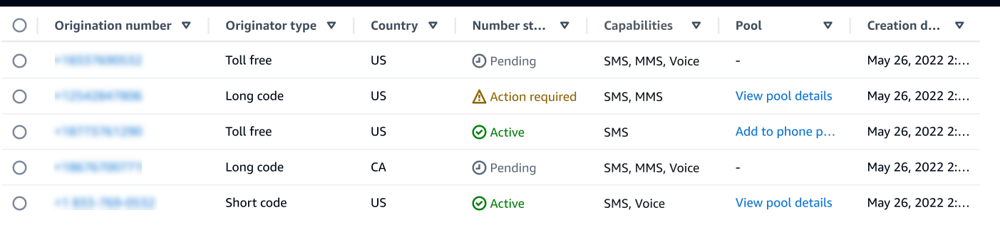

# View a phone number status and capabilities in AWS End User Messaging SMS

This section explains how to check that status and capabilities of your phone number in the AWS End User Messaging SMS console.

###### Phone number status

1. Open the AWS End User Messaging SMS console at
   [https://console.aws.amazon.com/sms-voice/](https://console.aws.amazon.com/sms-voice/ "https://console.aws.amazon.com/sms-voice/").
2. In the navigation pane, under **Configurations**, choose **Phone
   numbers**.
3. The following image shows the parts of the phone number status.

    * **Origination number** – The numeric number that
     customers see on their handsets.
    * **Origination type** – The type of origination
     number. This can be a long code, short code or toll-free.
    * **Country** – The country or region the **Origination number** is provisioned from.
    * **Number status** – The status of the **Origination number**. This can be `Pending`,
     `Active` or `Action required`.
    * **Capabilities** – The capabilities of the **Origination number**. This can be a combination of `SMS`,
     `MMS`, or `Voice`.
    * **Pool** – The pool, if any, that the **Origination number** is associated with.
    * **Creation date** – The time the **Origination number** was requested.

When you first purchase a phone number, the phone number's **Number
status** is `PENDING`. When the phone number is ready to use, the phone
number's **status** is `ACTIVE`. If the phone number requires
registration then that must be completed before the phone number's **Number
status** is changed to `ACTIVE`.
