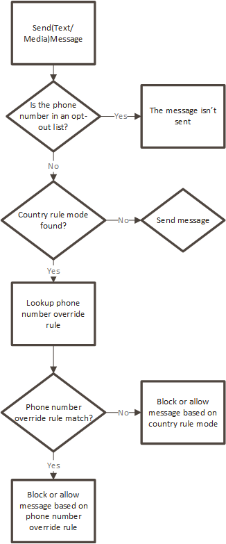

# How phone number override rules

are processed in AWS End User Messaging SMS

If a phone number is in the opt-out list then the message is not sent regardless if
there is an override to allow. The phone number override always takes precedent over the
country rule mode. For example, if the country rule mode is block and a phone number
override rule is always allow then sending to the phone number is allowed. The opposite
is also true, if the country rule mode is allow and a phone number override rule is
always block then sending to the phone number is not allowed.

