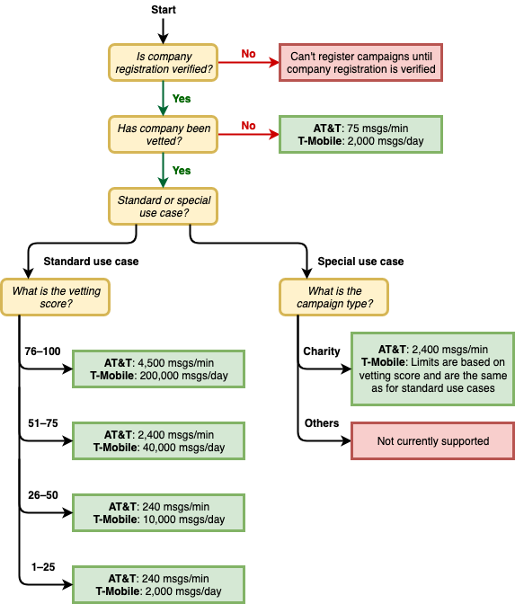

# United States 10DLC registration

###### Important

The following table has the expected times for each 10DLC registration step based on
if your business is located in the United States or internationally.

| 10DLC registration step     | US based companies | International based companies |
| --------------------------- | ------------------ | ----------------------------- |
| Register your brand/company | 1-2 business days  | Up to 3 weeks                 |
| Apply for vetting           | 1-2 business days  | Up to 3 weeks                 |
| Register your campaign      | Up to 4 weeks      | Up to 4 weeks                 |
| Request your 10DLC number   | Up to 10 days      | Up to 10 days                 |

If you use AWS End User Messaging SMS to send messages to recipients in the United States or the US territories
of Puerto Rico, US Virgin Islands, Guam and American Samoa, you can use 10DLC phone numbers
to deliver those messages. The abbreviation _10DLC_ stands for "10-digit
long code." A 10DLC phone number is registered for use by a single sender and for a single
use case. This registration process gives the mobile carriers insight into the approved use
cases for each phone number that is used to send messages. As a result, 10DLC phone numbers
can offer high throughput and deliverability rates.

A message that you send from a 10DLC phone number appears on the devices of your
recipients as a 10-digit phone number. You can use 10DLC phone numbers to send both
transactional and promotional messages. If you already use short codes or toll-free numbers
to send your messages, then you don't need to set up 10DLC.

To set up 10DLC, you first register your company or brand. You should then externally vet
your 10DLC company to ensure you get the highest eligible throughput. Next, you create a
_10DLC campaign_, which is a description of your use case. This
information is then shared with the Campaign Registry, an industry organization that
collects 10DLC registration information.

###### Note

For more information about how the Campaign Registry uses your information, see the
FAQ on the [Campaign Registry
website](https://www.campaignregistry.com/resources/ "https://www.campaignregistry.com/resources/").

After your company and 10DLC campaign are approved, you can purchase a phone number and
associate it with your 10DLC campaign. Associating a phone number with a 10DLC campaign can
take approximately 14 days to complete. Although you can associate multiple phone numbers
with a single campaign, you can't use the same phone number across multiple 10DLC campaigns.
For each 10DLC campaign that you create, you must have at least one unique phone number.
Throughput for 10DLC phone numbers is based on the company and campaign registration
information that you provide. Each 10DLC number associated to a
campaign supports 1 message part per second (MPS). In order to get the eligible throughput
from your campaign applied to the associated 10DLC numbers, you need to submit a request to
increase SMS sending rates.

If you have an existing unregistered long code in your AWS End User Messaging SMS account, you can request that
it be converted to a 10DLC number. To convert an existing long code, complete the
registration process, and then create a case in the AWS Support Center. In some
situations, it isn't possible to convert an unregistered long code to a 10DLC phone number.
In this case, you must request a new number through the AWS End User Messaging SMS console and associate it with
your 10DLC campaign. For more information about using 10DLC with existing long codes, see
[Associating a long code with a 10DLC
campaign](registrations-10dlc-associate.md "registrations-10dlc-associate.md").

###### Topics

- [10DLC capabilities](#registrations-10dlc-capabilities "#registrations-10dlc-capabilities")
- [10DLC registration process](registrations-10dlc-setup.md "registrations-10dlc-setup.md")
- [10DLC brand registration form](registrations-10dlc-company.md "registrations-10dlc-company.md")
- [Resend a 10DLC brand email authentication](registrations-10dlc-auth.md "registrations-10dlc-auth.md")
- [10DLC brand vetting form](registrations-10dlc-vetting.md "registrations-10dlc-vetting.md")
- [10DLC campaign registration form](registrations-10dlc-register-campaign.md "registrations-10dlc-register-campaign.md")
- [Associating a long code with a 10DLC
  campaign](registrations-10dlc-associate.md "registrations-10dlc-associate.md")
- [10DLC registration and monthly fees](#registrations-10dlc-fees "#registrations-10dlc-fees")
- [10DLC cross-account
  access](registrations-10dlc-configure-cross-account-access.md "registrations-10dlc-configure-cross-account-access.md")

## 10DLC capabilities

###### Note

**Important:** Brand registration and external brand vetting
alone does not automatically increase the default of 1 MPS limit per number
associated to an approved 10DLC campaign. In order to get the eligible throughput
from your campaign applied to the associated 10DLC numbers, you need to submit a
request to increase SMS sending rates.

The capabilities of 10DLC phone numbers depend on which mobile carriers your
recipients use. AT&T provides a limit on the number of message parts that can be
sent each minute for each campaign. T-Mobile provides a daily limit of messages that can
be sent for each company, with no limit on the number of message parts that can be sent
per minute. Verizon hasn't published throughput limits, but uses a filtering system for
10DLC that is designed to remove spam, unsolicited messages, and abusive content, with
less emphasis on the actual message throughput.

New 10DLC campaigns that are associated with _unvetted_ companies
can send 75 message parts per minute to recipients who use AT&T, and 2,000 messages
per day to recipients who use T-Mobile. The company limit is shared across all of your
10DLC campaigns. For example, if you have registered one company and two campaigns, the
daily allotment of 2,000 messages to T-Mobile customers is shared across those
campaigns. Similarly, if you register the same company in more than one AWS account,
the daily allotment is shared across those accounts.

If your throughput needs exceed these limits, you can request that your company
registration be vetted. When you vet your company registration, a third-party
verification provider analyzes your company details. The verification provider then
provides a vetting score, which determines the capabilities of your 10DLC campaigns.
There is a one-time charge for the vetting service. For more information, see [10DLC brand vetting form](registrations-10dlc-vetting.md "registrations-10dlc-vetting.md").

Your actual throughput rate will vary depending on various factors, such as whether or
not your company has been vetted, your campaign types, and your vetting score. The
following flowchart shows the throughput rates for various situations.

Throughput rates for 10DLC are determined by the US mobile carriers in cooperation
with the Campaign Registry. Neither AWS End User Messaging SMS nor any other SMS sending service can increase
10DLC throughput beyond these rates. If you need high throughput rates and high
deliverability rates across all US carriers, we recommend that you use a short code.

## 10DLC registration and monthly fees

There are registration and monthly fees associated with using 10DLC, such as
registering your company and 10DLC campaign. These are separate from any other monthly
or AWS fees. For more information about 10DLC fees, see the [AWS End User Messaging
Pricing](https://aws.amazon.com//end-user-messaging/pricing/ "https://aws.amazon.com//end-user-messaging/pricing/") page.
