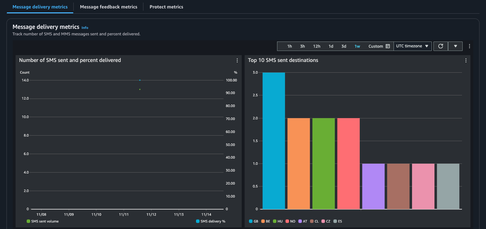
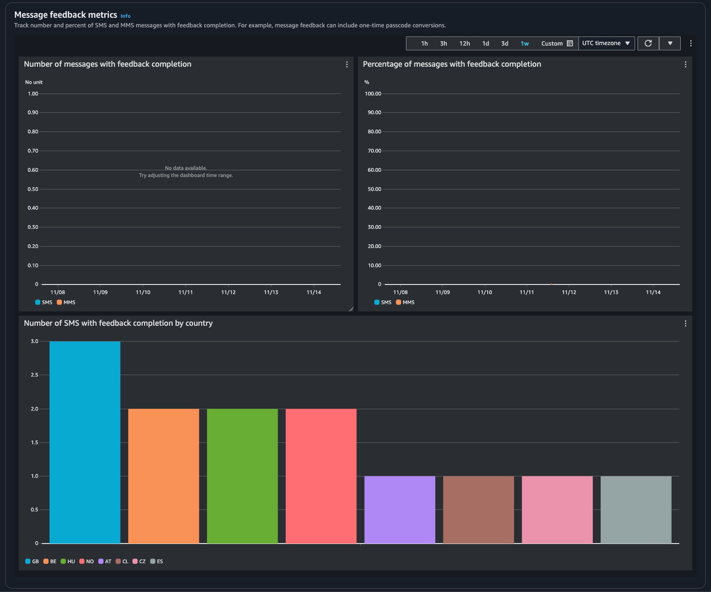

# Dashboard metrics for AWS End User Messaging SMS

The **Dashboard** page contains several charts and metrics
that provide an overview of message sending, message feedback, and messages evaluated by
Protect. For a list of all CloudWatch metrics, see [CloudWatch metrics](monitoring-cloudwatch.md#cw-metrics "monitoring-cloudwatch.md#cw-metrics"). For directions on how to setup an alarm, see [Create CloudWatch Alarms](monitoring-sms-cw.md "monitoring-sms-cw.md").

**Account overview metrics**: Are for the last 30 days of activity.

- **Message Parts Send** – The total number of [message parts](sms-limitations-mps.md "sms-limitations-mps.md") that have been sent but a
  delivery receipt (DLR) hasn't been received from the carrier yet..
- **Message Parts Delivered** – The total number of message
  parts that have been sent and received a [success DLR](configuration-sets-event-destinations.md#configuration-sets-event-destinations.title "configuration-sets-event-destinations.md#configuration-sets-event-destinations.title").
- **Feedback Received** – The total number of messages that
  have received [message feedback](message-feedback.md#message-feedback.title "message-feedback.md#message-feedback.title").
- **Messages sent with protect** – The total number of
  messages that were sent using a [protect
  configuration](filter-and-monitor-messages-monitor.md#filter-and-monitor-messages-monitor.title "filter-and-monitor-messages-monitor.md#filter-and-monitor-messages-monitor.title").
  **Metric tabs**

- **Message delivery metrics** – Metrics on the number of
  messages sent and top ten destination countries.
  - **Number of SMS sent and percent delivered** – The
    count of SMS messages that have been sent and the percentage of those
    messages that have been delivered.
  - **Top 10 SMS sent destinations** – The count of SMS
    messages that have been sent to the top 10 countries.
  - **Number of MMS sent and percent delivered** – The
    count of MMS messages that have been sent and the percentage of those
    messages that have been delivered.
  - **Top 10 MMS sent destinations** – The count of MMS
    messages that have been sent to the top 10 countries.

- **Message feedback metrics** – Metrics for messages that
  are sent using [message
  feedback](message-feedback.md#message-feedback.title "message-feedback.md#message-feedback.title").
  - **Number of messages with feedback completion** –
    The count of SMS and MMS messages where the [message feedback
    record](message-feedback-change-status.md#message-feedback-change-status.title "message-feedback-change-status.md#message-feedback-change-status.title") is set to `RECEIVED`.
  - **Percentage of messages with feedback completion**
    – The percentage of SMS and MMS messages where the message feedback
    record is set to `RECEIVED`.
  - **Number of SMS with feedback completion by country**
    – The count of message feedback received by country.

- **Protect metrics** – Metrics for each [protect configuration](filter-and-monitor-messages-monitor.md#filter-and-monitor-messages-monitor.title "filter-and-monitor-messages-monitor.md#filter-and-monitor-messages-monitor.title")
  on messages blocked. Choose **View details** to view the graphs for
  a protect configuration.
  You can access metrics from the AWS End User Messaging SMS console, the CloudWatch console, using the AWS CLI, or using
  the CloudWatch API. You can also set CloudWatch alarms for AWS End User Messaging SMS metrics.

AWS End User Messaging SMS Console

1. Open the AWS End User Messaging SMS console at
   [https://console.aws.amazon.com/sms-voice/](https://console.aws.amazon.com/sms-voice/ "https://console.aws.amazon.com/sms-voice/").
2. In the navigation pane choose **Dashboard**.
3. Choose one of the tabs to view metrics for: **Message Delivery**, **Message
   Conversion**, or **Protect**.

You can find more information about a graph by hovering over the
information icon or review [Monitoring AWS End User Messaging SMS with Amazon CloudWatch](monitoring-cloudwatch.md "monitoring-cloudwatch.md").

    1. To change the time range, use the **Time
     Range** dropdown and select the desired time
     range.
    2. Choose a graph to view additional statistics for it.
    3. In the CloudWatch Monitoring Details dialog box, you can choose a
     statistic such as the sum, average, or sample count. For a list
     of supported statistics, see [CloudWatch metrics for AWS End User Messaging SMS](monitoring-cloudwatch.md#cw-metrics "monitoring-cloudwatch.md#cw-metrics").
    4. To access additional CloudWatch features, choose **View all
     CloudWatch metrics** and follow the directions in
     the [CloudWatch console
     tab](#view-metrics-dashboard-cw-tab "#view-metrics-dashboard-cw-tab").

CloudWatch Console

1. Open the CloudWatch console at
   [https://console.aws.amazon.com/cloudwatch/](https://console.aws.amazon.com/cloudwatch/ "https://console.aws.amazon.com/cloudwatch/").
2. In the navigation pane, choose **Metrics**.
3. On the **All metrics** tab, choose
   `AWS/SMSVoice` namespace.
4. Choose one of the available metric dimensions.
5. You can now sort and filter the metric by:
   1. Sort the metrics using the column heading
   2. Create a graph by choosing the check box next to it
   3. Filter on a metric by choosing the metric name and choosing
      **Add to search**For more information and additional options, see [Graph Metrics](../../../AmazonCloudWatch/latest/monitoring/graph_a_metric.md "../../../AmazonCloudWatch/latest/monitoring/graph_a_metric.md") and [Using Amazon CloudWatch Dashboards](../../../AmazonCloudWatch/latest/monitoring/CloudWatch_Dashboards.md "../../../AmazonCloudWatch/latest/monitoring/CloudWatch_Dashboards.md") in the
      _Amazon CloudWatch User Guide_.

AWS CLI
To access AWS End User Messaging SMS metrics using the AWS CLI, run the
`get-metric-statistics` command. For more information, see [Get Statistics for a Metric](../../../AmazonCloudWatch/latest/monitoring/getting-metric-statistics.md "../../../AmazonCloudWatch/latest/monitoring/getting-metric-statistics.md") in the
_Amazon CloudWatch User Guide_.

CloudWatch API
To access AWS End User Messaging SMS metrics using the CloudWatch API, use the
`GetMetricStatistics` action. For more information, see [Get Statistics for a Metric](../../../AmazonCloudWatch/latest/monitoring/getting-metric-statistics.md "../../../AmazonCloudWatch/latest/monitoring/getting-metric-statistics.md") in the
_Amazon CloudWatch User Guide_.
